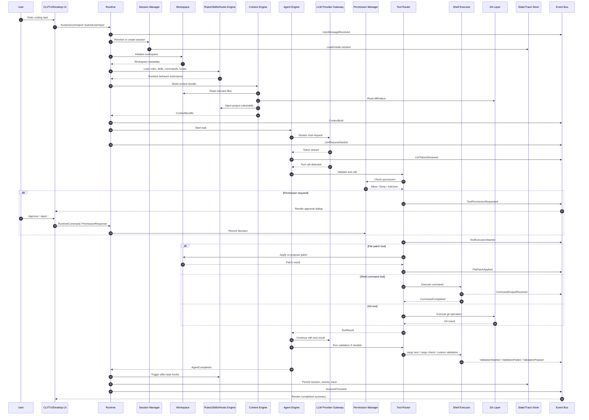

# Coding Agent Runtime Architecture Reference Design for `opencode-rs`

本文档定义一个面向 Rust 实现的 Coding Agent Runtime 参考架构，可用于对比、评估和重构 `opencode-rs` 的基础运行时设计。

核心目标不是复制 opencode、Claude Code、OpenClaw 或 Aider，而是抽象出一个清晰、可测试、可扩展、可观测、适合 CLI/TUI/桌面端/远程控制复用的 Coding Agent Runtime。

---

# 3.1 Runtime Design Principles

## 1. UI 与 Runtime 严格分离

Runtime 不应该知道自己运行在 CLI、TUI、Desktop UI 还是 Remote Controller 中。

正确边界是：

```text
UI Adapter 只负责：
- 接收用户输入
- 发送 RuntimeCommand
- 订阅 RuntimeEvent
- 渲染 ViewState
- 发起 Cancel / Approve / Reject / Select 等交互命令

Runtime 只负责：
- Session / Turn / Task 管理
- Agent 执行
- Tool 调度
- 状态持久化
- 事件输出
- 权限检查
- LLM 请求
- Workspace 修改
```

**禁止行为：**

```text
Runtime 直接 println 到终端
Provider 直接修改 TUI 状态
Tool 直接调用 UI 对话框
TUI 直接写配置文件
TUI 直接执行 shell command
LLM Provider 直接访问 workspace 文件
```

---

## 2. Runtime Core 应该事件驱动

所有关键运行时动作都应发布事件：

```text
UserMessageReceived
ContextBuilt
LlmRequestStarted
LlmTokenStreamed
ToolCallRequested
ToolExecutionStarted
FilePatchApplied
CommandOutputReceived
AgentCompleted
RuntimeError
```

事件是以下能力的基础：

```text
TUI 渲染
CLI streaming 输出
日志记录
调试
回放
测试断言
远程控制
任务监控
长任务恢复
```

---

## 3. Lifecycle 必须显式

Coding Agent Runtime 不应是“一段 while loop + LLM call + tool call”。

它应该有明确状态机：

```text
Idle
Preparing
BuildingContext
CallingModel
WaitingForPermission
ExecutingTool
ApplyingPatch
RunningCommand
Validating
Summarizing
Persisting
Completed
Failed
Cancelled
Interrupted
```

这样 TUI 才能正确显示进度，日志才能清晰，测试才能断言。

---

## 4. Deterministic Core, Non-deterministic Boundary

尽可能让核心流程确定化，把不确定性隔离在边界：

```text
确定性核心：
- Session 状态转换
- Event emission
- Tool dispatch
- Permission decision
- Context assembly algorithm
- State persistence
- Replay logic

非确定性边界：
- LLM Provider
- Shell process
- MCP server
- Network
- File system race
- Git state
- User approval
```

测试时可以替换非确定性边界。

---

## 5. Provider Complexity 不应泄漏到 Runtime Core

Runtime Core 不应该知道：

```text
OpenAI 是如何传 tool schema 的
Anthropic 是如何表达 tool_use 的
Ollama 是否支持原生 tool calling
某个 provider 的错误码是什么
某个 provider 的 streaming delta 格式是什么
```

Provider Gateway 应统一成：

```rust
ProviderRequest
ProviderResponse
ProviderStreamEvent
NormalizedToolCall
ProviderError
ModelCapability
```

---

## 6. Tool Execution 必须安全、可审计、可回滚

Coding Agent 的高风险操作包括：

```text
写文件
删除文件
执行 shell
git reset / git push
访问网络
调用 MCP tool
修改配置
读写 secret
```

每个动作应经过：

```text
Tool schema validation
Permission policy check
Risk classification
Optional user approval
Execution sandbox
Audit event
Result persistence
Rollback metadata if possible
```

---

## 7. Context 必须可解释、可检查、可重放

Context Engine 不是简单拼 prompt。

它应该输出结构化上下文包：

```rust
ContextBundle {
    items: Vec<ContextItem>,
    token_budget: TokenBudget,
    provenance: Vec<ContextProvenance>,
    truncation_report: TruncationReport,
    ranking_report: RankingReport,
}
```

用户和开发者应该能知道：

```text
为什么某个文件进入了上下文？
为什么某个文件被丢弃？
Git diff 占用了多少 token？
规则占用了多少 token？
测试失败日志是否被注入？
MCP resource 是否被注入？
```

---

## 8. Testability by Design

每个关键边界都应是 trait：

```rust
trait ProviderGateway
trait ToolExecutor
trait ShellExecutor
trait FileSystem
trait GitService
trait StateStore
trait EventSink
trait PermissionManager
trait McpClient
trait Clock
trait IdGenerator
```

这样才能做：

```text
mock provider
fake shell
in-memory state store
fake workspace
golden context tests
replay tests
TUI event rendering tests
```

---

# 3.2 High-Level Architecture

## Architecture Overview

```text
┌──────────────────────────────────────────────────────────────────────────────┐
│                              Frontend Adapters                               │
│                                                                              │
│   ┌────────────┐   ┌────────────┐   ┌────────────┐   ┌──────────────────┐   │
│   │    CLI     │   │    TUI     │   │ Desktop UI │   │ Remote / Mobile   │   │
│   └─────┬──────┘   └─────┬──────┘   └─────┬──────┘   └────────┬─────────┘   │
│         │ RuntimeCommand │ RuntimeCommand │ RuntimeCommand     │             │
│         └────────────────┴────────────────┴────────────────────┘             │
│                                      │                                       │
│                                      ▼                                       │
├──────────────────────────────────────────────────────────────────────────────┤
│                                Runtime API                                   │
│                                                                              │
│   submit_user_input()  cancel_task()  approve_tool()  list_sessions()         │
│   resume_session()     replay_trace() inspect_context() export_logs()         │
├──────────────────────────────────────────────────────────────────────────────┤
│                                Runtime Core                                  │
│                                                                              │
│   ┌──────────────────┐   ┌──────────────────┐   ┌──────────────────────┐    │
│   │ Session Manager  │   │ Task Scheduler   │   │ Agent Execution Engine │    │
│   └────────┬─────────┘   └────────┬─────────┘   └──────────┬───────────┘    │
│            │                      │                        │                │
│            ▼                      ▼                        ▼                │
│   ┌──────────────────┐   ┌──────────────────┐   ┌──────────────────────┐    │
│   │ Context Engine   │   │ Tool Router      │   │ Planning Orchestrator │    │
│   └────────┬─────────┘   └────────┬─────────┘   └──────────┬───────────┘    │
│            │                      │                        │                │
│            ▼                      ▼                        ▼                │
│   ┌──────────────────┐   ┌──────────────────┐   ┌──────────────────────┐    │
│   │ Rules / Skills   │   │ Permission /     │   │ Subagent Coordinator  │    │
│   │ Commands / Hooks │   │ Safety Manager   │   │                      │    │
│   └──────────────────┘   └──────────────────┘   └──────────────────────┘    │
│                                                                              │
├──────────────────────────────────────────────────────────────────────────────┤
│                              Execution Services                              │
│                                                                              │
│   ┌──────────────────┐   ┌──────────────────┐   ┌──────────────────────┐    │
│   │ Shell Executor   │   │ File Workspace   │   │ Git Integration       │    │
│   └──────────────────┘   └──────────────────┘   └──────────────────────┘    │
│                                                                              │
│   ┌──────────────────┐   ┌──────────────────┐   ┌──────────────────────┐    │
│   │ MCP Integration  │   │ Provider Gateway │   │ Validation Runner     │    │
│   └──────────────────┘   └──────────────────┘   └──────────────────────┘    │
├──────────────────────────────────────────────────────────────────────────────┤
│                          Event / State / Observability                       │
│                                                                              │
│   ┌──────────────────┐   ┌──────────────────┐   ┌──────────────────────┐    │
│   │ Event Bus        │   │ State Store      │   │ Trace Store           │    │
│   └──────────────────┘   └──────────────────┘   └──────────────────────┘    │
│                                                                              │
│   ┌──────────────────┐   ┌──────────────────┐   ┌──────────────────────┐    │
│   │ Structured Logs  │   │ Telemetry        │   │ Replay Engine         │    │
│   └──────────────────┘   └──────────────────┘   └──────────────────────┘    │
└──────────────────────────────────────────────────────────────────────────────┘
```

## Component Responsibility Summary

| Layer         | Component                 | Responsibility                                           |
| ------------- | ------------------------- | -------------------------------------------------------- |
| Frontend      | CLI                       | One-shot commands, scripting, batch execution            |
| Frontend      | TUI                       | Interactive sessions, streaming view, dialogs, approvals |
| Frontend      | Desktop UI                | Rich workspace, visual task management                   |
| Frontend      | Remote/mobile controller  | Remote task control, notifications, approvals            |
| Runtime Core  | Runtime                   | Top-level orchestration and API boundary                 |
| Runtime Core  | Session Manager           | Create, load, resume, persist sessions                   |
| Runtime Core  | Agent Engine              | Execute agent loop and tool-call loop                    |
| Runtime Core  | Context Engine            | Build model-ready context bundles                        |
| Runtime Core  | Tool Router               | Validate and dispatch tool calls                         |
| Runtime Core  | Permission Manager        | Decide whether operation is allowed                      |
| Runtime Core  | Rules/Skills/Hooks Engine | Load and apply higher-level behavior extensions          |
| Execution     | Shell Executor            | Controlled command execution                             |
| Execution     | Workspace Layer           | Safe file reads/writes/patching                          |
| Execution     | Git Layer                 | Git status, diff, branch, commit, restore                |
| Execution     | Provider Gateway          | Normalize LLM providers                                  |
| Execution     | MCP Layer                 | MCP server lifecycle, discovery, tool/resource bridge    |
| Observability | Event Bus                 | Broadcast runtime events                                 |
| Observability | Trace Store               | Persist replayable execution traces                      |
| Persistence   | State Store               | Sessions, turns, messages, tool history, config metadata |

---

# 3.3 Core Runtime Abstractions

## Recommended Core Abstractions

| Abstraction      | Represents                                  | Owner                       | Lifecycle                          |
| ---------------- | ------------------------------------------- | --------------------------- | ---------------------------------- |
| Runtime          | Running backend instance                    | Application bootstrap       | Process lifetime                   |
| Session          | Conversation/workspace-bound interaction    | SessionManager              | Created/resumed/archived           |
| Turn             | One user input and resulting agent activity | Session                     | Created per user message           |
| Task             | Executable unit of work                     | TaskScheduler / AgentEngine | Pending/running/completed/failed   |
| Agent            | Role that processes tasks                   | AgentRegistry / AgentEngine | Loaded per task                    |
| Subagent         | Specialized delegated agent                 | SubagentCoordinator         | Spawned by parent task             |
| Message          | User/assistant/system/tool message          | Session / Turn              | Persisted conversation item        |
| Context          | Model input bundle                          | ContextEngine               | Built per LLM call                 |
| Tool             | Executable capability                       | ToolRegistry                | Registered at startup/runtime      |
| ToolCall         | Requested invocation                        | AgentEngine / ToolRouter    | Created from model/tool command    |
| ToolResult       | Tool execution result                       | ToolRouter                  | Returned to agent                  |
| Workspace        | Project filesystem boundary                 | WorkspaceService            | Session-bound                      |
| FilePatch        | Proposed/applied file change                | WorkspaceService            | Proposed/approved/applied/reverted |
| CommandExecution | Shell process execution                     | ShellExecutor               | Started/streaming/completed        |
| Event            | Runtime state change notification           | EventBus                    | Emitted continuously               |
| Hook             | Lifecycle-triggered automation              | HookEngine                  | Triggered by event/lifecycle point |
| Skill            | Reusable capability package                 | SkillRegistry               | Loaded from config/project/user    |
| Rule             | Persistent behavior constraint              | RuleEngine / ContextEngine  | Loaded per session/context         |
| PermissionPolicy | Safety decision rules                       | PermissionManager           | Loaded per project/user/session    |
| Provider         | LLM backend adapter                         | ProviderGateway             | Configured/validated/used          |
| Model            | Specific model capability descriptor        | ProviderGateway             | Discovered/configured              |
| StateStore       | Persistence interface                       | Runtime                     | Process lifetime                   |
| Trace            | Replayable execution record                 | TraceStore                  | Created per turn/task              |

---

## Runtime

### What it represents

The Runtime is the backend kernel of `opencode-rs`.

It owns:

```text
SessionManager
TaskScheduler
AgentEngine
EventBus
StateStore
ProviderGateway
ToolRegistry
PermissionManager
ContextEngine
HookEngine
```

### Should contain

```rust
pub struct Runtime {
    session_manager: Arc<dyn SessionManager>,
    task_scheduler: Arc<dyn TaskScheduler>,
    agent_engine: Arc<dyn AgentEngine>,
    event_bus: Arc<dyn EventBus>,
    state_store: Arc<dyn StateStore>,
    config_service: Arc<dyn ConfigService>,
}
```

### Should not contain

```text
TUI rendering state
Terminal styling
Provider-specific request formats
Raw global mutable state
Hardcoded filesystem paths
Direct println/log formatting
```

---

## Session

### What it represents

A persistent interaction context, usually bound to:

```text
workspace
conversation history
selected agent
provider/model settings
rules/skills/hooks
permission decisions
runtime state
```

### Should contain

```rust
pub struct Session {
    pub id: SessionId,
    pub workspace_id: WorkspaceId,
    pub created_at: DateTime<Utc>,
    pub updated_at: DateTime<Utc>,
    pub title: Option<String>,
    pub turns: Vec<TurnId>,
    pub active_task: Option<TaskId>,
    pub metadata: SessionMetadata,
}
```

### Should not contain

```text
Large file contents
Raw provider secrets
TUI cursor state
Transient streaming tokens unless persisted as events
Unbounded logs
```

---

## Turn

### What it represents

One user input and the agent processing caused by that input.

```text
User says: “Fix the failing tests”
=> creates Turn
=> Turn may create one or more Tasks
=> Tasks may call LLM, tools, shell, file patches
```

### Should contain

```rust
pub struct Turn {
    pub id: TurnId,
    pub session_id: SessionId,
    pub user_message_id: MessageId,
    pub task_ids: Vec<TaskId>,
    pub status: TurnStatus,
    pub started_at: DateTime<Utc>,
    pub completed_at: Option<DateTime<Utc>>,
}
```

---

## Task

### What it represents

A concrete executable unit of work.

Examples:

```text
answer user question
modify files
run tests
summarize repo
apply patch
delegate to subagent
validate provider key
```

### Should contain

```rust
pub struct Task {
    pub id: TaskId,
    pub session_id: SessionId,
    pub turn_id: TurnId,
    pub parent_task_id: Option<TaskId>,
    pub kind: TaskKind,
    pub status: TaskStatus,
    pub cancellation_token: CancellationToken,
    pub trace_id: TraceId,
}
```

### Task state machine

```text
Pending
Preparing
Running
WaitingForPermission
Cancelling
Completed
Failed
Cancelled
```

---

## Agent

### What it represents

An agent is a role and policy bundle for processing tasks.

Examples:

```text
default coding agent
planner
implementer
reviewer
test-fixer
git agent
refactoring agent
security reviewer
```

### Should contain

```rust
pub struct AgentDefinition {
    pub id: AgentId,
    pub name: String,
    pub description: String,
    pub system_prompt: PromptTemplate,
    pub allowed_tools: Vec<ToolName>,
    pub default_model: Option<ModelRef>,
    pub rules: Vec<RuleRef>,
    pub skills: Vec<SkillRef>,
    pub max_iterations: usize,
}
```

### Should not contain

```text
Runtime mutable state
Provider API client
TUI state
Workspace file cache
```

---

## Subagent

A Subagent is a specialized agent spawned by another agent.

Example:

```text
Main Agent:
  "Investigate why tests fail"

Subagents:
  - Repo Scanner
  - Test Failure Analyzer
  - Patch Implementer
  - Code Reviewer
```

Subagents should communicate through structured task results, not shared mutable conversation blobs.

---

## Message

### Message types

```rust
pub enum MessageRole {
    System,
    User,
    Assistant,
    Tool,
    Developer,
}
```

### Message should contain

```rust
pub struct Message {
    pub id: MessageId,
    pub session_id: SessionId,
    pub turn_id: Option<TurnId>,
    pub role: MessageRole,
    pub content: MessageContent,
    pub created_at: DateTime<Utc>,
    pub metadata: MessageMetadata,
}
```

### Should not contain

```text
Provider raw response unless stored separately
Secret values
Huge binary payloads
Unbounded command output
```

---

## Context

Context is the structured input prepared for an LLM call.

```rust
pub struct ContextBundle {
    pub id: ContextId,
    pub session_id: SessionId,
    pub turn_id: TurnId,
    pub items: Vec<ContextItem>,
    pub token_budget: TokenBudget,
    pub provenance: Vec<ContextProvenance>,
    pub truncation_report: TruncationReport,
}
```

Context items may include:

```text
system prompt
developer instructions
project rules
user message
recent turns
git diff
selected files
diagnostics
test failures
MCP resources
skill instructions
tool schemas
```

---

## Tool

Tool is a typed executable capability.

```rust
pub trait Tool: Send + Sync {
    fn name(&self) -> ToolName;
    fn schema(&self) -> ToolSchema;
    fn risk_level(&self) -> RiskLevel;
    async fn execute(&self, call: ToolCall, ctx: ToolExecutionContext)
        -> Result<ToolResult, ToolError>;
}
```

Examples:

```text
read_file
write_file
apply_patch
run_shell
git_status
git_diff
git_commit
search_files
mcp_call_tool
```

---

## ToolCall

```rust
pub struct ToolCall {
    pub id: ToolCallId,
    pub name: ToolName,
    pub arguments: serde_json::Value,
    pub requested_by: AgentId,
    pub task_id: TaskId,
    pub risk_level: RiskLevel,
}
```

ToolCall should not include execution result or UI approval state directly. Those should be represented by separate events and state records.

---

## ToolResult

```rust
pub struct ToolResult {
    pub call_id: ToolCallId,
    pub status: ToolResultStatus,
    pub content: ToolResultContent,
    pub artifacts: Vec<ArtifactRef>,
    pub summary: Option<String>,
}
```

---

## Workspace

Workspace abstracts project filesystem access.

```rust
pub struct Workspace {
    pub id: WorkspaceId,
    pub root: PathBuf,
    pub git_root: Option<PathBuf>,
    pub metadata: WorkspaceMetadata,
}
```

Workspace layer should own:

```text
path normalization
path traversal prevention
file reads
file writes
patch application
ignore rules
workspace metadata
```

---

## FilePatch

```rust
pub struct FilePatch {
    pub id: FilePatchId,
    pub path: RelativePath,
    pub base_hash: Option<String>,
    pub diff: UnifiedDiff,
    pub status: FilePatchStatus,
}
```

States:

```text
Proposed
Approved
Applied
Rejected
Failed
Reverted
```

---

## CommandExecution

```rust
pub struct CommandExecution {
    pub id: CommandExecutionId,
    pub command: String,
    pub args: Vec<String>,
    pub cwd: RelativePath,
    pub env: BTreeMap<String, String>,
    pub status: CommandStatus,
    pub exit_code: Option<i32>,
}
```

Command output should be streamed as events, not stored only after completion.

---

## Event

Event is the common runtime communication unit.

```rust
pub struct RuntimeEvent {
    pub id: EventId,
    pub timestamp: DateTime<Utc>,
    pub session_id: Option<SessionId>,
    pub turn_id: Option<TurnId>,
    pub task_id: Option<TaskId>,
    pub trace_id: Option<TraceId>,
    pub kind: RuntimeEventKind,
}
```

---

## Hook

Hook is lifecycle-triggered automation.

Examples:

```text
before_context_build
after_context_build
before_tool_execution
after_file_patch
after_command_completed
before_session_persist
on_task_failed
```

---

## Skill

Skill is a reusable capability package.

A skill may contain:

```text
instructions
examples
tool permissions
context selectors
validation commands
subagent definitions
prompt templates
```

---

## Rule

Rule is a persistent constraint.

Examples:

```text
Do not modify generated files.
All Rust code must pass cargo fmt and cargo clippy.
Use anyhow only in binaries, thiserror in libraries.
Never store provider API keys in plaintext.
```

Rules should be loaded into context and optionally enforced by hooks or validators.

---

## PermissionPolicy

PermissionPolicy defines allowed, denied, and approval-required operations.

```rust
pub enum PermissionDecision {
    Allow,
    Deny { reason: String },
    AskUser { prompt: PermissionPrompt },
}
```

---

## Provider and Model

Provider abstracts an LLM backend.

```rust
pub trait Provider: Send + Sync {
    async fn list_models(&self) -> Result<Vec<ModelInfo>, ProviderError>;
    async fn validate_auth(&self) -> Result<AuthStatus, ProviderError>;
    async fn stream_chat(&self, request: ProviderRequest)
        -> Result<ProviderStream, ProviderError>;
}
```

Model contains capabilities:

```rust
pub struct ModelInfo {
    pub id: String,
    pub display_name: String,
    pub context_window: usize,
    pub supports_tools: bool,
    pub supports_streaming: bool,
    pub supports_json_mode: bool,
    pub supports_images: bool,
}
```

---

## StateStore

StateStore persists runtime state.

```rust
pub trait StateStore: Send + Sync {
    async fn save_session(&self, session: &Session) -> Result<()>;
    async fn load_session(&self, id: SessionId) -> Result<Session>;
    async fn append_event(&self, event: RuntimeEvent) -> Result<()>;
    async fn save_trace(&self, trace: Trace) -> Result<()>;
}
```

---

## Trace

Trace is a replayable execution record.

It should contain:

```text
runtime events
provider request metadata
provider normalized responses
tool calls
tool results
permission decisions
context bundle summary
file patch metadata
command execution records
error chain
```

It should not contain unredacted secrets.

---

# 3.4 Runtime Execution Lifecycle

## End-to-End Lifecycle

```text
1. User input received
2. Session resolved or created
3. Turn created
4. Workspace initialized
5. Rules, skills, commands, hooks loaded
6. Context assembled
7. Agent selected
8. LLM request prepared
9. Model response streamed
10. Tool calls detected
11. Permission checks performed
12. Tools executed
13. File changes proposed/applied
14. Shell commands executed
15. Validation commands run
16. Results summarized
17. State persisted
18. Hooks triggered
19. UI updated
20. Task completed, cancelled, or failed
```

## Mermaid Sequence Diagram



---

# 3.5 Event-Driven Runtime Model

## Event Categories

| Category          | Examples                                    | Persist? | UI Uses? | Replay Uses? |
| ----------------- | ------------------------------------------- | -------: | -------: | -----------: |
| Session events    | SessionCreated, SessionResumed              |      Yes |      Yes |          Yes |
| Turn events       | UserMessageReceived, TurnStarted            |      Yes |      Yes |          Yes |
| Context events    | ContextBuildStarted, ContextBuilt           |      Yes | Optional |          Yes |
| LLM events        | LlmRequestStarted, LlmTokenStreamed         |  Partial |      Yes |     Optional |
| Tool events       | ToolCallRequested, ToolExecutionCompleted   |      Yes |      Yes |          Yes |
| Permission events | ToolPermissionRequested, PermissionResolved |      Yes |      Yes |          Yes |
| File events       | FilePatchProposed, FilePatchApplied         |      Yes |      Yes |          Yes |
| Command events    | CommandStarted, CommandOutputReceived       |  Partial |      Yes |          Yes |
| Validation events | ValidationStarted, ValidationFailed         |      Yes |      Yes |          Yes |
| Hook events       | HookTriggered, HookFailed                   |      Yes | Optional |          Yes |
| Error events      | RuntimeError                                |      Yes |      Yes |          Yes |
| UI-only events    | CursorMoved, PanelResized                   |       No |      Yes |           No |

---

## Example Event Enum

```rust
pub enum RuntimeEventKind {
    SessionCreated { workspace: WorkspaceId },
    SessionResumed { session_id: SessionId },
    UserMessageReceived { message_id: MessageId },

    TurnStarted { turn_id: TurnId },
    TurnCompleted { turn_id: TurnId },
    TurnFailed { turn_id: TurnId, error: RuntimeError },

    ContextBuildStarted,
    ContextBuilt {
        context_id: ContextId,
        token_count: usize,
        item_count: usize,
        truncated: bool,
    },

    AgentStarted { agent_id: AgentId },
    AgentCompleted { summary: String },

    LlmRequestStarted {
        provider: String,
        model: String,
        request_id: ProviderRequestId,
    },
    LlmTokenStreamed {
        delta: String,
    },
    LlmRequestCompleted {
        usage: Option<TokenUsage>,
    },

    ToolCallRequested {
        call_id: ToolCallId,
        tool_name: String,
    },
    ToolPermissionRequested {
        call_id: ToolCallId,
        risk_level: RiskLevel,
        reason: String,
    },
    ToolExecutionStarted {
        call_id: ToolCallId,
    },
    ToolExecutionCompleted {
        call_id: ToolCallId,
        status: ToolResultStatus,
    },

    FilePatchProposed {
        patch_id: FilePatchId,
        path: RelativePath,
    },
    FilePatchApplied {
        patch_id: FilePatchId,
        path: RelativePath,
    },

    CommandStarted {
        execution_id: CommandExecutionId,
        command: String,
    },
    CommandOutputReceived {
        execution_id: CommandExecutionId,
        stream: OutputStreamKind,
        chunk: String,
    },
    CommandCompleted {
        execution_id: CommandExecutionId,
        exit_code: Option<i32>,
    },

    ValidationStarted { command: String },
    ValidationPassed,
    ValidationFailed { reason: String },

    HookTriggered { hook_id: HookId, hook_name: String },
    HookFailed { hook_id: HookId, error: String },

    SessionPersisted,
    CancellationRequested { task_id: TaskId },

    RuntimeError { error: RuntimeError },
}
```

---

## Publishers and Subscribers

| Component        | Publishes                       | Subscribes                         |
| ---------------- | ------------------------------- | ---------------------------------- |
| Runtime          | session, turn, lifecycle events | UI commands, cancellation          |
| Agent Engine     | agent, LLM, tool-loop events    | cancellation, permission responses |
| Provider Gateway | request, stream, error events   | none                               |
| Tool Router      | tool events                     | permission decisions               |
| Shell Executor   | command output events           | cancellation                       |
| Workspace Layer  | file patch events               | permission decisions               |
| Hook Engine      | hook events                     | lifecycle events                   |
| TUI              | UI commands                     | all visible runtime events         |
| CLI              | commands                        | stream and completion events       |
| State Store      | persistence events              | persistable events                 |
| Replay Engine    | synthetic replay events         | trace files                        |

---

## Persistent vs Transient Events

### Persist

```text
SessionCreated
UserMessageReceived
ContextBuilt summary
LlmRequestStarted metadata
ToolCallRequested
ToolPermissionRequested
ToolExecutionStarted
ToolExecutionCompleted
FilePatchProposed
FilePatchApplied
CommandStarted
CommandCompleted
ValidationStarted
ValidationFailed
AgentCompleted
RuntimeError
CancellationRequested
```

### Usually transient

```text
LlmTokenStreamed
CommandOutputReceived
TUI render events
Progress animation ticks
Cursor movement
Spinner updates
```

But for debug mode, token stream and command output can be persisted with size limits.

---

# 3.6 State and Persistence Design

## What Should Be Persisted

| State                  |           Persist? | Notes                                   |
| ---------------------- | -----------------: | --------------------------------------- |
| Session metadata       |                Yes | id, title, workspace, timestamps        |
| Conversation history   |                Yes | messages with redaction                 |
| Turn records           |                Yes | status, task ids                        |
| Tool call history      |                Yes | call args, result summary, risk         |
| File change history    |                Yes | diff, base hash, applied status         |
| Command history        |                Yes | command, cwd, exit code, output summary |
| Execution traces       |                Yes | replay/debug                            |
| Provider configuration |                Yes | no raw secrets                          |
| Provider secrets       |  Secure store only | keychain / OS secret store              |
| Workspace metadata     |                Yes | git root, project type, indexes         |
| Permission decisions   |                Yes | scoped and expirable                    |
| User preferences       |                Yes | UI/model/default behavior               |
| Project rules          |                Yes | project files, config                   |
| Cache data             |           Optional | index, model list, MCP discovery        |
| Runtime checkpoints    | Yes for long tasks | resumability                            |

---

## Suggested Storage Layout

Avoid polluting opencode-compatible paths. Use dedicated `opencode-rs` namespace.

### User-level config

```text
~/.config/opencode-rs/
  config.toml
  providers.toml
  agents/
  skills/
  commands/
  rules/
  hooks/
```

### User-level state

```text
~/.local/share/opencode-rs/
  sessions/
  traces/
  indexes/
  cache/
  mcp/
```

### User-level logs

```text
~/.local/state/opencode-rs/
  logs/
    runtime.log
    provider.log
    tui.log
    tool.log
    mcp.log
  crash/
  debug-bundles/
```

### Project-level config

```text
<repo>/.opencode-rs/
  project.toml
  rules/
  skills/
  commands/
  hooks/
  context.toml
  permissions.toml
```

### Project-level ephemeral state

```text
<repo>/.opencode-rs/state/
  workspace-index/
  task-cache/
```

This directory should usually be gitignored.

---

## Path Strategy

Use a single path resolver service:

```rust
pub trait PathResolver {
    fn user_config_dir(&self) -> PathBuf;
    fn user_state_dir(&self) -> PathBuf;
    fn user_log_dir(&self) -> PathBuf;
    fn project_config_dir(&self, workspace: &Workspace) -> PathBuf;
    fn project_state_dir(&self, workspace: &Workspace) -> PathBuf;
}
```

Do not scatter path logic across TUI, provider, logging, config, and runtime modules.

---

## Replay and Debugging

A replay trace should allow:

```text
reconstruct event timeline
inspect context bundle
inspect tool calls/results
inspect file patches
inspect provider request metadata
re-run with mock provider
re-render TUI state
compare actual vs expected event sequence
```

Recommended trace format:

```text
trace.jsonl
  one event per line
  stable schema version
  redacted secrets
  references to large artifacts

artifacts/
  context-001.json
  patch-001.diff
  command-001.stdout.txt
  command-001.stderr.txt
```

---

# 3.7 Context Engineering Design

## Context Engine Responsibilities

The Context Engine builds a model-ready `ContextBundle`.

It should not merely concatenate strings. It should:

```text
collect candidate context
rank relevance
deduplicate
allocate token budget
truncate safely
preserve provenance
produce inspectable reports
```

---

## Context Sources

| Source              | Example                                     |
| ------------------- | ------------------------------------------- |
| User input          | Current task                                |
| Recent conversation | Previous turns                              |
| Open files          | Files user is editing                       |
| Selected files      | Explicitly attached/mentioned files         |
| Repo index          | Symbols, filenames, dependency graph        |
| Git diff            | Current changes                             |
| Git status          | Modified/untracked files                    |
| Diagnostics         | compiler/linter errors                      |
| Test failures       | failing command outputs                     |
| Project rules       | coding standards                            |
| Skills              | task-specific procedures                    |
| Commands            | workflow definitions                        |
| MCP resources       | external docs, issue trackers, runtime data |
| Memory              | stable user/project preferences             |
| Tool results        | previous command/file search results        |

---

## Context Assembly Pipeline

```text
1. Build ContextRequest
2. Collect candidate items
3. Normalize items
4. Score relevance
5. Apply mandatory context
6. Allocate token budget
7. Compress long items
8. Truncate low-value content
9. Attach provenance
10. Emit ContextBuilt event
11. Store context summary for debugging
```

---

## Context Item Model

```rust
pub struct ContextItem {
    pub id: ContextItemId,
    pub kind: ContextItemKind,
    pub content: String,
    pub source: ContextSource,
    pub priority: ContextPriority,
    pub estimated_tokens: usize,
    pub provenance: ContextProvenance,
    pub inclusion_reason: String,
}
```

Kinds:

```rust
pub enum ContextItemKind {
    SystemInstruction,
    UserMessage,
    ConversationSummary,
    FileContent,
    FileSnippet,
    GitDiff,
    Diagnostic,
    TestFailure,
    Rule,
    SkillInstruction,
    CommandDefinition,
    McpResource,
    ToolResult,
}
```

---

## Ranking Signals

| Signal                 | Meaning                                  |
| ---------------------- | ---------------------------------------- |
| Explicit mention       | User named file/symbol/path              |
| Open/recent file       | Likely relevant to task                  |
| Git modified           | Current working area                     |
| Test failure reference | Failure-driven relevance                 |
| Symbol match           | Function/class/module mentioned          |
| Dependency proximity   | Related imports/call graph               |
| Skill requirement      | Skill requires certain context           |
| Rule priority          | Mandatory project constraints            |
| MCP priority           | External issue/doc explicitly referenced |

---

## Token Budget Allocation Example

```text
System + developer instructions: 10%
Current user request: mandatory
Project rules: 10%
Relevant files: 35%
Git diff: 15%
Diagnostics/test failures: 15%
Recent conversation: 10%
MCP/resources/skills: 5%
```

Budget should be dynamic by task type.

For example:

```text
Debugging task:
  more diagnostics/test output

Refactoring task:
  more file graph and symbol context

PRD/doc task:
  more rules and existing docs

Git commit task:
  more git diff/status
```

---

## Context Inspectability

Expose commands:

```text
opencode-rs context inspect
opencode-rs context explain
opencode-rs context dump --turn <id>
opencode-rs context why <file>
```

TUI should be able to show:

```text
Included files
Excluded files
Token budget
Truncation report
MCP resources used
Rules applied
Skills injected
```

---

# 3.8 Tool Execution and Safety Model

## Tool System Architecture

```text
LLM / Agent
   │
   ▼
ToolCall
   │
   ▼
Tool Router
   │
   ├─ schema validation
   ├─ risk classification
   ├─ permission check
   ├─ audit event
   └─ dispatch
        │
        ├─ Workspace tools
        ├─ Shell tools
        ├─ Git tools
        ├─ Search tools
        ├─ MCP tools
        └─ Custom skill tools
```

---

## Tool Registry

```rust
pub trait ToolRegistry {
    fn register(&mut self, tool: Arc<dyn Tool>);
    fn get(&self, name: &ToolName) -> Option<Arc<dyn Tool>>;
    fn list_for_agent(&self, agent: &AgentDefinition) -> Vec<ToolDescriptor>;
}
```

---

## Risk Levels

| Risk     | Examples                                                  | Default Behavior                  |
| -------- | --------------------------------------------------------- | --------------------------------- |
| ReadOnly | read file, git status, list files                         | allow                             |
| Low      | search, inspect context                                   | allow                             |
| Medium   | write file, apply patch                                   | ask or allow in trusted workspace |
| High     | shell command, git commit                                 | ask                               |
| Critical | git reset, delete directory, network write, secret access | always ask / deny by default      |

---

## Permission Policy

Permission should be scoped.

Examples:

```text
Allow read-only tools for this session
Allow cargo test in this workspace
Allow editing files under src/
Deny editing .env
Ask before git commit
Deny git push unless explicitly approved
Ask before network access
```

---

## Shell Command Safety

Shell executor should support:

```text
cwd restrictions
timeout
output size limits
environment filtering
command allow/deny patterns
streamed stdout/stderr
cancellation
dry-run display
audit log
```

Dangerous commands should be detected:

```text
rm -rf
sudo
chmod -R
chown -R
git reset --hard
git clean -fd
curl | sh
wget | sh
ssh
scp
```

---

## File Write Safety

File writes should go through Workspace Layer:

```text
normalize path
prevent path traversal
check ignored/protected files
calculate base hash
propose patch
request approval if needed
apply patch
emit FilePatchApplied
store patch diff
```

Protected files:

```text
.env
.env.*
id_rsa
credentials
tokens
node_modules
target
.git
generated files
lockfiles depending on policy
```

---

## Rollback Strategy

| Operation     | Rollback                               |
| ------------- | -------------------------------------- |
| File patch    | reverse patch if base hash matches     |
| File create   | delete created file                    |
| File delete   | restore from saved content if captured |
| Shell command | not generally reversible               |
| Git commit    | revert commit or reset with approval   |
| MCP operation | depends on MCP tool semantics          |

Every non-read tool should record rollback metadata when possible.

---

# 3.9 Skills, Commands, Rules, Hooks, and Subagents

## Conceptual Differences

| Concept  | What it is                  | Who invokes it            | Runtime role                |
| -------- | --------------------------- | ------------------------- | --------------------------- |
| Skill    | Reusable capability package | Agent/context engine      | Enhances task execution     |
| Command  | User-invoked workflow       | User/UI/CLI               | Starts structured task      |
| Rule     | Persistent constraint       | Runtime/context/validator | Guides or enforces behavior |
| Hook     | Lifecycle automation        | Runtime event/lifecycle   | Runs at specific points     |
| Subagent | Specialized agent role      | Main agent/runtime        | Delegates focused work      |

---

## Skills

### Purpose

Skills package reusable task knowledge.

Examples:

```text
rust-refactor-skill
tui-debugging-skill
provider-integration-skill
mcp-tool-authoring-skill
openapi-test-generation-skill
```

### Runtime representation

```rust
pub struct Skill {
    pub id: SkillId,
    pub name: String,
    pub description: String,
    pub instructions: String,
    pub triggers: Vec<SkillTrigger>,
    pub required_tools: Vec<ToolName>,
    pub context_selectors: Vec<ContextSelector>,
    pub validation: Vec<ValidationCommand>,
}
```

### Loading mechanism

```text
Built-in skills
User-level skills
Project-level skills
Remote/marketplace later
```

### Execution timing

```text
During context build
Before agent execution
During command workflow
When explicitly invoked
When agent selects matching skill
```

### Example

```toml
[id]
name = "rust-tui-debugging"

[triggers]
keywords = ["tui", "ratatui", "terminal", "render", "event"]

[tools]
allowed = ["read_file", "search_files", "run_shell", "apply_patch"]

[validation]
commands = ["cargo test", "cargo fmt --check"]
```

---

## Commands

### Purpose

Commands are named workflows.

Examples:

```text
/fix-tests
/review
/refactor-module
/explain-runtime
/provider-validate
/context-inspect
```

### Runtime representation

```rust
pub struct CommandDefinition {
    pub name: String,
    pub description: String,
    pub arguments_schema: JsonSchema,
    pub workflow: CommandWorkflow,
    pub required_permissions: Vec<PermissionRequirement>,
}
```

### Execution timing

User invokes from CLI/TUI:

```text
opencode-rs /fix-tests
```

or TUI command palette:

```text
/fix-tests --target crates/runtime
```

### Example command workflow

```yaml
name: fix-tests
steps:
  - run: cargo test
  - analyze_failure: true
  - invoke_agent: test-fixer
  - run: cargo test
  - summarize: true
```

---

## Rules

### Purpose

Rules are durable constraints.

Examples:

```text
Use idiomatic Rust.
Do not put provider-specific logic in runtime core.
All TUI rendering must derive from event-driven view state.
Never log secrets.
All file modifications must go through WorkspaceService.
```

### Rule types

```rust
pub enum RuleKind {
    Instructional,
    EnforcedByHook,
    EnforcedByValidator,
    PermissionPolicy,
    ContextPolicy,
}
```

### Example

```toml
[[rules]]
id = "no-provider-leakage"
kind = "instructional"
content = "Provider-specific API formats must not leak into runtime core."

[[rules]]
id = "no-tui-println"
kind = "enforced_by_validator"
command = "cargo test tui_no_stdout_pollution"
```

---

## Hooks

### Purpose

Hooks automate lifecycle behavior.

### Hook points

```text
before_session_start
after_session_start
before_context_build
after_context_build
before_llm_request
after_llm_response
before_tool_execution
after_tool_execution
after_file_patch
after_command_completed
before_validation
after_validation
on_task_failed
before_session_persist
```

### Runtime representation

```rust
pub struct Hook {
    pub id: HookId,
    pub name: String,
    pub trigger: HookTrigger,
    pub action: HookAction,
    pub timeout_ms: u64,
    pub failure_policy: HookFailurePolicy,
}
```

### Failure behavior

| Failure Policy | Behavior                     |
| -------------- | ---------------------------- |
| Ignore         | Log and continue             |
| Warn           | Surface warning but continue |
| Block          | Stop task                    |
| AskUser        | Ask user whether to continue |

---

## Subagents

### Purpose

Subagents split work into specialized roles.

Examples:

```text
Planner
Repo Scanner
Rust Implementer
Test Runner
Code Reviewer
Security Reviewer
Migration Planner
```

### Runtime representation

```rust
pub struct SubagentTask {
    pub id: TaskId,
    pub parent_task_id: TaskId,
    pub agent_id: AgentId,
    pub input: SubagentInput,
    pub output_contract: OutputSchema,
}
```

### Best practice

Subagents should return structured outputs:

```json
{
  "summary": "...",
  "findings": [],
  "recommended_changes": [],
  "files_to_modify": [],
  "risks": []
}
```

Not just free-form chat.

---

# 3.10 LLM Provider Gateway

## Provider Gateway Goals

The Provider Gateway should normalize:

```text
authentication
model listing
model validation
streaming
tool calling
JSON mode
error formats
retry behavior
rate limits
request logging
response logging
```

Runtime Core should depend only on normalized provider types.

---

## Provider Abstraction

```rust
#[async_trait]
pub trait ProviderGateway: Send + Sync {
    async fn validate_provider(&self, provider: ProviderRef) -> Result<ProviderStatus>;
    async fn list_models(&self, provider: ProviderRef) -> Result<Vec<ModelInfo>>;
    async fn stream_chat(
        &self,
        request: ProviderRequest,
    ) -> Result<BoxStream<'static, Result<ProviderStreamEvent>>>;
}
```

---

## Provider Request

```rust
pub struct ProviderRequest {
    pub provider: ProviderRef,
    pub model: ModelRef,
    pub messages: Vec<ProviderMessage>,
    pub tools: Vec<ToolDescriptor>,
    pub tool_choice: ToolChoice,
    pub temperature: Option<f32>,
    pub max_tokens: Option<u32>,
    pub metadata: ProviderRequestMetadata,
}
```

---

## Provider Stream Events

```rust
pub enum ProviderStreamEvent {
    Started { request_id: ProviderRequestId },
    Token { text: String },
    ToolCallDelta { call_id: String, name: Option<String>, arguments_delta: String },
    ToolCallCompleted { call: NormalizedToolCall },
    Completed { usage: Option<TokenUsage> },
    Error { error: ProviderError },
}
```

---

## Authentication Modes

Support:

```text
API key
OAuth
Browser-based login
Local runtime with no auth
Proxy-based auth
Environment variable
OS keychain
```

Secrets should not be stored in TOML/JSON config.

Use:

```text
macOS Keychain
Linux Secret Service
Windows Credential Manager
fallback encrypted local secret store
```

---

## Model Capability Detection

Each model should have capabilities:

```rust
pub struct ModelCapabilities {
    pub context_window: Option<usize>,
    pub max_output_tokens: Option<usize>,
    pub supports_streaming: bool,
    pub supports_tools: bool,
    pub supports_parallel_tool_calls: bool,
    pub supports_json_schema: bool,
    pub supports_images: bool,
    pub supports_cache_control: bool,
}
```

Runtime should adapt:

```text
If no native tool calling:
  use text-based tool protocol parser

If no streaming:
  emit synthetic streaming events at completion

If small context:
  use more aggressive compression
```

---

## Error Normalization

Provider-specific errors should map to:

```rust
pub enum ProviderErrorKind {
    AuthenticationFailed,
    ModelNotFound,
    RateLimited,
    QuotaExceeded,
    ContextLengthExceeded,
    InvalidRequest,
    Network,
    Timeout,
    ServerError,
    UnsupportedCapability,
    Unknown,
}
```

User-visible example:

```text
Model not found: minimax-m2.5-free

The provider responded successfully, but the configured model ID was not accepted.

Suggested actions:
1. Run: opencode-rs provider models minimax-cn
2. Select a valid model
3. Update your project or user provider config
```

---

## Provider Validation Flow

```text
1. Load provider config
2. Resolve auth method
3. Validate secret exists
4. Send minimal validation request or model list request
5. Normalize result
6. Store provider status
7. Emit ProviderValidated / ProviderValidationFailed
8. Never write logs into TUI render area
```

---

# 3.11 MCP Integration Design

## MCP Layer Responsibility

MCP Integration Layer should own:

```text
MCP server registration
MCP process lifecycle
MCP transport
tool discovery
resource discovery
prompt discovery
capability mapping
MCP-specific errors
MCP security boundary
```

General Tool Layer should own:

```text
tool registry
tool schema normalization
permission checks
tool execution events
tool result normalization
audit logs
```

---

## MCP Server Registration

Example config:

```toml
[[mcp.servers]]
name = "github"
transport = "stdio"
command = "github-mcp-server"
args = []
enabled = true

[[mcp.servers]]
name = "runtime-observability"
transport = "http"
url = "http://localhost:8811/mcp"
enabled = true
```

---

## MCP Discovery Flow

```text
1. Load MCP config
2. Start/connect MCP server
3. Discover tools/resources/prompts
4. Normalize MCP tool schemas into Runtime ToolDescriptor
5. Register MCP tools under namespace:
   mcp.github.create_issue
   mcp.docs.search
6. Emit McpServerConnected
7. Emit McpToolsDiscovered
```

---

## MCP Permission Boundary

MCP tools should not be trusted by default.

Permission examples:

```text
Allow mcp.docs.search
Ask before mcp.github.create_issue
Deny mcp.secrets.read
Ask before any MCP tool with network write
```

---

## MCP Context Injection

MCP resources can enter context through:

```text
explicit user request
skill context selector
command workflow
agent tool result
project config
```

Each MCP context item must include provenance:

```text
server name
resource URI
retrieval time
tool/resource used
summary
```

---

## MCP Failure Isolation

MCP failures should not crash Runtime.

Common failure handling:

```text
server unavailable -> mark tools unavailable
tool timeout -> return ToolResult error
invalid schema -> disable tool and log
resource fetch failure -> context warning
server crash -> restart if policy allows
```

---

# 3.12 CLI / TUI Runtime Interaction

## Runtime as Library or Backend Service

Support both modes:

```text
Embedded library mode:
  CLI/TUI links runtime crate directly

Service mode:
  Desktop/remote controller talks to runtime daemon via IPC/WebSocket/gRPC
```

Both should use the same command/event API.

---

## Runtime Command API

```rust
pub enum RuntimeCommand {
    SubmitUserInput {
        session_id: Option<SessionId>,
        workspace: Option<PathBuf>,
        input: String,
    },
    CancelTask {
        task_id: TaskId,
    },
    ApproveToolCall {
        call_id: ToolCallId,
        decision: PermissionDecision,
    },
    SelectModel {
        session_id: SessionId,
        model: ModelRef,
    },
    InvokeCommand {
        session_id: SessionId,
        command: String,
        args: serde_json::Value,
    },
}
```

---

## TUI Should Subscribe to Events

TUI should maintain its own `ViewState` derived from events.

```rust
pub struct TuiViewState {
    pub active_session: Option<SessionId>,
    pub active_turn: Option<TurnId>,
    pub messages: Vec<RenderedMessage>,
    pub progress: ProgressState,
    pub dialogs: DialogStack,
    pub command_outputs: BTreeMap<CommandExecutionId, CommandOutputView>,
    pub pending_permissions: Vec<PermissionPrompt>,
}
```

Runtime state and TUI view state are different.

---

## Avoid Logs Printed Into TUI Screen

Use separate logging sinks:

```text
runtime.log -> file
provider.log -> file
tool.log -> file
tui.log -> file
TUI visible diagnostics -> RuntimeEvent
```

Never:

```rust
println!("debug info")
eprintln!("provider response")
dbg!(...)
```

inside runtime/provider/tool code.

Use:

```rust
tracing::debug!(...)
event_bus.publish(RuntimeEventKind::DiagnosticVisible { ... })
```

---

## Dialog Lifecycle

Dialog state should be event-driven:

```text
ToolPermissionRequested
  -> TUI opens approval dialog

PermissionResolved
  -> TUI closes approval dialog

ProviderValidationStarted
  -> TUI opens validation progress dialog

ProviderValidationCompleted
  -> TUI closes validation dialog
  -> TUI opens model selection dialog if needed
```

This directly addresses common TUI bugs:

```text
validation dialog does not close
model selection dialog does not open
logs printed into middle of TUI
state stuck after ESC
background task continues without UI state update
```

---

## Cancellation and Interruption

Cancellation should propagate through:

```text
RuntimeCommand::CancelTask
Task cancellation token
Provider stream abort
Shell child process kill
Tool execution abort
Hook abort if possible
State persisted as Cancelled
```

TUI should render:

```text
Cancelling...
Cancelled
Partial results available
```

---

# 3.13 Observability, Logging, and Debugging

## Required IDs

Every log and event should include:

```text
session_id
turn_id
task_id
trace_id
tool_call_id when relevant
command_execution_id when relevant
provider_request_id when relevant
mcp_server_id when relevant
```

---

## Log Types

| Log          | Purpose                              |
| ------------ | ------------------------------------ |
| runtime.log  | lifecycle, state transitions         |
| provider.log | provider requests/responses metadata |
| tool.log     | tool calls/results                   |
| shell.log    | command execution details            |
| mcp.log      | MCP server/tool/resource events      |
| tui.log      | rendering/input/dialog events        |
| error.log    | normalized errors and backtraces     |
| trace.jsonl  | replayable runtime event stream      |

---

## Structured Logging Example

```rust
tracing::info!(
    session_id = %session_id,
    turn_id = %turn_id,
    task_id = %task_id,
    provider = %provider,
    model = %model,
    "llm request started"
);
```

---

## Redaction Rules

Always redact:

```text
API keys
Authorization headers
OAuth tokens
cookies
.env contents
private keys
passwords
secret-looking values
```

Provider request logging should support levels:

```text
off
metadata_only
redacted_body
full_body_debug
```

Default should be `metadata_only`.

---

## Debug Bundle

Command:

```text
opencode-rs debug bundle --session <id>
```

Should export:

```text
trace.jsonl
runtime.log
provider.log
tool.log
mcp.log
context-summary.json
config-summary.json
error-report.md
```

Without secrets.

---

## Replay Mode

```text
opencode-rs replay trace.jsonl
opencode-rs replay trace.jsonl --render-tui
opencode-rs replay trace.jsonl --assert golden.yaml
```

Replay should help reproduce:

```text
TUI rendering bugs
provider normalization bugs
tool execution sequence issues
context assembly regressions
permission flow problems
```

---

# 3.14 Error Handling and Recovery

## Error Categories

| Error Category          | Representation                       | Recoverable? | User Sees                | Logged |   Agent Continue? |
| ----------------------- | ------------------------------------ | -----------: | ------------------------ | -----: | ----------------: |
| Provider auth failure   | ProviderError::AuthenticationFailed  |          Yes | Reconnect provider       |    Yes |   No, until fixed |
| Model not found         | ProviderError::ModelNotFound         |          Yes | Select valid model       |    Yes |                No |
| Rate limit              | ProviderError::RateLimited           |          Yes | Retry/fallback option    |    Yes |             Maybe |
| Context too long        | ProviderError::ContextLengthExceeded |          Yes | Compress/rebuild context |    Yes |               Yes |
| Tool validation failure | ToolError::InvalidArguments          |          Yes | Tool call invalid        |    Yes |               Yes |
| Shell command failure   | ShellError::NonZeroExit              |          Yes | Command failed + output  |    Yes |               Yes |
| Patch apply failure     | WorkspaceError::PatchConflict        |          Yes | Patch conflict           |    Yes |             Maybe |
| Git conflict            | GitError::Conflict                   |          Yes | Manual resolution needed |    Yes |             Maybe |
| MCP server failure      | McpError::ServerUnavailable          |          Yes | MCP unavailable          |    Yes |   Yes without MCP |
| Permission denied       | PermissionError::Denied              |          Yes | Action denied            |    Yes |               Yes |
| Context build failure   | ContextError                         |        Maybe | Context incomplete       |    Yes |             Maybe |
| Persistence failure     | StateStoreError                      |     Critical | State save failed        |    Yes |      Maybe unsafe |
| TUI rendering failure   | UiError                              |          Yes | Fallback display         |    Yes | Runtime continues |

---

## Error Object

```rust
pub struct RuntimeError {
    pub id: ErrorId,
    pub kind: RuntimeErrorKind,
    pub message: String,
    pub user_message: String,
    pub recoverable: bool,
    pub retryable: bool,
    pub source_chain: Vec<String>,
    pub suggested_actions: Vec<String>,
}
```

---

## Example: Model Not Found

```text
Kind:
  ProviderError::ModelNotFound

User message:
  The configured model was not found by this provider.

Suggested actions:
  - Run provider model discovery
  - Choose a valid model
  - Check whether the provider base URL points to the expected proxy
  - Check provider logs with request_id

Agent continue:
  No, unless fallback model is configured
```

---

## Example: TUI Rendering Failure

TUI failure must not crash Runtime Core.

```text
TUI render panic
  -> log tui error
  -> try fallback screen
  -> preserve runtime task
  -> allow user to reconnect or resume
```

---

# 3.15 Testability and Harness Design

## Test Layers

| Test Type               | Target                                                |
| ----------------------- | ----------------------------------------------------- |
| Unit tests              | IDs, state transitions, event mapping, config parsing |
| Integration tests       | Tool execution, workspace patching, provider gateway  |
| Golden tests            | prompts, context bundles, provider requests           |
| Mock provider tests     | streaming, tool calls, errors                         |
| Fake filesystem tests   | file read/write/patch safety                          |
| Fake shell tests        | command output, timeout, cancellation                 |
| TUI event-render tests  | event stream to view state                            |
| Replay tests            | trace replay determinism                              |
| E2E tests               | real CLI/TUI flows                                    |
| Provider contract tests | provider validation/model listing/chat                |
| MCP contract tests      | server discovery/tool invocation                      |
| Regression tests        | known bugs                                            |

---

## Required Test Doubles

```rust
FakeProviderGateway
FakeShellExecutor
FakeFileSystem
FakeGitService
InMemoryStateStore
RecordingEventSink
FakeMcpServer
FakePermissionManager
DeterministicClock
DeterministicIdGenerator
```

---

## Golden Context Test Example

```text
Given:
  repo fixture
  user input: "fix failing tests"
  git diff
  test failure output

When:
  ContextEngine builds context

Then:
  context includes:
    - failing test output
    - relevant source file
    - relevant test file
    - project rule
  context excludes:
    - unrelated large file
  token budget <= limit
```

---

## TUI Event Render Test

```text
Given event stream:
  UserMessageReceived
  ContextBuilt
  LlmTokenStreamed
  ToolPermissionRequested
  PermissionResolved
  ToolExecutionStarted
  ToolExecutionCompleted
  AgentCompleted

Assert:
  validation dialog opens/closes correctly
  progress state updates correctly
  logs do not appear in message pane
  final summary is visible
```

---

## Separate Harness Project for opencode vs opencode-rs

A separate `opencode-rs-test-harness` project can compare behavior.

```text
opencode-rs-test-harness/
  fixtures/
    repos/
    configs/
    prompts/
  scenarios/
    basic-chat.yaml
    file-edit.yaml
    run-tests.yaml
    git-diff.yaml
    provider-connect.yaml
    tui-connect-flow.yaml
  runners/
    opencode-runner
    opencode-rs-runner
  assertions/
    event-sequence
    file-diff
    command-output
    trace-shape
    user-visible-output
```

Comparison should focus on observable behavior, not internal implementation.

Example scenario:

```yaml
name: fix-rust-test
repo_fixture: rust-failing-test
input: "Fix the failing test"
assertions:
  - command_executed: "cargo test"
  - file_modified: "src/lib.rs"
  - final_command_passes: "cargo test"
  - no_secret_logged: true
```

---

# 3.16 Recommended Rust Module Structure

## Workspace Layout

```text
opencode-rs/
  crates/
    opencode-rs-core/
    opencode-rs-runtime/
    opencode-rs-agent/
    opencode-rs-context/
    opencode-rs-tools/
    opencode-rs-provider/
    opencode-rs-mcp/
    opencode-rs-storage/
    opencode-rs-workspace/
    opencode-rs-git/
    opencode-rs-permission/
    opencode-rs-events/
    opencode-rs-cli/
    opencode-rs-tui/
    opencode-rs-ui/
    opencode-rs-config/
    opencode-rs-observability/
    opencode-rs-test-harness/
```

---

## Crate Responsibilities

| Crate         | Responsibility                             | Should Depend On                    | Should Not Depend On      |
| ------------- | ------------------------------------------ | ----------------------------------- | ------------------------- |
| core          | IDs, shared types, errors                  | serde, thiserror                    | tokio runtime logic, TUI  |
| events        | RuntimeEvent definitions, event bus traits | core                                | provider, TUI             |
| runtime       | orchestration, lifecycle                   | core, events, agent, context, tools | TUI rendering             |
| agent         | agent loop, subagents                      | core, provider, tools, context      | concrete UI               |
| context       | context assembly                           | core, workspace, git, mcp           | TUI                       |
| tools         | tool registry/router                       | core, permission, workspace, shell  | provider-specific code    |
| provider      | provider gateway                           | core, config, observability         | runtime internals         |
| mcp           | MCP lifecycle/discovery                    | core, tools                         | TUI                       |
| storage       | state/trace persistence                    | core, events                        | TUI                       |
| workspace     | filesystem, patches                        | core                                | provider                  |
| git           | git abstraction                            | core, workspace                     | TUI                       |
| permission    | safety policy                              | core, config                        | TUI                       |
| config        | config loading/path resolver               | core                                | runtime loops             |
| observability | tracing/logging/redaction                  | core                                | TUI rendering             |
| cli           | CLI adapter                                | runtime                             | provider internals        |
| tui           | TUI adapter                                | runtime, events                     | direct tool execution     |
| ui            | shared UI view state                       | events                              | runtime mutation          |
| test-harness  | fixtures/scenario runner                   | public APIs                         | production-only internals |

---

## Dependency Direction

```text
CLI/TUI
  ↓
Runtime
  ↓
Agent / Context / Tools
  ↓
Provider / MCP / Workspace / Git / Shell / Permission
  ↓
Core / Events / Config / Observability / Storage
```

Avoid circular dependencies.

---

## Public API Boundary Example

Runtime exposes:

```rust
pub trait RuntimeHandle {
    async fn send(&self, command: RuntimeCommand) -> Result<()>;
    fn subscribe(&self) -> BoxStream<'static, RuntimeEvent>;
}
```

TUI should not directly call:

```text
ToolRouter
ProviderGateway
ShellExecutor
StateStore internals
```

---

# 3.17 Comparison Checklist

| Area                    | Question to Ask                           | Good Design Signal                                | Warning Signal                    | Suggested Improvement                    |
| ----------------------- | ----------------------------------------- | ------------------------------------------------- | --------------------------------- | ---------------------------------------- |
| Architecture separation | Is UI separated from runtime?             | TUI only sends commands and receives events       | TUI executes tools directly       | Introduce RuntimeCommand/Event API       |
| Runtime lifecycle       | Are task states explicit?                 | Clear state enum and transitions                  | Ad-hoc booleans like `is_running` | Add TaskStatus/TurnStatus state machines |
| Event model             | Are all major actions events?             | Tool, LLM, command, file, permission events exist | UI polls internal state           | Add central EventBus                     |
| State persistence       | Can sessions resume?                      | Sessions, turns, traces persisted                 | Only chat text saved              | Add StateStore and TraceStore            |
| Provider abstraction    | Is provider complexity isolated?          | Normalized ProviderRequest/StreamEvent            | Runtime checks provider name      | Add ProviderGateway                      |
| Context engine          | Is context inspectable?                   | ContextBundle with provenance                     | Prompt string built inline        | Add structured ContextEngine             |
| Tool execution          | Are tools typed and validated?            | Tool schema + ToolRouter                          | Raw JSON executed directly        | Add ToolRegistry and validation          |
| Safety model            | Are risky actions gated?                  | PermissionManager with policies                   | Shell/file writes auto-run        | Add risk levels and approval flow        |
| MCP integration         | Is MCP isolated?                          | MCP tools normalized into ToolRegistry            | MCP calls scattered in runtime    | Add McpIntegrationLayer                  |
| Skills                  | Are reusable capabilities structured?     | Skill definitions with triggers/tools/context     | Prompt snippets copied everywhere | Add SkillRegistry                        |
| Commands                | Are workflows first-class?                | Command definitions and workflows                 | Slash commands hardcoded in UI    | Move commands into runtime               |
| Rules                   | Are rules loaded consistently?            | Project/user rules enter context                  | Rules only in prompt files        | Add RuleEngine                           |
| Hooks                   | Are lifecycle automations explicit?       | Hook points with failure policy                   | Random side effects               | Add HookEngine                           |
| Subagents               | Are delegated tasks structured?           | Parent/child task IDs and schemas                 | Nested chat blobs                 | Add SubagentCoordinator                  |
| TUI integration         | Is render state derived from events?      | ViewState reducer exists                          | Runtime prints into terminal      | Add event-to-view reducer                |
| Logging                 | Are logs structured and TUI-safe?         | tracing logs to files                             | println/debug in runtime          | Replace with tracing + log sinks         |
| Debugging               | Can failures be replayed?                 | trace.jsonl and replay command                    | Bugs require manual reproduction  | Add TraceStore and ReplayEngine          |
| Error recovery          | Are errors normalized?                    | RuntimeError with recoverable/retryable           | Raw anyhow displayed to user      | Add typed error taxonomy                 |
| Testability             | Are boundaries mockable?                  | Traits for provider/shell/fs/git                  | Real APIs needed for tests        | Add test doubles                         |
| Extensibility           | Can new tools/providers be added cleanly? | Plugin-like registries                            | Hardcoded match statements        | Add registries and descriptors           |
| Rust boundaries         | Are crates cohesive?                      | Low coupling, clear dependency direction          | Giant `app` crate                 | Split core/runtime/tui/provider/tools    |

---

# 3.18 Migration / Refactoring Guidance

## Phase 1: Stabilize the Observable Runtime Behavior

Before large refactors, define what must not break.

Stabilize:

```text
CLI command behavior
TUI startup
provider validation
session creation
basic chat
file read/write
shell execution
logging paths
config loading
```

Add regression tests for current known bugs:

```text
provider validation succeeds but key not persisted
validation dialog does not close
model selection dialog does not open
logs appear in TUI screen
config path conflicts with opencode
provider model not found gives poor diagnostics
```

---

## Phase 2: Introduce Core Types Without Rewriting Everything

Add shared abstractions first:

```rust
SessionId
TurnId
TaskId
TraceId
ToolCallId
RuntimeEvent
RuntimeCommand
TaskStatus
TurnStatus
RuntimeError
```

Do not immediately rewrite all features. Start wrapping existing logic.

---

## Phase 3: Add Event Bus

Introduce a simple event bus:

```rust
pub trait EventBus {
    fn publish(&self, event: RuntimeEvent);
    fn subscribe(&self) -> BoxStream<'static, RuntimeEvent>;
}
```

Then gradually emit events from existing flows:

```text
session created
user input received
provider validation started/completed
tool call started/completed
command output
file patch applied
error occurred
```

This gives immediate TUI improvement without full architecture rewrite.

---

## Phase 4: Separate TUI from Runtime Logic

Look for code smells:

```text
TUI module calls provider API
TUI module writes config files
TUI module validates API keys
TUI module executes shell commands
Runtime uses println/eprintln
Provider code directly mutates TUI state
Dialog state controlled by async task internals
```

Refactor to:

```text
TUI sends RuntimeCommand::ValidateProvider
Runtime emits ProviderValidationStarted
Runtime emits ProviderValidationCompleted
TUI closes validation dialog
TUI opens model selection dialog
```

---

## Phase 5: Unify Config and State Paths

Create one `PathResolver`.

Replace scattered path logic.

Target layout:

```text
~/.config/opencode-rs/
~/.local/share/opencode-rs/
~/.local/state/opencode-rs/
<repo>/.opencode-rs/
```

Add tests:

```text
does not write to ~/.config/opencode
does not read opencode config unless explicitly imported
project config overrides user config
secrets are not stored in config files
```

---

## Phase 6: Normalize Provider Layer

Introduce:

```rust
ProviderGateway
ProviderRequest
ProviderStreamEvent
ProviderErrorKind
ModelCapabilities
```

Move provider-specific code behind adapters.

Start with current providers:

```text
OpenAI-compatible
Ollama
local proxy
Minimax/Kimi/GLM-style providers
```

The runtime should only see normalized events.

---

## Phase 7: Introduce Tool Router and Permission Manager

Move tool execution into:

```text
ToolRegistry
ToolRouter
PermissionManager
WorkspaceService
ShellExecutor
GitService
```

Refactor high-risk operations first:

```text
write_file
apply_patch
run_shell
git operations
MCP tools
```

Add audit events.

---

## Phase 8: Build Context Engine

Replace inline prompt construction with:

```rust
ContextRequest
ContextBundle
ContextItem
ContextProvenance
TokenBudget
```

Start small:

```text
system prompt
current user message
recent messages
git diff
selected files
project rules
```

Then add:

```text
repo index
diagnostics
test failures
MCP resources
skills
compression
```

---

## Phase 9: Add Trace and Replay

Persist event stream as JSONL.

Start with:

```text
session events
turn events
tool events
provider metadata
command events
file patch events
errors
```

Then add:

```text
context summaries
redacted provider request/response
command outputs
patch artifacts
```

Replay can initially be read-only timeline rendering, then later support TUI replay and scenario tests.

---

## Phase 10: Build Harness Before Deep Refactors

Before refactoring large modules, create scenario tests:

```text
basic chat
provider validation
file edit
run shell command
fix failing test
TUI provider connect flow
cancel long-running command
MCP tool discovery
```

Use fake providers and fake shell first.

Then add optional real-provider contract tests.

---

# Recommended Reference Runtime Flow

A clean `opencode-rs` runtime should roughly behave like this:

```text
User/TUI/CLI
  -> RuntimeCommand
  -> Runtime
  -> SessionManager
  -> Turn created
  -> ContextEngine builds ContextBundle
  -> AgentEngine starts
  -> ProviderGateway streams normalized events
  -> AgentEngine detects tool calls
  -> ToolRouter validates
  -> PermissionManager checks
  -> Tool executes through Workspace/Shell/Git/MCP services
  -> Events emitted throughout
  -> StateStore persists session/trace
  -> TUI/CLI renders from event stream
```

The most important architectural rule:

```text
The runtime owns behavior.
The UI owns presentation.
The provider owns protocol adaptation.
The tool layer owns execution.
The permission layer owns safety.
The context engine owns model input.
The state store owns persistence.
The event bus connects everything.
```

---

# Practical Priority for `opencode-rs`

If your current implementation already works but feels inconsistent, the highest-value refactoring order is:

```text
1. Unify config/state/log paths under opencode-rs namespace
2. Remove println/eprintln/dbg from runtime/provider/tool code
3. Add RuntimeEvent and EventBus
4. Make TUI render from events instead of internal async side effects
5. Normalize provider validation and model selection flow
6. Introduce ToolRouter and PermissionManager
7. Introduce ContextBundle with provenance
8. Persist trace.jsonl
9. Add fake provider/shell/filesystem tests
10. Split crates only after boundaries are clear
```

This avoids a dangerous “big rewrite” while moving the system toward a clean runtime foundation.
