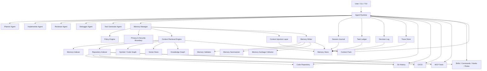
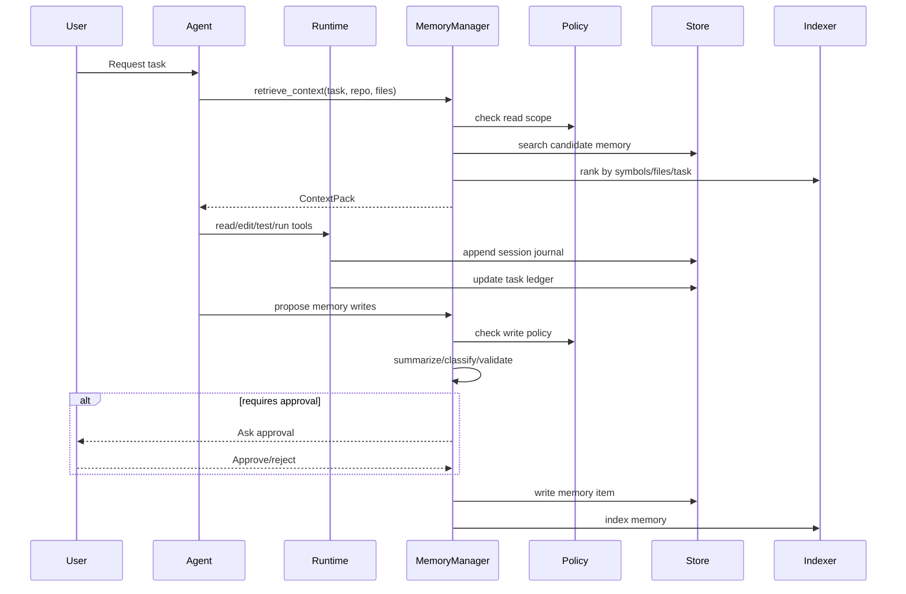

# Next-Generation Memory Architecture for Coding Agents

## 1. Executive Summary

A next-generation coding-agent memory subsystem should not be a simple “chat history store” or “vector database.” For a serious coding agent, memory must become a **repository-aware, workflow-aware, policy-controlled context operating system**.

The key design idea is:

> Memory should capture durable engineering knowledge, validate it, scope it correctly, retrieve it just-in-time, inject it transparently, and continuously update it based on task outcomes.

Existing tools show useful patterns but also limitations. Claude Code is documented as an agentic coding tool that reads codebases, edits files, runs commands, and integrates with development tools; its common persistent-memory pattern revolves around explicit project/user instruction files such as `CLAUDE.md`. ([Claude][1]) OpenCode supports project rules through `AGENTS.md`, and its agent model includes primary agents and subagents with configurable prompts, models, and tool access. ([opencode.ai][2]) OpenClaw emphasizes always-available agents, skills, local execution, and broad tool/channel integration, but its skill ecosystem also highlights the security risks of untrusted agent extensions. ([GitHub][3])

The next-generation design should improve on these patterns by adding:

1. **Typed memory**, not just markdown instructions.
2. **Scoped memory**, separated by turn, session, task, repository, user, team, and organization.
3. **Evidence-backed memory**, with source references, confidence, freshness, and audit logs.
4. **Code-aware retrieval**, using symbols, files, modules, Git history, tests, diagnostics, and runtime traces.
5. **Policy-controlled writes**, preventing memory poisoning, stale rules, secret leakage, and cross-repository contamination.
6. **Context injection as a first-class subsystem**, not an ad hoc prompt-building step.
7. **Memory explainability**, so the agent can say why a memory was used.
8. **Outcome-driven memory updates**, where successful or failed attempts update future behavior.

For a Rust-based coding agent such as `opencode-rs`, the recommended MVP is:

* Local-first SQLite store
* File-based repository memory artifacts
* Session journal
* Task ledger
* Decision log
* Failure/test memory
* Rule/skill integration
* Hybrid retrieval: keyword + metadata + embeddings later
* Explicit user-visible memory writes for durable memory
* Automatic temporary/session memory
* Audit log from day one

---

## 2. Design Principles

### 2.1 Memory Is Not Context

Context is what enters the model now.

Memory is persistent, structured knowledge that may become context later.

A coding agent should never blindly inject all memory. It should retrieve, rank, compress, and explain selected memory.

### 2.2 Memory Must Be Scoped

Bad memory scope creates bad agent behavior.

A user preference like “prefer concise answers” may be user-scoped. A repository rule like “all commands must use `cargo nextest`” must not leak into another repository. A team security policy may apply across multiple repositories but should be governed.

Recommended scopes:

```text
Turn → Session → Task → Repository → Workspace → User → Team → Organization
```

### 2.3 Memory Must Be Evidence-Backed

Every durable memory item should have:

* Source
* Creator
* Timestamp
* Scope
* Confidence
* Validation status
* Expiry/deprecation policy
* Audit history

A memory without provenance is dangerous.

### 2.4 Memory Writes Should Be More Conservative Than Memory Reads

A coding agent may retrieve many memories, but it should write durable memory cautiously.

Default policy:

* Temporary memory: automatic
* Session memory: automatic with summarization
* Repository memory: user-confirmed or rule-derived
* User memory: user-confirmed
* Team memory: reviewed or approved
* Organization memory: governed, versioned, and auditable

### 2.5 The Memory System Should Support Agent Workflows

Memory must integrate with:

* Planning
* Editing
* Testing
* Debugging
* Reviewing
* Refactoring
* Documentation
* Git operations
* PR generation
* Subagent delegation
* Skills/rules/hooks/MCP tools

A memory system that only helps chat continuation is insufficient.

### 2.6 Memory Must Be Safe by Default

Security controls are mandatory because coding agents can read files, run commands, call tools, and operate on credentials. OpenClaw’s public skill security issues are a useful warning that agent extension ecosystems need trust boundaries, verification, and policy enforcement. ([The Verge][4])

---

## 3. High-Level Architecture



---

## 4. Core Concept: Memory as a Context Operating System

The memory subsystem should provide four core services:

| Service     | Purpose                                                                                      |
| ----------- | -------------------------------------------------------------------------------------------- |
| Capture     | Observe conversations, edits, tests, failures, decisions, tool calls, and user confirmations |
| Persistence | Store durable, scoped, versioned, auditable memory                                           |
| Retrieval   | Find relevant memory using task, repo, file, symbol, error, and workflow signals             |
| Injection   | Convert retrieved memory into compact, prioritized context packs for the model               |

The agent runtime should not directly read memory files and concatenate them into prompts. Instead, it should request a **Context Pack** from the Memory Manager.

Example:

```text
Agent Runtime:
  "I am planning a refactor in crates/runtime/src/tools.rs.
   Give me relevant memory for planning and risk analysis."

Memory Manager:
  returns ContextPack {
    project_rules,
    related_architecture_decisions,
    recent failures,
    test commands,
    affected symbols,
    forbidden approaches,
    user preferences,
    relevant skills/hooks
  }
```

---

# 5. Memory Taxonomy

## 5.1 Memory Taxonomy Table

| Memory Type            | What It Stores                                                 | Created From                              | Updated By               | Retrieved By         | Lifetime          | Reliability            | Injection Style          |
| ---------------------- | -------------------------------------------------------------- | ----------------------------------------- | ------------------------ | -------------------- | ----------------- | ---------------------- | ------------------------ |
| Conversation memory    | Current dialogue facts, recent user intent, active constraints | Chat turns                                | Each turn                | Current task         | Short             | Medium                 | Inline session context   |
| Session memory         | Session summary, active task state, unresolved issues          | Session journal                           | Summarizer               | Continuation, resume | Hours/days        | Medium                 | Session brief            |
| Task memory            | Goal, plan, files touched, decisions, test status              | Task ledger                               | Planner/runtime          | Task execution       | Until task closed | High if verified       | Task state block         |
| Repository memory      | Project conventions, architecture, commands, known constraints | AGENTS.md, repo scans, user confirmations | User/agent with approval | All repo tasks       | Long              | High if sourced        | Project rules/context    |
| File/module memory     | File responsibilities, invariants, risky areas                 | Repo indexer, summaries, reviews          | Indexer/reviewer         | File editing         | Medium/long       | Medium                 | File pre-edit brief      |
| Symbol-level memory    | Function/class/type purpose, call relationships, invariants    | LSP, tree-sitter, code graph              | Repo indexer             | Symbol edits/search  | Medium            | Medium/high            | Symbol card              |
| Architecture memory    | System boundaries, layers, patterns, ADRs                      | Docs, decisions, code graph               | User/reviewer            | Planning/refactor    | Long              | High if linked to ADR  | Architecture constraints |
| Dependency/API memory  | Library usage, internal APIs, version constraints              | Cargo/npm files, docs, failures           | Indexer/debugger         | Implementation       | Medium            | Medium                 | API usage notes          |
| Error/debugging memory | Error signatures, root causes, fixes, failed attempts          | Test failures, logs, debugger             | Debugger                 | Failure handling     | Long if recurring | High if outcome-backed | Debug playbook           |
| Test memory            | Test commands, fixtures, flaky tests, coverage gaps            | Test runs, CI reports                     | Test agent               | Testing/debugging    | Medium/long       | High if recent         | Test strategy block      |
| User preference memory | Preferred style, language, workflow, verbosity                 | Explicit user statements                  | User only or confirmed   | All interactions     | Long              | High if explicit       | Behavior hints           |
| Team/org memory        | Engineering standards, security rules, release policy          | Team docs, approved rules                 | Governance flow          | Team repos           | Long              | High                   | Mandatory policy block   |
| Skill/rule/hook memory | Available skills, when to use hooks, command patterns          | Config files, skill registry              | Runtime/indexer          | Tool planning        | Medium            | Depends on trust       | Tool guidance            |
| Tool/MCP memory        | Tool capabilities, schemas, reliability, previous results      | MCP introspection, tool calls             | Tool runtime             | Tool selection       | Medium            | Medium                 | Tool selection hints     |
| Decision memory        | Why a choice was made, alternatives rejected                   | Planner/reviewer/user                     | Decision log             | Future planning      | Long              | High if approved       | Decision record          |
| Execution trace memory | Tool calls, commands, outputs, edits, timings                  | Runtime trace                             | Runtime                  | Debug/audit          | Short/medium      | High raw, noisy        | Rarely injected directly |

---

## 5.2 Practical Interpretation

A mature coding agent should treat these memory types differently.

For example:

* **Conversation memory** can be noisy and temporary.
* **Repository memory** should be stable and explicit.
* **Error memory** should be outcome-backed.
* **Team memory** should be governed.
* **Execution traces** should be stored for audit and summarization, not directly injected unless debugging.

---

# 6. Component Design

## 6.1 Memory Manager

The central orchestrator.

Responsibilities:

* Accept memory read/write requests
* Enforce policy
* Route retrieval queries
* Build context packs
* Coordinate summarization and validation
* Maintain auditability
* Expose explainability

It should be the only public entry point for memory operations.

```rust
pub struct MemoryManager {
    store: Arc<dyn MemoryStore>,
    retriever: Arc<ContextRetrievalEngine>,
    injector: Arc<ContextInjectionLayer>,
    policy: Arc<PolicyEngine>,
    validator: Arc<MemoryValidator>,
    summarizer: Arc<MemorySummarizer>,
    audit: Arc<dyn AuditLog>,
}
```

---

## 6.2 Memory Store

Persistent storage abstraction.

Responsibilities:

* Store memory items
* Store raw/summarized session journals
* Store task ledgers
* Store decision records
* Store failure/test records
* Provide transactional writes
* Support deletion and versioning

Recommended MVP implementation:

* SQLite for structured metadata
* JSON columns for flexible fields
* FTS5 for keyword search
* File-backed artifacts for large traces
* Optional vector index later

---

## 6.3 Context Retrieval Engine

The retrieval brain.

Responsibilities:

* Convert task state into retrieval queries
* Search memory store, repo index, symbol graph, and vector index
* Rank results
* Deduplicate
* Filter by scope and policy
* Return retrieval results with explanations

Retrieval should be hybrid:

```text
metadata filter
+ keyword search
+ symbol/file proximity
+ recency
+ trust level
+ task similarity
+ error similarity
+ vector similarity
+ success/failure outcome
```

---

## 6.4 Memory Indexer

Indexes memory items for retrieval.

Responsibilities:

* Build keyword index
* Build embedding index
* Extract entities: file paths, symbols, commands, packages, errors
* Update graph links
* Re-index stale memory

---

## 6.5 Repository Indexer

Maintains code-aware repository context.

Responsibilities:

* File summaries
* Module summaries
* Symbol graph
* Dependency graph
* Test map
* Command map
* Config map
* Documentation map
* Git history references

Implementation options:

* `tree-sitter` for parsing
* LSP integration for symbols/references/diagnostics
* Git metadata for history
* Language-specific analyzers where needed

---

## 6.6 Symbol Graph / Code Graph

Stores code relationships.

Examples:

```text
symbol -> file
symbol -> references
symbol -> tests
symbol -> owners
symbol -> recent commits
symbol -> related failures
symbol -> architecture layer
```

This is critical for high-precision memory injection before editing.

---

## 6.7 Vector Store

Used for semantic retrieval.

MVP can skip this or use a simple embedded vector backend.

Use vector search for:

* Similar past tasks
* Similar errors
* Similar architectural decisions
* Similar module summaries
* Similar code review comments

Do not rely only on vector search. Coding-agent retrieval needs exact file, symbol, command, error, and test matching.

---

## 6.8 Knowledge Graph

Stores typed relationships.

Examples:

```text
Repository uses Framework
Module belongs_to Layer
Symbol tested_by TestFile
Error fixed_by MemoryItem
Rule applies_to PathPattern
Decision supersedes Decision
Skill requires Permission
```

Knowledge graph can start as relational tables and evolve later.

---

## 6.9 Session Journal

Append-only record of the current session.

Stores:

* User requests
* Agent plans
* Tool calls
* Files read
* Files edited
* Commands run
* Test outputs
* Errors
* User confirmations
* Agent summaries

The journal is mostly raw, but summarized periodically.

---

## 6.10 Task Ledger

Structured task state.

Stores:

* Task goal
* Current plan
* Subtasks
* Files touched
* Commands run
* Test status
* Open risks
* Decisions
* Completion status

Unlike the session journal, the task ledger is intended to be injected often.

---

## 6.11 Decision Log

Records important engineering decisions.

Example:

```text
Decision:
  Use rusqlite + SQLite FTS5 for MVP memory store.
Reason:
  Local-first, simple deployment, transactional, good enough for metadata + keyword retrieval.
Rejected:
  PostgreSQL, because it complicates local installation.
Scope:
  opencode-rs memory subsystem.
Status:
  accepted.
```

---

## 6.12 Trace Store

Stores raw execution data.

Examples:

* Full shell outputs
* Tool call inputs/outputs
* Test logs
* LSP diagnostics
* MCP responses
* Agent step timings

Trace data is high-volume and should not be injected by default.

---

## 6.13 Memory Summarizer

Converts noisy traces into useful memory.

Responsibilities:

* Summarize sessions
* Extract decisions
* Extract failed approaches
* Extract recurring errors
* Extract conventions
* Produce candidate memory write requests

The summarizer should not directly write durable memory without policy approval.

---

## 6.14 Memory Validator

Checks whether memory is safe, valid, and useful.

Validation dimensions:

* Is it factual?
* Is it supported by evidence?
* Is it scoped correctly?
* Is it stale?
* Does it contain secrets?
* Does it conflict with higher-priority rules?
* Is it duplicated?
* Is it malicious or prompt-injection-like?
* Was the outcome successful?

---

## 6.15 Memory Garbage Collector

Handles memory decay.

Responsibilities:

* Expire temporary memory
* Deprecate stale memory
* Merge duplicates
* Archive old traces
* Delete user-requested memory
* Remove repo memory when repo identity changes
* Flag memories not used for a long time

---

## 6.16 Policy Engine

Controls memory read/write behavior.

Policies include:

* Scope isolation
* User approval requirements
* Team approval requirements
* Secret handling
* Trust levels
* Tool/skill permissions
* Cross-repo access
* Audit requirements
* Retention windows

---

## 6.17 Privacy / Security Boundary

All memory writes and reads pass through this boundary.

Controls:

* Secret detection
* PII detection
* `.env` / key redaction
* Credential path redaction
* Prompt-injection detection
* Untrusted skill output classification
* Tool output sandboxing
* Per-repo isolation

---

## 6.18 Context Injection Layer

Builds final model context.

Responsibilities:

* Select memory items
* Compress/summarize
* Deduplicate
* Order by priority
* Add source attribution
* Respect token budget
* Separate mandatory rules from optional hints
* Produce explainable context packs

Output:

```rust
pub struct ContextPack {
    pub pack_id: ContextPackId,
    pub purpose: ContextPurpose,
    pub token_budget: usize,
    pub sections: Vec<ContextSection>,
    pub source_memory_ids: Vec<MemoryId>,
    pub omitted: Vec<OmittedContext>,
}
```

---

# 7. Storage Model

## 7.1 Recommended Local-First Layout

For a Rust-based agent:

```text
~/.opencode-rs/
  memory/
    user/
      memory.db
      audit.log
      preferences.md
      global-rules.md
    cache/
      embeddings/
      repo-indexes/
      traces/

<repo>/
  .opencode-rs/
    memory/
      repo.db
      AGENTS.md
      decisions/
        ADR-0001-memory-store.md
        ADR-0002-tool-policy.md
      conventions/
        rust.md
        testing.md
      summaries/
        repository-summary.md
        module-summaries/
      tasks/
        task-2026-04-28-refactor-runtime.json
      traces/
        session-xxx.jsonl
      policies/
        memory-policy.toml
```

For compatibility with existing agent ecosystems, the agent should also read conventional instruction files where appropriate:

```text
AGENTS.md
CLAUDE.md
.cursor/rules/*
.continue/*
.github/copilot-instructions.md
```

But these should be normalized into internal memory records with source attribution and priority.

---

## 7.2 SQLite Schema Sketch

```sql
CREATE TABLE memory_items (
    id TEXT PRIMARY KEY,
    scope_kind TEXT NOT NULL,
    scope_id TEXT NOT NULL,
    memory_type TEXT NOT NULL,
    title TEXT NOT NULL,
    summary TEXT NOT NULL,
    body TEXT,
    source_kind TEXT NOT NULL,
    source_ref TEXT,
    confidence REAL NOT NULL,
    trust_level TEXT NOT NULL,
    status TEXT NOT NULL,
    created_at TEXT NOT NULL,
    updated_at TEXT NOT NULL,
    expires_at TEXT,
    last_used_at TEXT,
    use_count INTEGER DEFAULT 0,
    success_score REAL DEFAULT 0.0,
    metadata_json TEXT NOT NULL
);

CREATE VIRTUAL TABLE memory_fts USING fts5(
    title,
    summary,
    body,
    content='memory_items',
    content_rowid='rowid'
);

CREATE TABLE memory_links (
    id TEXT PRIMARY KEY,
    from_memory_id TEXT NOT NULL,
    to_memory_id TEXT NOT NULL,
    link_type TEXT NOT NULL,
    confidence REAL NOT NULL
);

CREATE TABLE memory_entities (
    id TEXT PRIMARY KEY,
    memory_id TEXT NOT NULL,
    entity_type TEXT NOT NULL,
    entity_value TEXT NOT NULL,
    normalized_value TEXT
);

CREATE TABLE memory_audit_log (
    id TEXT PRIMARY KEY,
    memory_id TEXT,
    action TEXT NOT NULL,
    actor TEXT NOT NULL,
    reason TEXT,
    before_json TEXT,
    after_json TEXT,
    created_at TEXT NOT NULL
);
```

---

## 7.3 Repo Identity

Repository memory must be tied to stable repo identity.

```text
repo_id = hash(remote_url + root_path + initial_commit_hash)
```

For private/forked repos, allow user override:

```toml
[memory.repo_identity]
repo_id = "opencode-rs"
team_scope = "local-only"
```

---

## 7.4 Storage Layers

| Layer          | Storage                              | Purpose                    |
| -------------- | ------------------------------------ | -------------------------- |
| Hot session    | In-memory + JSONL                    | Fast active state          |
| Local durable  | SQLite                               | Structured memory          |
| File artifacts | Markdown/JSON                        | Human-readable repo memory |
| Search index   | SQLite FTS / Tantivy                 | Keyword retrieval          |
| Vector index   | LanceDB/Qdrant-lite/SQLite extension | Semantic retrieval         |
| Code graph     | SQLite / sled / redb                 | Symbol relationships       |
| Team sync      | Git repo / remote service            | Shared memory              |
| Audit log      | Append-only JSONL + DB               | Governance                 |

---

## 7.5 Encryption and Access Control

Recommended defaults:

* Local DB unencrypted by default for MVP, optional encryption later
* Sensitive fields encrypted using OS keychain-derived keys
* Secrets never stored unless explicitly allowed
* Team memory signed or reviewed
* Untrusted skill/tool memory cannot become durable without validation

---

# 8. Memory Lifecycle



## 8.1 Lifecycle Steps

### Capture

Happens during:

* User message
* Agent plan
* Tool call
* File read/edit
* Shell execution
* Test run
* Failure
* User approval
* Commit/PR generation

Captured into:

* Session journal
* Task ledger
* Trace store

### Normalize

Convert raw events into standard forms.

Examples:

```text
cargo test failure → TestFailureEvent
user says “always use nextest” → CandidateUserPreference
edit file → FileChangeEvent
```

### Summarize

Compress raw traces.

Examples:

* Session summary
* Task summary
* Failure summary
* Module summary
* Decision summary

### Classify

Assign memory type and scope.

Example:

```text
"Use cargo nextest for this repo"
→ type: TestMemory / RepositoryMemory
→ scope: repository
→ requires approval: maybe yes
```

### Validate

Check:

* Evidence
* Secret leakage
* Conflicts
* Staleness
* Scope
* Trust

### Store

Persist in DB/file store.

### Index

Index by:

* Text
* Tags
* Files
* Symbols
* Errors
* Commands
* Packages
* Memory type
* Scope

### Retrieve

Based on active task.

### Rank

Use weighted scoring.

### Inject

Build context pack under token budget.

### Use

Agent performs task.

### Observe Outcome

Was the memory useful?

Signals:

* Tests passed
* User accepted
* Build succeeded
* Reviewer approved
* Same failure avoided
* Memory was ignored or contradicted

### Update

Adjust confidence, success score, last used time, links.

### Deprecate

Mark stale or superseded memory.

### Delete

User-requested or policy-driven removal.

---

# 9. Retrieval and Context Injection

## 9.1 Retrieval Query Inputs

A retrieval query should contain:

```rust
pub struct RetrievalQuery {
    pub purpose: ContextPurpose,
    pub user_request: String,
    pub repo_id: Option<RepoId>,
    pub task_id: Option<TaskId>,
    pub session_id: Option<SessionId>,
    pub files: Vec<PathBuf>,
    pub symbols: Vec<SymbolRef>,
    pub errors: Vec<ErrorSignature>,
    pub commands: Vec<String>,
    pub agent_role: AgentRole,
    pub token_budget: usize,
    pub required_memory_types: Vec<MemoryType>,
    pub excluded_scopes: Vec<MemoryScope>,
}
```

---

## 9.2 Ranking Formula

Example scoring:

```text
score =
  0.25 * scope_match
+ 0.20 * file_symbol_proximity
+ 0.15 * task_similarity
+ 0.10 * recency
+ 0.10 * success_score
+ 0.08 * trust_level
+ 0.05 * user_confirmation
+ 0.04 * rule_priority
+ 0.03 * freshness
- 0.20 * staleness_penalty
- 0.30 * conflict_penalty
- 0.50 * untrusted_source_penalty
```

## 9.3 Retrieval Signals

| Signal               | Meaning                                                 |
| -------------------- | ------------------------------------------------------- |
| Repository relevance | Same repo or workspace                                  |
| File proximity       | Same file, directory, module                            |
| Symbol proximity     | Same function/type/interface or call graph neighborhood |
| Recent usage         | Used successfully in recent sessions                    |
| Recency              | Recently created/updated                                |
| User confirmation    | Explicitly approved                                     |
| Success rate         | Associated with successful outcomes                     |
| Task similarity      | Similar natural-language task                           |
| Error similarity     | Similar stack trace/error signature                     |
| Rule priority        | Mandatory project/team rule                             |
| Confidence score     | Validator confidence                                    |
| Trust level          | Source trust                                            |
| Freshness            | Not stale relative to code changes                      |

---

## 9.4 Context Pack Structure

```text
Context Pack
├── Mandatory Instructions
│   ├── Team policies
│   ├── Repo rules
│   └── Safety constraints
├── Task Continuity
│   ├── Current goal
│   ├── Current plan
│   └── Open risks
├── Relevant Code Intelligence
│   ├── Files
│   ├── Symbols
│   └── Module summaries
├── Relevant Past Knowledge
│   ├── Similar bugs
│   ├── Past decisions
│   └── Failed approaches
├── Tooling Guidance
│   ├── Test commands
│   ├── Build commands
│   └── Skills/hooks/MCP tools
└── Source Attribution
```

---

## 9.5 Injection by Workflow

| Workflow               | Memory Needed                                               | Injection Style             |
| ---------------------- | ----------------------------------------------------------- | --------------------------- |
| Task understanding     | User prefs, repo overview, active task state                | Compact brief               |
| Planning               | Architecture memory, decisions, constraints, prior failures | Structured planning context |
| Code search            | Repo index, symbol graph, module summaries                  | Search hints                |
| File editing           | File/module memory, symbol invariants, tests                | Pre-edit guardrail          |
| Tool execution         | Tool/MCP memory, command history, safety rules              | Tool selection hints        |
| Test failure debugging | Error memory, test memory, recent changes                   | Debug playbook              |
| Refactoring            | Architecture, dependency graph, test map, decisions         | Refactor risk pack          |
| Code review            | Team standards, security rules, past review comments        | Review rubric               |
| Commit generation      | Task ledger, changed files, decisions                       | Commit summary pack         |
| PR description         | Task goal, tests run, risks, decisions                      | PR narrative pack           |
| Multi-agent delegation | Role-specific memory, task boundaries                       | Agent-specific context      |

---

# 10. Memory Write Policy

## 10.1 Write Classes

| Write Class              | Approval                   | Examples                                      |
| ------------------------ | -------------------------- | --------------------------------------------- |
| Ephemeral scratch        | No                         | Current reasoning notes, temporary hypotheses |
| Session journal          | No                         | Tool calls, file reads, commands              |
| Task ledger              | No, but visible            | Plan, subtasks, status                        |
| Candidate durable memory | User confirmation          | “Always use cargo nextest”                    |
| Repo memory              | Usually user confirmation  | Project conventions                           |
| User memory              | Explicit user confirmation | Personal preferences                          |
| Team memory              | Review/approval            | Team standards                                |
| Org memory               | Governance                 | Security policy                               |

---

## 10.2 What Should Always Be Remembered

Automatically, but usually scoped to session/task unless promoted:

* Current task goal
* Files edited
* Commands run
* Test results
* Known failures during the task
* User-approved plan
* User rejection of a specific approach
* Temporary constraints

---

## 10.3 What Should Sometimes Be Remembered

With confirmation or validation:

* Project coding conventions
* Test command preferences
* Reusable debugging fixes
* Architecture decisions
* Known flaky tests
* Module invariants
* Tool reliability notes
* Dependency constraints
* Common PR review comments

---

## 10.4 What Should Never Be Remembered by Default

* API keys
* Tokens
* Passwords
* Private keys
* `.env` contents
* Production customer data
* Personal sensitive data
* One-off emotional statements
* Unverified tool output from untrusted skills
* Malicious instructions embedded in logs or docs
* Credentials accidentally printed in command output

---

## 10.5 Memory Poisoning Prevention

Controls:

1. Treat tool output as untrusted unless tool is trusted.
2. Never promote instructions from logs/test output automatically.
3. Require source attribution.
4. Require higher approval for team/org memory.
5. Detect prompt-injection patterns.
6. Detect secret-like strings.
7. Use scoped memory isolation.
8. Track conflicts and supersession.
9. Keep rollback history.
10. Expose `explain_memory_use`.

---

# 11. Agent Workflow Integration

## 11.1 Planner Agent

Needs:

* Task memory
* Repo architecture
* Past decisions
* Known constraints
* Similar tasks
* Failed approaches

Can write:

* Task plan
* Candidate decisions
* Risk notes

Must not write:

* User/team durable preferences without approval

Effect:

* Produces plans consistent with project history and constraints.

---

## 11.2 Implementer Agent

Needs:

* File/module memory
* Symbol memory
* API/dependency memory
* Test command memory
* Current task ledger

Can write:

* File change trace
* Implementation notes
* Candidate module summary updates

Must not write:

* Long-term architectural decisions without review

Effect:

* Edits fewer wrong files and respects invariants.

---

## 11.3 Reviewer Agent

Needs:

* Team rules
* Repo rules
* Security policy
* Past review findings
* Architecture decisions
* Changed files

Can write:

* Review findings
* Candidate recurring issue memory
* Quality gate results

Must not write:

* User preferences or unverified conventions

Effect:

* Reviews become consistent across sessions.

---

## 11.4 Debugger Agent

Needs:

* Error/debugging memory
* Test memory
* Recent changes
* Logs
* Similar failures

Can write:

* Failure record
* Root cause
* Fix outcome
* Failed approach memory

Must not write:

* Raw secrets from logs

Effect:

* Avoids repeating failed debugging paths.

---

## 11.5 Test Generator Agent

Needs:

* Test memory
* Existing test patterns
* Coverage gaps
* Flaky test records
* Module invariants

Can write:

* Test coverage notes
* New test patterns
* Flaky test candidates

Must not write:

* Permanent test policy without approval

Effect:

* Generates tests aligned with project style.

---

## 11.6 Refactoring Agent

Needs:

* Architecture memory
* Symbol graph
* Dependency graph
* Test map
* Past refactor failures
* Module boundaries

Can write:

* Refactor plan
* Migration notes
* Candidate architecture updates

Must not write:

* Final architecture memory without review

Effect:

* Reduces unsafe refactors.

---

## 11.7 Documentation Agent

Needs:

* Decisions
* Architecture summaries
* Public API memory
* User-facing behavior

Can write:

* Doc summaries
* Candidate README updates
* Documentation gap memory

Must not write:

* Unverified technical facts

Effect:

* Documentation remains aligned with real implementation.

---

## 11.8 Security Review Agent

Needs:

* Security policies
* Secret detection rules
* Dependency vulnerabilities
* Sensitive paths
* Skill/tool trust metadata

Can write:

* Security findings
* Risk records
* Rejected unsafe approaches

Must not write:

* Secret values

Effect:

* Enforces safety around code, tools, and memory.

---

## 11.9 Release Agent

Needs:

* Task ledger
* Git history
* PRs
* CI results
* Migration notes
* Known risks

Can write:

* Release notes
* Deployment memory
* Rollback notes

Must not write:

* Permanent team policy

Effect:

* Produces better changelogs and release summaries.

---

# 12. Integration with Coding-Agent Features

## 12.1 Skills

Memory should record:

* Available skills
* Skill purpose
* Required permissions
* Trust level
* Usage history
* Failures
* Known risks

Skill output should be marked as source-specific and trust-limited.

---

## 12.2 Commands

Commands can read memory to populate context.

Examples:

```text
/memory search "test command"
/memory explain
/memory remember "Use cargo nextest in this repo"
/memory forget <id>
/resume-task <task-id>
/debug-last-failure
```

---

## 12.3 Rules

Rules should be represented as high-priority memory items.

Sources:

* `AGENTS.md`
* `CLAUDE.md`
* `.cursor/rules`
* Team policy
* User-created rules

OpenCode’s `AGENTS.md` model is a useful existing pattern for project instructions. ([opencode.ai][2]) The next-generation approach should parse these into typed, scoped, validated rule memory rather than treating them only as plain prompt text.

---

## 12.4 Hooks

Hooks should trigger memory lifecycle events.

Examples:

| Hook            | Memory Action                         |
| --------------- | ------------------------------------- |
| `session_start` | Load repo/user/team context           |
| `before_plan`   | Retrieve architecture and task memory |
| `before_edit`   | Retrieve file/symbol memory           |
| `after_edit`    | Update task ledger                    |
| `after_test`    | Record test result                    |
| `on_failure`    | Record failure candidate              |
| `before_commit` | Retrieve commit context               |
| `session_end`   | Summarize session                     |

---

## 12.5 Subagents

Each subagent should receive role-specific context packs.

OpenCode’s model of primary agents and subagents suggests a useful foundation for this pattern. ([opencode.ai][5]) The improvement is to make memory retrieval role-aware.

Example:

```text
Planner receives:
  architecture + decisions + constraints

Implementer receives:
  file summaries + symbol invariants + commands

Reviewer receives:
  rules + security policy + prior review issues
```

---

## 12.6 MCP Tools

Memory should track:

* Tool schemas
* Tool reliability
* Permissions
* Last successful usage
* Common failure modes
* Sensitive output classification

MCP output should not automatically become durable memory unless validated.

---

## 12.7 Repository Context

Memory should connect to:

* Files
* Modules
* Symbols
* Tests
* Build commands
* Git history
* Docs
* Configuration

Repository memory should be invalidated when relevant code changes.

---

## 12.8 Git History

Use Git for:

* Change frequency
* Ownership hints
* Recently changed files
* Decision provenance
* Regression investigation
* Memory invalidation

Example:

```text
If module summary references old architecture and related files changed heavily, lower confidence.
```

---

## 12.9 CI/CD, Test Reports, Logs, Runtime Telemetry

Use as evidence, not raw memory.

Examples:

* Repeated CI failure becomes error memory.
* Flaky test pattern becomes test memory.
* Deployment failure becomes release/debug memory.
* Runtime telemetry informs architecture risk memory.

---

# 13. Concrete Data Model

## 13.1 Rust-Like Types

```rust
#[derive(Debug, Clone, Serialize, Deserialize)]
pub struct MemoryItem {
    pub id: MemoryId,
    pub scope: MemoryScope,
    pub memory_type: MemoryType,
    pub title: String,
    pub summary: String,
    pub body: Option<String>,
    pub source: MemorySource,
    pub confidence: Confidence,
    pub trust_level: TrustLevel,
    pub status: MemoryStatus,
    pub entities: Vec<MemoryEntity>,
    pub links: Vec<MemoryLink>,
    pub evidence: Vec<EvidenceRef>,
    pub policy: MemoryPolicy,
    pub created_at: DateTime<Utc>,
    pub updated_at: DateTime<Utc>,
    pub expires_at: Option<DateTime<Utc>>,
    pub last_used_at: Option<DateTime<Utc>>,
    pub use_count: u64,
    pub success_score: f32,
    pub metadata: serde_json::Value,
}
```

---

## 13.2 Memory Scope

```rust
#[derive(Debug, Clone, Serialize, Deserialize)]
pub enum MemoryScope {
    Turn { turn_id: TurnId },
    Session { session_id: SessionId },
    Task { task_id: TaskId },
    Repository { repo_id: RepoId },
    Workspace { workspace_id: WorkspaceId },
    User { user_id: UserId },
    Team { team_id: TeamId },
    Organization { org_id: OrgId },
}
```

---

## 13.3 Memory Type

```rust
#[derive(Debug, Clone, Serialize, Deserialize)]
pub enum MemoryType {
    Conversation,
    SessionSummary,
    TaskState,
    RepositoryConvention,
    FileSummary,
    ModuleSummary,
    SymbolInvariant,
    ArchitectureDecision,
    DependencyApiUsage,
    ErrorDebugging,
    TestKnowledge,
    UserPreference,
    TeamPolicy,
    SkillRuleHook,
    ToolMcpKnowledge,
    Decision,
    ExecutionTraceSummary,
}
```

---

## 13.4 Memory Source

```rust
#[derive(Debug, Clone, Serialize, Deserialize)]
pub enum MemorySource {
    UserMessage {
        session_id: SessionId,
        turn_id: TurnId,
    },
    AgentObservation {
        agent_role: AgentRole,
        trace_id: TraceId,
    },
    File {
        path: PathBuf,
        commit: Option<String>,
    },
    Git {
        commit: String,
        diff_ref: Option<String>,
    },
    TestRun {
        run_id: TestRunId,
    },
    ToolCall {
        tool_name: String,
        call_id: ToolCallId,
        trust_level: TrustLevel,
    },
    Mcp {
        server: String,
        tool: String,
        call_id: ToolCallId,
    },
    Manual {
        actor: String,
    },
}
```

---

## 13.5 Confidence and Trust

```rust
#[derive(Debug, Clone, Serialize, Deserialize)]
pub struct Confidence {
    pub score: f32, // 0.0 - 1.0
    pub reason: String,
}

#[derive(Debug, Clone, Serialize, Deserialize)]
pub enum TrustLevel {
    System,
    UserConfirmed,
    TeamApproved,
    RepositoryFile,
    ToolTrusted,
    ToolUntrusted,
    AgentInferred,
    ExternalUnverified,
}
```

---

## 13.6 Lifecycle Status

```rust
#[derive(Debug, Clone, Serialize, Deserialize)]
pub enum MemoryStatus {
    Candidate,
    Active,
    NeedsReview,
    Deprecated,
    Superseded { by: MemoryId },
    Rejected,
    Deleted,
}
```

---

## 13.7 Retrieval Result

```rust
#[derive(Debug, Clone, Serialize, Deserialize)]
pub struct RetrievalResult {
    pub memory: MemoryItem,
    pub score: f32,
    pub matched_signals: Vec<RetrievalSignal>,
    pub explanation: String,
    pub recommended_injection: InjectionMode,
}
```

---

## 13.8 Context Pack

```rust
#[derive(Debug, Clone, Serialize, Deserialize)]
pub struct ContextPack {
    pub id: ContextPackId,
    pub purpose: ContextPurpose,
    pub agent_role: AgentRole,
    pub token_budget: usize,
    pub estimated_tokens: usize,
    pub sections: Vec<ContextSection>,
    pub source_memory_ids: Vec<MemoryId>,
    pub omitted: Vec<OmittedContext>,
    pub created_at: DateTime<Utc>,
}
```

```rust
#[derive(Debug, Clone, Serialize, Deserialize)]
pub struct ContextSection {
    pub title: String,
    pub priority: ContextPriority,
    pub content: String,
    pub source_refs: Vec<EvidenceRef>,
    pub injection_mode: InjectionMode,
}
```

---

## 13.9 Memory Write Request

```rust
#[derive(Debug, Clone, Serialize, Deserialize)]
pub struct MemoryWriteRequest {
    pub proposed_scope: MemoryScope,
    pub memory_type: MemoryType,
    pub title: String,
    pub summary: String,
    pub body: Option<String>,
    pub source: MemorySource,
    pub evidence: Vec<EvidenceRef>,
    pub requested_by: Actor,
    pub requires_approval: bool,
    pub reason: String,
}
```

---

## 13.10 Audit Log

```rust
#[derive(Debug, Clone, Serialize, Deserialize)]
pub struct MemoryAuditLog {
    pub id: AuditId,
    pub memory_id: Option<MemoryId>,
    pub action: AuditAction,
    pub actor: Actor,
    pub reason: Option<String>,
    pub before: Option<serde_json::Value>,
    pub after: Option<serde_json::Value>,
    pub created_at: DateTime<Utc>,
}
```

---

# 14. API Design

## 14.1 `remember`

```rust
async fn remember(req: MemoryWriteRequest) -> Result<MemoryWriteResult>;
```

Behavior:

1. Validate scope.
2. Detect secrets.
3. Check conflicts.
4. Determine approval requirement.
5. Store as `Candidate` or `Active`.
6. Index if active.
7. Write audit log.

Example:

```json
{
  "proposed_scope": { "Repository": { "repo_id": "opencode-rs" } },
  "memory_type": "TestKnowledge",
  "title": "Use cargo nextest for full Rust test runs",
  "summary": "For this repository, prefer `cargo nextest run` over plain `cargo test` when running the full test suite.",
  "source": {
    "UserMessage": {
      "session_id": "s_123",
      "turn_id": "t_456"
    }
  },
  "requires_approval": true,
  "reason": "Durable repository testing convention"
}
```

---

## 14.2 `forget`

```rust
async fn forget(req: ForgetRequest) -> Result<ForgetResult>;
```

Supports:

* Delete memory
* Deprecate memory
* Remove from retrieval
* Hard delete sensitive memory
* Delete by scope

---

## 14.3 `search_memory`

```rust
async fn search_memory(req: SearchMemoryRequest) -> Result<Vec<RetrievalResult>>;
```

For user-visible memory search.

Example CLI:

```bash
opencode-rs memory search "nextest"
```

---

## 14.4 `retrieve_context`

```rust
async fn retrieve_context(req: RetrievalQuery) -> Result<ContextPack>;
```

This is the most important runtime API.

Used before:

* Planning
* Editing
* Testing
* Reviewing
* Debugging
* Committing

---

## 14.5 `summarize_session`

```rust
async fn summarize_session(session_id: SessionId) -> Result<SessionSummary>;
```

Outputs:

* What happened
* Files touched
* Commands run
* Decisions made
* Failures encountered
* Candidate durable memories

---

## 14.6 `record_decision`

```rust
async fn record_decision(req: DecisionRecordRequest) -> Result<MemoryId>;
```

Stores an architecture or task decision.

---

## 14.7 `record_failure`

```rust
async fn record_failure(req: FailureRecordRequest) -> Result<MemoryId>;
```

Stores:

* Error signature
* Context
* Root cause
* Fix
* Failed attempts
* Successful command/test

---

## 14.8 `record_test_result`

```rust
async fn record_test_result(req: TestResultRecordRequest) -> Result<MemoryId>;
```

Stores:

* Command
* Exit status
* Failed tests
* Flaky marker
* Coverage if available
* Related files

---

## 14.9 `promote_memory`

```rust
async fn promote_memory(req: PromoteMemoryRequest) -> Result<MemoryId>;
```

Moves memory upward in scope.

Examples:

```text
session → repository
repository → team
candidate → active
```

Requires policy checks.

---

## 14.10 `deprecate_memory`

```rust
async fn deprecate_memory(req: DeprecateMemoryRequest) -> Result<()>;
```

Marks memory stale or superseded.

---

## 14.11 `explain_memory_use`

```rust
async fn explain_memory_use(context_pack_id: ContextPackId) -> Result<MemoryUseExplanation>;
```

User-visible output:

```text
I used these memories:
1. Repo rule: Use cargo nextest for test runs.
   Source: .opencode-rs/memory/conventions/testing.md
   Reason: Current task involves test execution.

2. Past failure: minimax provider validation hung when config write failed.
   Source: session summary from 2026-04-26.
   Reason: Similar provider validation workflow.
```

---

# 15. Context Budget Management

## 15.1 Context Packing Strategy

Use priority tiers:

```text
Tier 0: System/developer instructions
Tier 1: Mandatory team/repo rules
Tier 2: Current task state
Tier 3: Relevant file/symbol memory
Tier 4: Relevant past failures/decisions
Tier 5: Optional user preferences
Tier 6: Raw excerpts only if necessary
```

## 15.2 Deduplication

Deduplicate by:

* Same source
* Same title
* Same file path
* Same symbol
* Same command
* Same semantic content
* Supersession links

## 15.3 Hierarchical Summaries

Use layered summaries:

```text
Repo summary
  → Module summary
    → File summary
      → Symbol card
```

Inject the lowest sufficient level.

Do not inject full repo summary when editing one function unless architecture context is required.

## 15.4 Lazy Retrieval

The agent can request more memory as needed.

Example:

```text
Initial context:
  "There is a known failure pattern for this module."

Lazy follow-up:
  retrieve_context(purpose = DebugFailure, error = current_error)
```

## 15.5 Progressive Disclosure

First inject:

* Summary
* Key constraints
* Source reference

Only inject raw details when:

* The agent asks
* The task requires exact command/log/file content
* The memory is high-confidence and directly relevant

## 15.6 Quoting vs Summarizing

Use exact quotes for:

* Rules
* Commands
* Error messages
* API contracts
* Security policies

Use summaries for:

* Past sessions
* Long traces
* Architecture context
* Debugging narratives

## 15.7 Confidence-Aware Injection

Low-confidence memory should be marked:

```text
Possible relevant past issue:
  This may be related to a previous config-write bug, but confidence is 0.55.
```

High-confidence memory can be directive:

```text
Repository rule:
  Use cargo nextest for full test runs.
```

---

# 16. Safety, Privacy, and Governance

## 16.1 Sensitive Data Detection

Detect:

* API keys
* SSH keys
* JWTs
* OAuth tokens
* Passwords
* Private keys
* `.env` values
* Database URLs
* Cloud credentials
* Customer data

Actions:

* Redact before storage
* Block durable memory write
* Store only metadata if needed
* Require explicit override for exceptional cases

---

## 16.2 User Approval

Required for:

* User-level preferences
* Durable repository conventions inferred from behavior
* Promotion from session to repo memory
* Memories that change future agent behavior
* Any memory with ambiguous sensitivity

---

## 16.3 Team Approval

Required for:

* Team standards
* Shared rules
* Shared debugging playbooks
* Cross-repo conventions
* CI/CD policy
* Security policy

---

## 16.4 Memory Audit Logs

Every durable memory operation should be auditable:

* Create
* Update
* Promote
* Deprecate
* Delete
* Inject
* Reject
* Conflict resolution

---

## 16.5 Source Attribution

Every memory item should answer:

```text
Where did this come from?
Who approved it?
When was it last validated?
What code/docs/tests support it?
```

---

## 16.6 Cross-Repository Isolation

Default:

```text
Repository memory cannot cross repositories.
```

Allowed only when:

* User explicitly promotes to user/team memory
* Team policy approves
* Source attribution remains visible

---

## 16.7 Memory Export/Import

Support:

```bash
opencode-rs memory export --scope repo --format json
opencode-rs memory import memory.json --review
```

Import should create candidate memories, not active memories, unless signed/trusted.

---

## 16.8 Deletion Guarantees

Support:

* Soft delete
* Hard delete
* Delete by scope
* Delete sensitive artifacts
* Delete embeddings
* Delete indexes
* Audit tombstone

---

# 17. Example Workflows

## 17.1 Remembering Project Coding Conventions

User says:

```text
For this repo, always use tracing instead of println for runtime logging.
```

Flow:

1. Capture user statement.
2. Classify as repository convention.
3. Create memory write request.
4. Ask confirmation or auto-accept if explicit enough.
5. Store as active repo memory.
6. Index tags: `logging`, `tracing`, `println`.
7. Inject before editing Rust runtime files.

Memory item:

```json
{
  "type": "RepositoryConvention",
  "scope": "Repository:opencode-rs",
  "title": "Use tracing for runtime logging",
  "summary": "Runtime logging should use tracing macros instead of println.",
  "confidence": 0.95,
  "trust_level": "UserConfirmed"
}
```

---

## 17.2 Reusing a Past Debugging Solution

Past failure:

```text
Provider validation hung because successful validation did not close the dialog and config write was not awaited.
```

Future task:

```text
Fix provider selection hang in TUI.
```

Retrieval finds:

* Similar terms: provider, validation, hang, TUI
* Same module path
* Prior successful fix

Injected memory:

```text
Relevant past debugging memory:
A previous provider-validation hang was caused by validation success not transitioning the TUI state and config persistence not completing. Before changing network validation, inspect state transition, dialog close handling, and config write path.
```

---

## 17.3 Remembering a Repository Architecture Decision

Decision:

```text
Use a separate memory-manager crate instead of embedding memory logic inside agent-runtime.
```

Stored as:

```text
ArchitectureDecision
Scope: repository
Evidence: design discussion, PR, code paths
Status: accepted
```

Injected when modifying runtime architecture.

---

## 17.4 Avoiding Repeated Failed Approaches

Failure memory:

```text
Do not parse terminal output directly for test status; use structured test runner output where possible.
```

During test harness work, the planner receives:

```text
Avoided approach:
Previous attempt to infer test status from raw terminal output was brittle. Prefer machine-readable output such as nextest JSON/JUnit where available.
```

---

## 17.5 Persisting Test Harness Knowledge

Memory:

```text
For opencode-rs TUI E2E, use fake LLM providers for deterministic flows and a real-provider smoke suite only for gated tests.
```

Injected into:

* Test generator
* Debugger
* CI planning
* Refactoring agent

---

## 17.6 Injecting Module-Specific Context Before Editing

Before editing:

```text
crates/runtime/src/tool_executor.rs
```

Retrieved:

* File summary
* Symbol invariants
* Recent failures
* Test files
* Tool permission rules
* Security constraints

Injected:

```text
Before editing tool_executor.rs:
- This module is responsible for sandboxed command/tool execution.
- Do not bypass PolicyEngine permission checks.
- Related tests: tests/tool_executor_permissions.rs.
- Past failure: command output containing secrets was previously logged without redaction.
```

---

## 17.7 Long Refactoring Project

Task:

```text
Refactor provider configuration system.
```

Memory support:

* Task ledger tracks phases.
* Session summaries preserve progress.
* Decision log records schema decisions.
* Failure memory captures broken migrations.
* File/module summaries update after each phase.
* Context pack resumes work next day.

Resume context:

```text
Current refactor state:
- Phase 1 complete: config schema split.
- Phase 2 pending: provider validation persistence.
- Known risk: TUI dialog state currently depends on old config path.
- Tests to run: provider_config_e2e, tui_connect_flow.
```

---

## 17.8 Sharing Team-Level Memory Safely

A developer proposes:

```text
All repositories should use the same security review checklist.
```

Flow:

1. Store as candidate team memory.
2. Require reviewer approval.
3. Attach source document.
4. Sign/version memory.
5. Sync to team memory repo.
6. Agents inject as mandatory review rubric.

---

# 18. Comparison with Existing Tool Patterns

## 18.1 Claude Code

Claude Code’s public documentation describes it as an agentic coding tool available across terminal, IDE, desktop, and browser surfaces that can understand codebases, edit files, run commands, and integrate with developer tools. ([Claude][1]) The common memory/config pattern around Claude Code relies heavily on explicit memory/instruction files such as `CLAUDE.md`; practitioners often describe these files as high-leverage context that gets loaded into conversations. ([humanlayer.dev][6])

Strengths:

* Simple mental model
* Human-readable memory
* Easy to version-control
* Good for project conventions

Limitations:

* Mostly text-file driven
* Limited typed memory
* Limited outcome tracking
* Limited automatic validation
* Can become stale/noisy
* Context injection may be coarse

Next-gen improvement:

* Parse `CLAUDE.md`-style files into typed, scoped, validated memory items.
* Add retrieval, ranking, source attribution, and lifecycle management.

---

## 18.2 OpenCode

OpenCode supports `AGENTS.md` rules and describes this as similar to Cursor rules. ([opencode.ai][2]) It also supports specialized agents and subagents with custom prompts, models, and tool access. ([opencode.ai][5])

Strengths:

* Project rules via simple files
* Agent/subagent abstraction
* Terminal-first coding-agent workflow
* Customization hooks through rules and agents

Limitations:

* Rule files are not enough for durable task memory
* No obvious full memory lifecycle
* Limited typed retrieval and validation model
* Agent-specific context could be more systematic

Next-gen improvement:

* Memory should be role-aware: planner, implementer, reviewer, debugger receive different context packs.
* AGENTS.md should become one source among many memory sources.

---

## 18.3 OpenClaw

OpenClaw is positioned as a locally running assistant/gateway connected to chat surfaces and AI agents, with onboarding, workspaces, channels, and skills. ([GitHub][3]) Its skill ecosystem demonstrates the power and risk of agent extensions; public reporting has highlighted malicious or unsafe skills and credential-stealing risks. ([The Verge][4])

Strengths:

* Strong tool/skill ecosystem idea
* Local assistant orientation
* Broad workflow automation model
* Useful inspiration for always-available agent memory

Limitations:

* Skill trust/security is hard
* Untrusted extension output can poison memory
* Broad personal-assistant memory can leak across domains

Next-gen improvement:

* Skill outputs must be trust-limited.
* Memory promotion from skill output must require validation.
* Tool/skill permissions should influence memory read/write.

---

## 18.4 Cursor-Like Tools

Common pattern:

* IDE-integrated context
* Workspace indexing
* Rules files
* Chat history
* Codebase-aware retrieval

Strengths:

* Good file/symbol proximity
* Strong interactive editing UX
* Good project indexing

Limitations:

* Less terminal-native
* Memory often hidden
* Long-term decision/failure memory can be weak

Next-gen improvement:

* Make memory transparent, auditable, and CLI-controllable.

---

## 18.5 Aider-Like Tools

Common pattern:

* Git-aware editing
* File-based context
* Explicit user-selected files
* Commit generation

Strengths:

* Clear edit loop
* Strong Git integration
* Simple context control

Limitations:

* Limited durable multi-session memory
* Less rich subagent/tool memory

Next-gen improvement:

* Combine Git-aware task ledger with durable repository memory.

---

## 18.6 Continue-Like Tools

Common pattern:

* IDE assistant
* Configurable context providers
* Model/provider abstraction
* Retrieval over docs/code

Strengths:

* Context-provider abstraction
* Extensible developer workflow
* Good IDE integration

Limitations:

* Memory may be retrieval-oriented rather than lifecycle-governed
* Less emphasis on task ledgers and execution traces

Next-gen improvement:

* Treat context providers as memory sources with trust and scope.

---

## 18.7 Sourcegraph/Cody-Like Systems

Common pattern:

* Code intelligence
* Search
* Repo indexing
* Enterprise codebase context

Strengths:

* Strong code search/code graph orientation
* Enterprise-scale repository awareness
* Better symbol/codebase retrieval

Limitations:

* Less focused on autonomous terminal-agent task memory
* Less emphasis on local task execution traces

Next-gen improvement:

* Combine code intelligence with task/session/decision/failure memory.

---

# 19. Implementation Roadmap

## Phase 1: MVP Memory System

Scope:

* Local SQLite memory store
* Session journal
* Task ledger
* Manual `remember` / `forget`
* Repo-scoped and user-scoped memory
* Basic keyword search
* Context pack generation
* Audit log

Data model:

* `memory_items`
* `memory_audit_log`
* `session_events`
* `task_ledger`

Required components:

* Memory Manager
* Memory Store
* Policy Engine basic
* Context Injection Layer basic

Risks:

* Overengineering
* Poor UX for memory approval
* Noisy memory

Acceptance criteria:

* Agent can resume task from previous session summary.
* User can add repo memory.
* Agent injects repo rules during planning/editing.
* User can inspect why memory was used.
* Memory can be deleted.

---

## Phase 2: Repository Memory

Scope:

* Parse `AGENTS.md`, `CLAUDE.md`, project docs
* Repository summaries
* File/module summaries
* Test command memory
* Git-aware repo identity

Required components:

* Repository Indexer
* File summarizer
* Rule importer
* Repo memory invalidation

Risks:

* Stale summaries
* Bad repo identity
* Excessive indexing cost

Acceptance criteria:

* Agent retrieves module summary before file edit.
* Rule files become typed memory.
* Repo memory does not leak across repos.
* Changed files trigger summary invalidation.

---

## Phase 3: Retrieval Engine

Scope:

* Hybrid retrieval
* Ranking signals
* Scope filtering
* Context budget management
* Deduplication

Required components:

* Context Retrieval Engine
* FTS
* Ranking model
* Context pack sections

Risks:

* Irrelevant memory injection
* Too much prompt bloat
* Hard-to-debug ranking

Acceptance criteria:

* Retrieval explains matched signals.
* Context packs fit budget.
* File/symbol relevant memory ranks higher.
* Stale memory is penalized.

---

## Phase 4: Rule / Skill / Hook Integration

Scope:

* Hook-triggered memory retrieval/write
* Skill trust metadata
* Tool/MCP memory
* Agent-role-specific context packs

Required components:

* Hook integration
* Skill registry adapter
* Tool memory schema
* Role-based injection profiles

Risks:

* Skill memory poisoning
* Permission confusion
* Tool output leaks

Acceptance criteria:

* `before_edit` retrieves file memory.
* `after_test` records test results.
* Untrusted skill output cannot become active durable memory automatically.
* Planner/reviewer/debugger receive different context packs.

---

## Phase 5: Memory Validation

Scope:

* Secret detection
* Conflict detection
* Confidence scoring
* Candidate review queue
* Deprecation/supersession

Required components:

* Memory Validator
* Privacy/Security Boundary
* Conflict resolver
* Review UI/CLI

Risks:

* False positives
* User approval fatigue
* Missed secrets

Acceptance criteria:

* Secret-like strings are redacted or blocked.
* Conflicting memory is flagged.
* User can approve/reject candidates.
* Deprecated memory is not injected by default.

---

## Phase 6: Vector and Code Graph Integration

Scope:

* Embedding index
* Symbol graph
* Error similarity
* Task similarity
* Test map

Required components:

* Vector store
* Symbol graph
* LSP/tree-sitter integration
* Error signature extractor

Risks:

* Embedding cost
* Multi-language complexity
* Index drift

Acceptance criteria:

* Similar past failures are retrieved.
* Symbol-level memory is injected before edits.
* Related tests are suggested.
* Refactoring plans use dependency graph.

---

## Phase 7: Team-Shared Memory

Scope:

* Team memory store
* Approval workflow
* Signed memory bundles
* Sync via Git or remote service
* Access control

Required components:

* Team memory backend
* Approval metadata
* Sync engine
* Conflict resolution

Risks:

* Governance complexity
* Cross-team leakage
* Trust issues

Acceptance criteria:

* Team policy is injected into team repos.
* Team memory requires approval.
* Memory sync conflicts are visible.
* Users can inspect source and approver.

---

## Phase 8: Governance and Auditability

Scope:

* Full audit logs
* Export/import
* Deletion guarantees
* Compliance reporting
* Memory usage analytics

Required components:

* Audit explorer
* Export/import CLI
* Retention policies
* Usage reporting

Risks:

* Compliance scope creep
* Performance overhead
* Data retention confusion

Acceptance criteria:

* Every durable memory write has audit entry.
* User can export repo memory.
* User can hard-delete sensitive memory.
* Agent can explain memory usage for a task.

---

# 20. Engineering Trade-Offs

## 20.1 Local-First vs Cloud Memory

| Option      | Pros                              | Cons                        | Recommendation  |
| ----------- | --------------------------------- | --------------------------- | --------------- |
| Local-first | Privacy, speed, offline, simple   | Harder team sharing         | Default         |
| Cloud       | Collaboration, central governance | Privacy/security complexity | Later, optional |
| Hybrid      | Best of both                      | More complexity             | Advanced phase  |

Recommendation:

Start local-first. Add team sync later.

---

## 20.2 Vector Store vs Knowledge Graph

| Option          | Pros                   | Cons            |
| --------------- | ---------------------- | --------------- |
| Vector store    | Good fuzzy matching    | Weak precision  |
| Knowledge graph | Strong relationships   | Harder to build |
| Hybrid          | Best retrieval quality | More complexity |

Recommendation:

Start with metadata + FTS. Add vector and graph once the lifecycle is stable.

---

## 20.3 Automatic vs Explicit Memory Writes

| Option    | Pros            | Cons                   |
| --------- | --------------- | ---------------------- |
| Automatic | Low friction    | Poisoning/noise risk   |
| Explicit  | Safe/controlled | User burden            |
| Hybrid    | Balanced        | Requires policy design |

Recommendation:

Automatic for session/task memory. Explicit approval for durable user/repo/team memory.

---

## 20.4 Repository-Level vs User-Level Memory

Repository memory is safer for technical facts.

User memory is better for personal style.

Avoid using user memory for repo-specific technical rules.

---

## 20.5 File-Based vs Database-Backed Memory

| Option     | Pros                         | Cons                   |
| ---------- | ---------------------------- | ---------------------- |
| File-based | Human-readable, Git-friendly | Harder search/metadata |
| DB-backed  | Queryable, structured        | Less transparent       |
| Hybrid     | Practical                    | Need sync rules        |

Recommendation:

Use both. DB is source of operational truth; markdown files are human-facing artifacts for important repo/team memory.

---

## 20.6 Short Summaries vs Raw Traces

Raw traces are useful for audit/debugging but too noisy for context.

Summaries are useful for injection but can lose detail.

Recommendation:

Store both separately:

```text
raw trace → trace store
summary → memory item
```

---

## 20.7 Global Memory vs Isolated Memory

Global memory improves continuity but risks contamination.

Recommendation:

Default isolation. Promote memory upward only through explicit policy.

---

## 20.8 Recall vs Precision

Too much recall creates prompt pollution.

Too much precision misses useful context.

Recommendation:

Use progressive retrieval:

1. High-precision mandatory context
2. Optional relevant memories
3. Lazy retrieval when needed

---

## 20.9 Agent Autonomy vs User Control

High autonomy is powerful but risky.

Recommendation:

Use autonomy for temporary memory and observation. Use user control for durable behavior-changing memory.

---

# 21. Key Risks and Mitigations

| Risk                     | Impact                                | Mitigation                                          |
| ------------------------ | ------------------------------------- | --------------------------------------------------- |
| Memory bloat             | Slow, irrelevant context              | GC, ranking, summarization                          |
| Stale memory             | Wrong implementation                  | expiry, invalidation, code-change detection         |
| Memory poisoning         | Unsafe agent behavior                 | trust levels, validation, approval                  |
| Secret leakage           | Security incident                     | redaction, blocking, hard delete                    |
| Cross-repo contamination | Wrong conventions                     | strict scope isolation                              |
| User approval fatigue    | Poor UX                               | candidate batching, clear diffs                     |
| Poor retrieval           | Bad coding quality                    | hybrid retrieval and explainability                 |
| Overcomplex MVP          | Delayed delivery                      | phase implementation                                |
| Untrusted skills         | Credential theft / malicious behavior | permission model, trust boundary, no auto-promotion |
| Inaccurate summaries     | Wrong memory                          | evidence refs, confidence, raw trace fallback       |

---

# 22. Recommended MVP Design

For `opencode-rs`, implement this first:

## 22.1 MVP Components

```text
MemoryManager
MemoryStore(SQLite)
SessionJournal
TaskLedger
DecisionLog
FailureMemory
TestMemory
PolicyEngine basic
ContextRetrievalEngine basic
ContextInjectionLayer basic
AuditLog
```

## 22.2 MVP Storage

```text
~/.opencode-rs/memory/user/memory.db

<repo>/.opencode-rs/memory/repo.db
<repo>/.opencode-rs/memory/tasks/*.json
<repo>/.opencode-rs/memory/traces/*.jsonl
<repo>/.opencode-rs/memory/decisions/*.md
```

## 22.3 MVP Commands

```bash
opencode-rs memory remember
opencode-rs memory forget
opencode-rs memory search
opencode-rs memory list
opencode-rs memory explain
opencode-rs memory summarize-session
opencode-rs memory candidates
opencode-rs memory approve
opencode-rs memory reject
```

## 22.4 MVP Hook Points

```text
session_start:
  load repo/user memory

before_plan:
  retrieve task/repo/decision memory

before_edit:
  retrieve file/module memory

after_test:
  record test result

on_failure:
  record failure candidate

session_end:
  summarize session and propose durable memories
```

## 22.5 MVP Rules

1. Session/task memory can be automatic.
2. Durable repo/user memory requires explicit user confirmation.
3. Secrets are never stored.
4. Repo memory never leaks across repos.
5. Every memory injection is explainable.
6. Every durable memory write is audited.
7. Memory can be deleted from CLI.

---

# 23. Final Recommended Architecture

The best next-generation memory design is a **layered, scoped, auditable, repository-aware memory system**:

```text
Agent Runtime
  ↓
Memory Manager
  ↓
Policy + Security Boundary
  ↓
Hybrid Retrieval Engine
  ↓
Typed Memory Store + Repo Index + Symbol Graph
  ↓
Context Injection Layer
  ↓
Role-specific Context Packs
```

The central product insight is:

> The memory system should not try to make the model “remember everything.”
> It should help the coding agent remember the right thing, at the right scope, at the right time, with the right confidence, and with enough evidence to trust it.

For `opencode-rs`, the most valuable first version is not a sophisticated vector-memory system. It is a disciplined **session journal + task ledger + repository memory + failure memory + context pack** system. Once that foundation is stable, add embeddings, code graph retrieval, team memory, and governance.

[1]: https://code.claude.com/docs/en/overview?utm_source=chatgpt.com "Claude Code overview - Claude Code Docs"
[2]: https://opencode.ai/docs/rules/?utm_source=chatgpt.com "Rules"
[3]: https://github.com/openclaw/openclaw/blob/main/docs/index.md?utm_source=chatgpt.com "openclaw/docs/index.md at main"
[4]: https://www.theverge.com/news/874011/openclaw-ai-skill-clawhub-extensions-security-nightmare?utm_source=chatgpt.com "OpenClaw's AI 'skill' extensions are a security nightmare"
[5]: https://opencode.ai/docs/agents/?utm_source=chatgpt.com "Agents"
[6]: https://www.humanlayer.dev/blog/writing-a-good-claude-md?utm_source=chatgpt.com "Writing a good CLAUDE.md"
