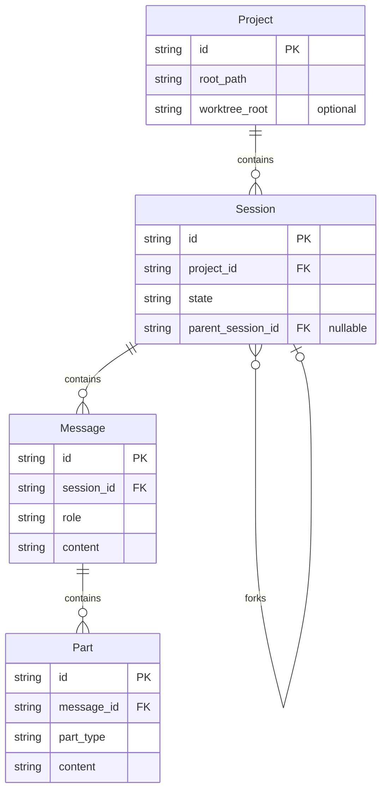

# PRD: Glossary

## Overview

This document provides canonical definitions for key terms used across the OpenCode-RS codebase and documentation. Terminology consistency is critical for AI Coding reliability and cross-document references.

---

## Core Entity Terms

### Session

**Definition**: A `Session` is a durable conversational execution context within a project. It owns an ordered sequence of messages and carries execution context such as model/agent selection and lifecycle status.

**Synonyms**: None (not called "conversation" in this codebase)

**Distinctions**:
- Session ≠ Conversation (conversation is a colloquial term; Session is the formal entity)
- Session ≠ Project (Project is the container, Session is the conversational context within)

**States**: `Idle` | `Running` | `Error` | `Aborted`

**Invariants**:
- A session belongs to exactly one project
- `Session.id` is stable once created
- Forking creates a new session identity (does not mutate parent)

**Reference**: [01-core-architecture.md](./01-core-architecture.md)

---

### Project

**Definition**: A `Project` is the durable container for a workspace being operated on by OpenCode. It defines the root filesystem boundary and owns zero or more sessions.

**Synonyms**: Workspace (in VCS context)

**Distinctions**:
- Project root ≠ Working directory (root is fixed, working dir changes per turn)
- Project ≠ Worktree (worktree is VCS-specific concept)

**Reference**: [01-core-architecture.md](./01-core-architecture.md)

---

### Message

**Definition**: A `Message` is a durable conversational record within a session that preserves ordered history for replay, resume, sharing, and summarization.

**Structure**: Messages contain ordered `Part` elements representing different content types.

**Invariants**:
- Append-oriented (destructive mutation modeled via higher-level operations)
- Message order is stable within a session

**Reference**: [01-core-architecture.md](./01-core-architecture.md)

---

### Part

**Definition**: A `Part` is a structured content element attached to a message, representing categories such as text, file references, images, tool calls, and tool results.

**Variants** (not exhaustive):
- `Text` - Plain text content
- `FileReference` - Reference to a file with optional content
- `ToolCall` - Invocation of a tool
- `ToolResult` - Result from a tool execution
- `Image` - Image content or reference

**Note**: The Part surface is versioned and extensible, not a closed enum.

**Reference**: [01-core-architecture.md](./01-core-architecture.md)

---

## Session Operations

### Fork

**Definition**: Forking creates a new child session that references the parent session lineage. The parent session history remains intact.

**Synonyms**: None (not called "branch" in this codebase)

**Distinction from Git**:
- Git "branch" is a pointer to a commit
- OpenCode "fork" creates a new session with its own identity that references parent

**Post-condition**: Child session starts in `Idle` state.

**Reference**: [01-core-architecture.md](./01-core-architecture.md)

---

### Compaction

**Definition**: Compaction is a session-level history transformation used to reduce context size while preserving durable semantics for continuation.

**Synonyms**: None (not called "summarization" although summarization may be a compaction strategy)

**Distinction**:
- Compaction is the formal operation
- Summarization is one potential strategy within compaction

**Invariants**:
- Must preserve enough information for continuation
- Should occur against a safe checkpoint boundary
- Post-compaction state must be shareable, resumable, and reviewable

**Reference**: [01-core-architecture.md](./01-core-architecture.md)

---

### Snapshot / Checkpoint

**Definition**: A snapshot (checkpoint) represents a restorable session state boundary. It exists to support revert/undo behavior, safe compaction, and recovery workflows.

**Synonyms**: Checkpoint

**Reference**: [01-core-architecture.md](./01-core-architecture.md)

---

### Revert

**Definition**: Revert is a session-level state restoration operation that targets a prior checkpoint/snapshot boundary.

**Distinction from Git**:
- Does not require per-edit Git commit model
- Expressed in session/state terms (VCS objects may be used internally)

**Reference**: [01-core-architecture.md](./01-core-architecture.md)

---

## Capability Terms

### Tool

**Definition**: A `Tool` is a built-in operation that the agent can invoke. Tools are registered in the ToolRegistry and execute within the agent loop.

**Synonyms**: Built-in tool, native tool

**Distinction**:
- Tool ≠ Skill (skill is a reusable prompt pattern, tool is executable)
- Tool ≠ Plugin (plugin is WASM-based extension, tool is native)

**Examples**: `Read`, `Write`, `Grep`, `Bash`, `Glob`

**Reference**: [03-tools-system.md](./03-tools-system.md)

---

### Skill

**Definition**: A `Skill` is a reusable prompt/instruction pattern that can be invoked to provide specialized capabilities or workflows.

**Synonyms**: Prompt template, instruction set

**Distinction**:
- Skill ≠ Tool (tool is executable, skill is instructional)
- Skill ≠ Plugin (plugin is code extension, skill is prompt pattern)

**Reference**: [12-skills-system.md](./12-skills-system.md)

---

### Plugin

**Definition**: A `Plugin` is a WASM-based extension that can register custom tools, hook into lifecycle events, and extend functionality through a sandboxed runtime.

**Synonyms**: WASM plugin

**Distinction**:
- Plugin ≠ Tool (tool is native, plugin is extension)
- Plugin ≠ Skill (plugin is code, skill is prompt)

**Reference**: [08-plugin-system.md](./08-plugin-system.md)

---

### Provider

**Definition**: A `Provider` is the LLM service that provides model access (e.g., OpenAI, Anthropic, local servers).

**Synonyms**: LLM provider, API provider

**Distinction**:
- Provider ≠ Model (provider is the service, model is the specific instance)
- Example: OpenAI (provider) vs gpt-4 (model)

**Reference**: [10-provider-model-system.md](./10-provider-model-system.md)

---

### Model

**Definition**: A `Model` is the specific LLM instance within a provider that processes requests (e.g., gpt-4o, claude-3-opus).

**Synonyms**: LLM instance

**Distinction**:
- Model ≠ Provider (model is specific instance, provider is the service)

**Reference**: [10-provider-model-system.md](./10-provider-model-system.md)

---

### Agent

**Definition**: An `Agent` is an autonomous entity that executes within a session, handling message processing, tool orchestration, and decision-making loops.

**Synonyms**: None

**Reference**: [02-agent-system.md](./02-agent-system.md)

---

## State Terms

### Idle

**Definition**: Session state indicating no active execution. Waiting for user input or scheduled trigger.

---

### Running

**Definition**: Session state indicating active execution, processing a prompt, command, or tool-driven workflow.

---

### Error

**Definition**: Session state indicating execution failed due to tool or provider error.

---

### Aborted

**Definition**: Session state indicating execution was interrupted by user action.

---

## Configuration Terms

### Config

**Definition**: Configuration for OpenCode RS application, loaded from `config.toml`, environment variables, and command-line arguments.

**Reference**: [06-configuration-system.md](./06-configuration-system.md)

---

### Worktree

**Definition**: VCS worktree boundary when different from project root. Represents a separate working tree associated with the same repository.

**Reference**: [modules/worktree.md](../modules/worktree.md)

---

## Error Handling

### Error Code Ranges

| Range | Category |
|-------|----------|
| 1xxx | Authentication errors |
| 2xxx | Authorization errors |
| 3xxx | Provider errors |
| 4xxx | Tool errors |
| 5xxx | Session errors |
| 6xxx | Config errors |
| 7xxx | Validation errors |
| 9xxx | Internal errors |

**Reference**: [crates/core/src/error.rs](../../opencode-rust/crates/core/src/error.rs)

---

## Mermaid Diagram: Entity Relationships

---

## Cross-Reference Table

| Term | PRD Reference | User Documentation |
|------|---------------|-------------------|
| Session | [01-core-architecture.md](./01-core-architecture.md) | (not exposed to users as entity) |
| Project | [01-core-architecture.md](./01-core-architecture.md) | [project.mdx](https://github.com/anomalyco/opencode/blob/main/packages/web/src/content/docs/zh-cn/project.mdx) |
| Tool | [03-tools-system.md](./03-tools-system.md) | [tools.mdx](https://github.com/anomalyco/opencode/blob/main/packages/web/src/content/docs/zh-cn/tools.mdx) |
| Skill | [12-skills-system.md](./12-skills-system.md) | [skills.mdx](https://github.com/anomalyco/opencode/blob/main/packages/web/src/content/docs/zh-cn/skills.mdx) |
| Provider | [10-provider-model-system.md](./10-provider-model-system.md) | [providers.mdx](https://github.com/anomalyco/opencode/blob/main/packages/web/src/content/docs/zh-cn/providers.mdx) |
| Agent | [02-agent-system.md](./02-agent-system.md) | [agents.mdx](https://github.com/anomalyco/opencode/blob/main/packages/web/src/content/docs/zh-cn/agents.mdx) |
| Config | [06-configuration-system.md](./06-configuration-system.md) | [config.mdx](https://github.com/anomalyco/opencode/blob/main/packages/web/src/content/docs/zh-cn/config.mdx) |
| MCP | [04-mcp-system.md](./04-mcp-system.md) | [mcp.mdx](https://github.com/anomalyco/opencode/blob/main/packages/web/src/content/docs/zh-cn/mcp.mdx) |
| Plugin | [08-plugin-system.md](./08-plugin-system.md) | (no user doc) |
| Share | [modules/share.md](../modules/share.md) | [share.mdx](https://github.com/anomalyco/opencode/blob/main/packages/web/src/content/docs/zh-cn/share.mdx) |
| LSP | [05-lsp-system.md](./05-lsp-system.md) | (not exposed to users) |

---

## Change Log

| Date | Change | Author |
|------|--------|--------|
| 2026-04-26 | Initial creation | AI |
