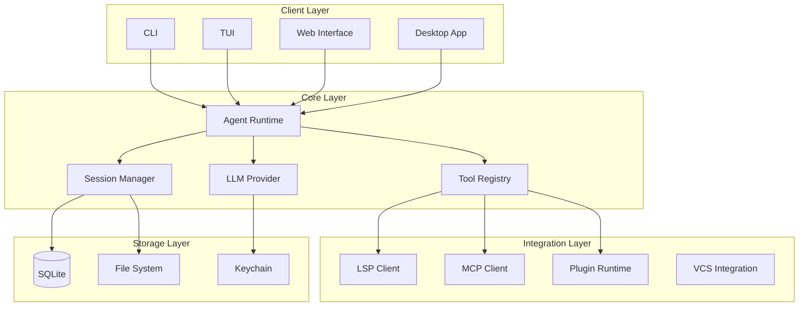
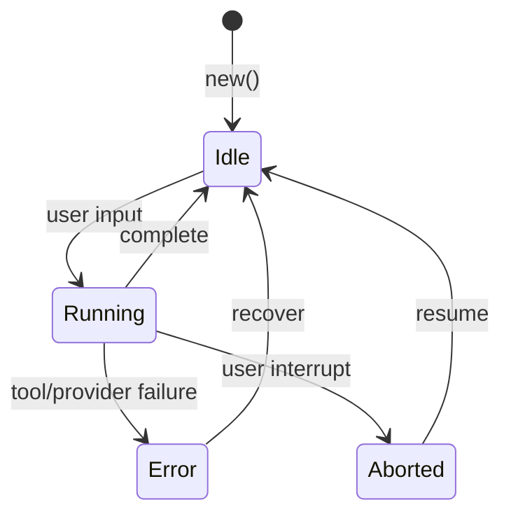
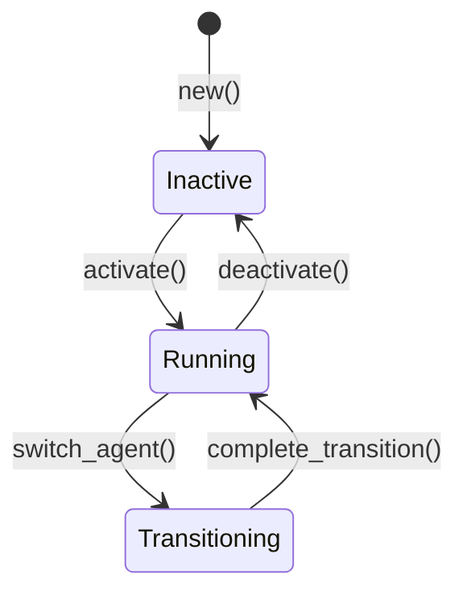

# PRD: Architecture Overview

## System Architecture



---

## Module Hierarchy

```
opencode-rs
├── crates/
│   ├── core/              # Core entities and traits
│   │   ├── session.rs     # Session management
│   │   ├── message.rs     # Message types
│   │   ├── tool.rs         # Tool trait
│   │   └── error.rs        # Error types (1xxx-9xxx)
│   │
│   ├── agent/             # Agent implementations
│   │   ├── build_agent.rs
│   │   ├── plan_agent.rs
│   │   ├── explore_agent.rs
│   │   └── runtime.rs
│   │
│   ├── tools/            # Tool implementations
│   │   ├── registry.rs    # Tool registry
│   │   ├── read.rs
│   │   ├── write.rs
│   │   ├── bash.rs
│   │   └── [20+ tools]
│   │
│   ├── llm/              # LLM provider abstraction
│   │   ├── provider.rs
│   │   ├── openai.rs
│   │   ├── anthropic.rs
│   │   └── [20+ providers]
│   │
│   ├── config/           # Configuration management
│   │   ├── lib.rs
│   │   └── schema.rs
│   │
│   ├── storage/         # SQLite persistence
│   │   ├── lib.rs
│   │   └── migrations/
│   │
│   ├── tui/              # Terminal UI (ratatui)
│   │   ├── lib.rs
│   │   └── dialogs/
│   │
│   ├── server/           # HTTP server (actix-web)
│   │   └── routes/
│   │
│   └── [15+ more crates]
```

---

## Data Flow

### Agent Execution Flow

```
User Input
    │
    ▼
┌─────────────┐
│  CLI/TUI    │
└─────────────┘
    │
    ▼
┌─────────────┐
│   Agent     │◄──── Tool Results
│   Runtime   │
└─────────────┘
    │
    ▼
┌─────────────┐     ┌─────────────┐
│    LLM      │────►│   Provider │
│   (GPT-4)   │     │  (OpenAI)  │
└─────────────┘     └─────────────┘
    │
    ▼
┌─────────────┐
│   Tool      │
│   Registry  │
└─────────────┘
    │
    ├──► Read/Write/Edit
    ├──► Bash/Git
    ├──► LSP/Grep
    └──► Web/API Calls
```

---

## Key Interfaces

### Tool Execution Pipeline

```rust
// Tool execution pipeline
async fn execute_tool(
    registry: &ToolRegistry,
    tool_name: &str,
    args: serde_json::Value,
    ctx: ToolContext,
) -> Result<ToolResult, ToolError> {
    // 1. Permission check
    permission::check_tool_permission(tool_name, &ctx.permission_scope)?;

    // 2. Schema validation
    schema_validation::validate_args(tool_name, &args)?;

    // 3. Execute with timeout
    let result = tokio::time::timeout(
        Duration::from_secs(30),
        registry.execute(tool_name, args, Some(ctx))
    ).await?;

    // 4. Audit logging
    audit::log_tool_execution(tool_name, &result);

    Ok(result)
}
```

### Provider Selection

```rust
// Provider selection logic
async fn select_provider(
    config: &ProviderConfig,
    manager: &ProviderManager,
) -> Result<DynProvider, ProviderError> {
    // 1. Check budget
    budget_tracker::check_budget(config.model)?;

    // 2. Select provider by priority
    for provider_name in &config.priority {
        if let Ok(provider) = manager.create_provider(provider_name, config).await {
            return Ok(provider);
        }
    }

    // 3. Fallback to default
    manager.create_provider("openai", config).await
}
```

---

## State Management

### Session State Machine



### Agent State Machine



---

## Cross-Cutting Concerns

### Error Handling

All errors follow the unified error code system:

| Range | Category |
|-------|----------|
| 1xxx | Authentication errors |
| 2xxx | Authorization errors |
| 3xxx | Provider errors |
| 4xxx | Tool errors |
| 5xxx | Session errors |
| 6xxx | Config errors |
| 7xxx | Validation errors |
| 9xxx | Internal errors |

### Observability

- **Logging**: Structured JSON with trace context
- **Metrics**: Token usage, tool latency, provider latency
- **Tracing**: Distributed tracing via `tracing` crate

### Security

- **Credential Storage**: System keychain integration
- **Credential Sanitization**: API keys redacted in exports
- **Permission Model**: RBAC with approval queues
- **Path Restrictions**: Sensitive paths blocked

---

## Deployment Modes

| Mode | Description | Port |
|------|-------------|------|
| CLI | Local terminal interaction | N/A |
| TUI | Full terminal UI | N/A |
| Server | HTTP API server | 8080 (configurable) |
| Desktop | TUI + Server + Browser | 3000 (configurable) |

---

## Technology Stack

| Component | Technology |
|-----------|------------|
| Language | Rust 2021 |
| Async Runtime | Tokio |
| HTTP Server | Actix-web |
| Database | SQLite (rusqlite) |
| UI | Ratatui |
| Serialization | Serde |
| Error Handling | Thiserror + Anyhow |
| Logging | Tracing |

---

## Cross-References

| Document | Description |
|---------|-------------|
| [Core Architecture](./10_CORE/10_core_architecture.md) | Entity definitions |
| [Agent System](./10_CORE/11_agent_system.md) | Agent architecture |
| [Tools System](./10_CORE/12_tools_system.md) | Tool architecture |
| [Provider Model](./20_INTEGRATION/23_provider_model.md) | LLM abstraction |
| [Permission Model](./40_USER_FACING/42_permission_model.md) | RBAC system |
| [Error Codes](./90_REFERENCE/ERROR_CODE_CATALOG.md) | Error reference |
