# PRD: Key Flows — Sequence Diagrams

This document provides Mermaid sequence diagrams for critical workflows in OpenCode RS.

---

## 1. Session Lifecycle Flows

### 1.1 Session Creation Flow

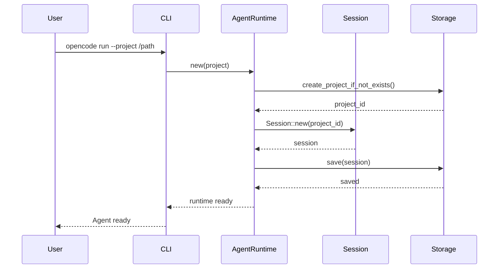
```mermaid
sequenceDiagram
    participant User
    participant CLI
    participant AgentRuntime
    participant Session
    participant Storage

    User->>CLI: opencode run --project /path
    CLI->>AgentRuntime: new(project)
    AgentRuntime->>Storage: create_project_if_not_exists()
    Storage-->>AgentRuntime: project_id
    AgentRuntime->>Session: Session::new(project_id)
    Session-->>AgentRuntime: session
    AgentRuntime->>Storage: save(session)
    Storage-->>AgentRuntime: saved
    AgentRuntime-->>CLI: runtime ready
    CLI-->>User: Agent ready
```

### 1.2 Session Fork Flow

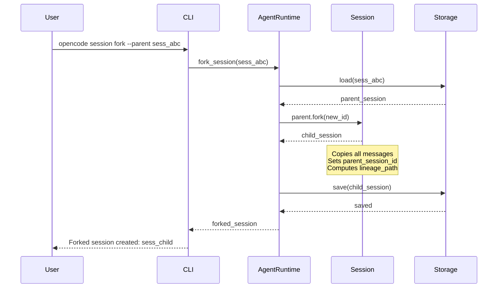
```mermaid
sequenceDiagram
    participant User
    participant CLI
    participant AgentRuntime
    participant Session
    participant Storage

    User->>CLI: opencode session fork --parent sess_abc
    CLI->>AgentRuntime: fork_session(sess_abc)
    AgentRuntime->>Storage: load(sess_abc)
    Storage-->>AgentRuntime: parent_session
    AgentRuntime->>Session: parent.fork(new_id)
    Session-->>AgentRuntime: child_session
    Note over Session: Copies all messages<br/>Sets parent_session_id<br/>Computes lineage_path
    AgentRuntime->>Storage: save(child_session)
    Storage-->>AgentRuntime: saved
    AgentRuntime-->>CLI: forked_session
    CLI-->>User: Forked session created: sess_child
```

### 1.3 Session Compaction Flow

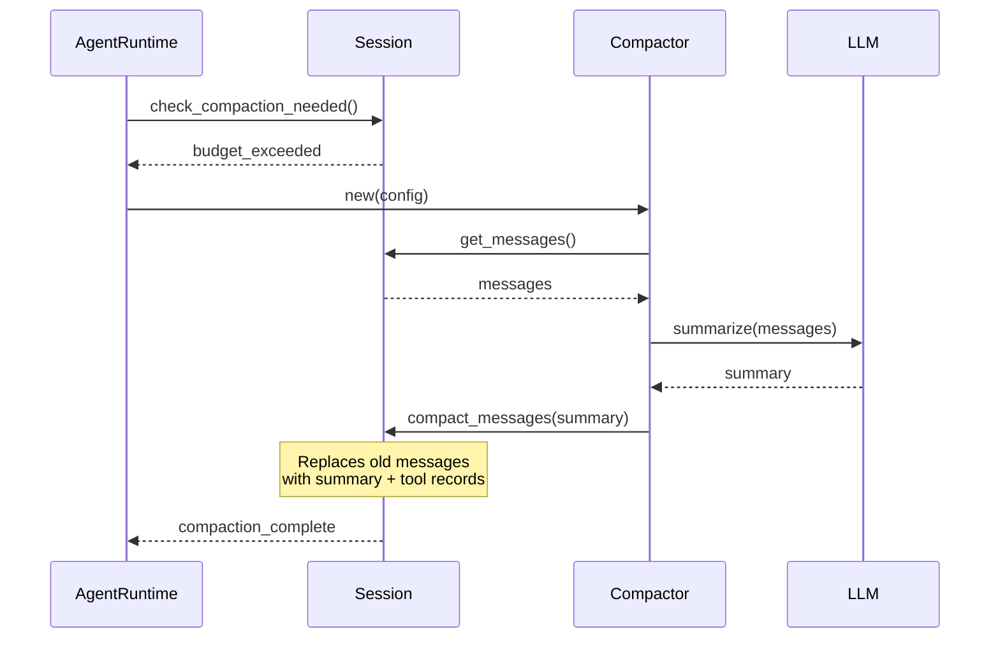
```mermaid
sequenceDiagram
    participant AgentRuntime
    participant Session
    participant Compactor
    participant LLM

    AgentRuntime->>Session: check_compaction_needed()
    Session-->>AgentRuntime: budget_exceeded
    AgentRuntime->>Compactor: new(config)
    Compactor->>Session: get_messages()
    Session-->>Compactor: messages
    Compactor->>LLM: summarize(messages)
    LLM-->>Compactor: summary
    Compactor->>Session: compact_messages(summary)
    Note over Session: Replaces old messages<br/>with summary + tool records
    Session-->>AgentRuntime: compaction_complete
```

### 1.4 Session Share Flow

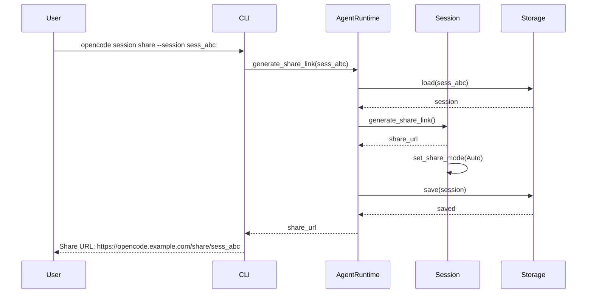
```mermaid
sequenceDiagram
    participant User
    participant CLI
    participant AgentRuntime
    participant Session
    participant Storage

    User->>CLI: opencode session share --session sess_abc
    CLI->>AgentRuntime: generate_share_link(sess_abc)
    AgentRuntime->>Storage: load(sess_abc)
    Storage-->>AgentRuntime: session
    AgentRuntime->>Session: generate_share_link()
    Session-->>AgentRuntime: share_url
    Session->>Session: set_share_mode(Auto)
    AgentRuntime->>Storage: save(session)
    Storage-->>AgentRuntime: saved
    AgentRuntime-->>CLI: share_url
    CLI-->>User: Share URL: https://opencode.example.com/share/sess_abc
```

---

## 2. Tool Execution Flows

### 2.1 Tool Call Flow (Success)

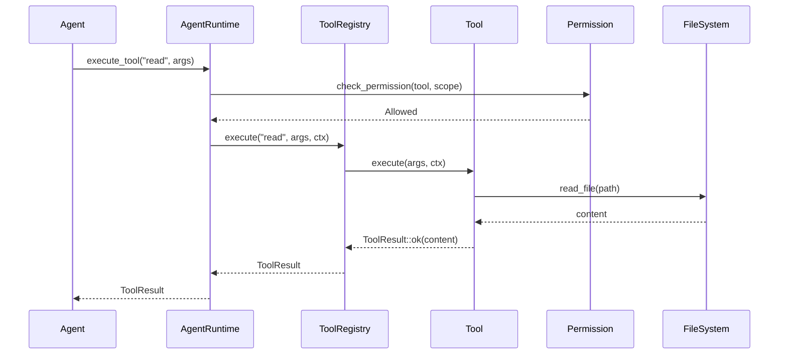
```mermaid
sequenceDiagram
    participant Agent
    participant AgentRuntime
    participant ToolRegistry
    participant Tool
    participant Permission
    participant FileSystem

    Agent->>AgentRuntime: execute_tool("read", args)
    AgentRuntime->>Permission: check_permission(tool, scope)
    Permission-->>AgentRuntime: Allowed
    AgentRuntime->>ToolRegistry: execute("read", args, ctx)
    ToolRegistry->>Tool: execute(args, ctx)
    Tool->>FileSystem: read_file(path)
    FileSystem-->>Tool: content
    Tool-->>ToolRegistry: ToolResult::ok(content)
    ToolRegistry-->>AgentRuntime: ToolResult
    AgentRuntime-->>Agent: ToolResult
```

### 2.2 Tool Call Flow (Permission Denied)

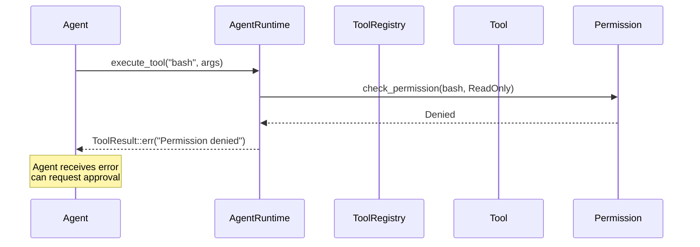
```mermaid
sequenceDiagram
    participant Agent
    participant AgentRuntime
    participant ToolRegistry
    participant Tool
    participant Permission

    Agent->>AgentRuntime: execute_tool("bash", args)
    AgentRuntime->>Permission: check_permission(bash, ReadOnly)
    Permission-->>AgentRuntime: Denied
    AgentRuntime-->>Agent: ToolResult::err("Permission denied")
    Note over Agent: Agent receives error<br/>can request approval
```

### 2.3 Tool Call Flow (Approval Required)

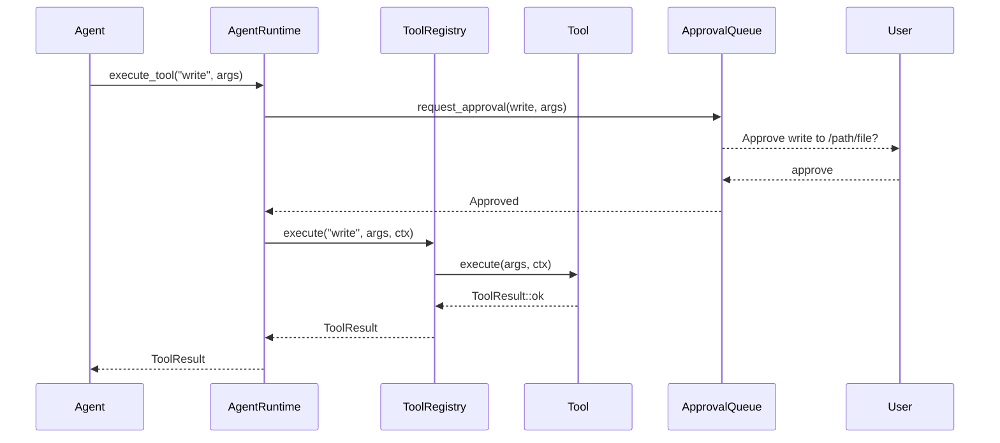
```mermaid
sequenceDiagram
    participant Agent
    participant AgentRuntime
    participant ToolRegistry
    participant Tool
    participant ApprovalQueue
    participant User

    Agent->>AgentRuntime: execute_tool("write", args)
    AgentRuntime->>ApprovalQueue: request_approval(write, args)
    ApprovalQueue-->>User: Approve write to /path/file?
    User-->>ApprovalQueue: approve
    ApprovalQueue-->>AgentRuntime: Approved
    AgentRuntime->>ToolRegistry: execute("write", args, ctx)
    ToolRegistry->>Tool: execute(args, ctx)
    Tool-->>ToolRegistry: ToolResult::ok
    ToolRegistry-->>AgentRuntime: ToolResult
    AgentRuntime-->>Agent: ToolResult
```

### 2.4 Tool Call Flow (Timeout)

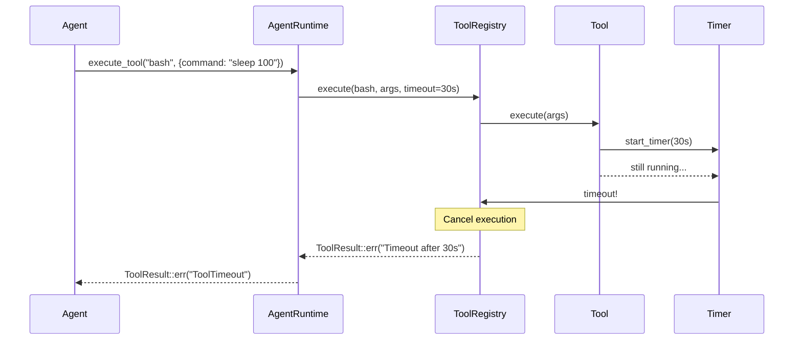
```mermaid
sequenceDiagram
    participant Agent
    participant AgentRuntime
    participant ToolRegistry
    participant Tool
    participant Timer

    Agent->>AgentRuntime: execute_tool("bash", {command: "sleep 100"})
    AgentRuntime->>ToolRegistry: execute(bash, args, timeout=30s)
    ToolRegistry->>Tool: execute(args)
    Tool->>Timer: start_timer(30s)
    Tool-->>Timer: still running...
    Timer->>ToolRegistry: timeout!
    Note over ToolRegistry: Cancel execution
    ToolRegistry-->>AgentRuntime: ToolResult::err("Timeout after 30s")
    AgentRuntime-->>Agent: ToolResult::err("ToolTimeout")
```

---

## 3. Agent Execution Flows

### 3.1 Agent Run Loop Flow

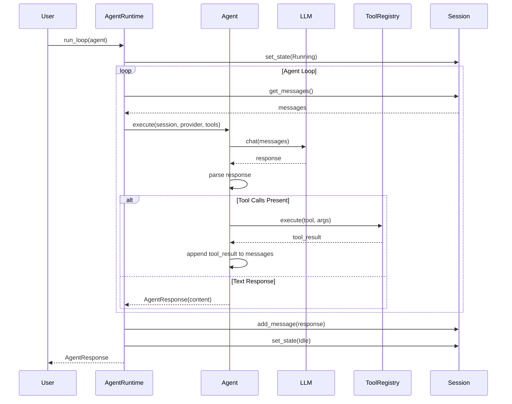
```mermaid
sequenceDiagram
    participant User
    participant AgentRuntime
    participant Agent
    participant LLM
    participant ToolRegistry
    participant Session

    User->>AgentRuntime: run_loop(agent)
    AgentRuntime->>Session: set_state(Running)
    loop Agent Loop
        AgentRuntime->>Session: get_messages()
        Session-->>AgentRuntime: messages
        AgentRuntime->>Agent: execute(session, provider, tools)
        Agent->>LLM: chat(messages)
        LLM-->>Agent: response
        Agent->>Agent: parse response
        alt Tool Calls Present
            Agent->>ToolRegistry: execute(tool, args)
            ToolRegistry-->>Agent: tool_result
            Agent->>Agent: append tool_result to messages
        else Text Response
            Agent-->>AgentRuntime: AgentResponse(content)
        end
    end
    AgentRuntime->>Session: add_message(response)
    AgentRuntime->>Session: set_state(Idle)
    AgentRuntime-->>User: AgentResponse
```

### 3.2 Subagent Delegation Flow

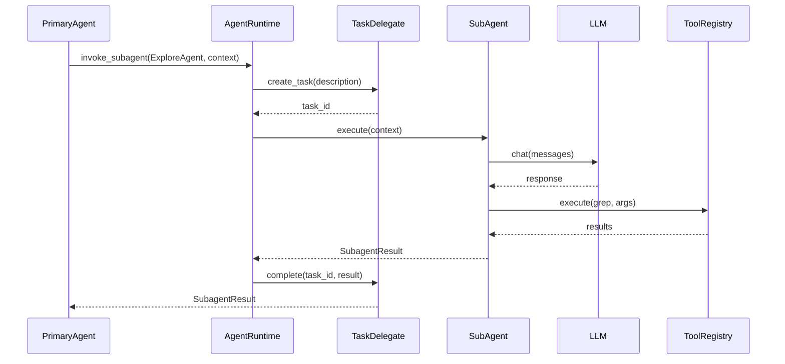
```mermaid
sequenceDiagram
    participant PrimaryAgent
    participant AgentRuntime
    participant TaskDelegate
    participant SubAgent
    participant LLM
    participant ToolRegistry

    PrimaryAgent->>AgentRuntime: invoke_subagent(ExploreAgent, context)
    AgentRuntime->>TaskDelegate: create_task(description)
    TaskDelegate-->>AgentRuntime: task_id
    AgentRuntime->>SubAgent: execute(context)
    SubAgent->>LLM: chat(messages)
    LLM-->>SubAgent: response
    SubAgent->>ToolRegistry: execute(grep, args)
    ToolRegistry-->>SubAgent: results
    SubAgent-->>AgentRuntime: SubagentResult
    AgentRuntime->>TaskDelegate: complete(task_id, result)
    TaskDelegate-->>PrimaryAgent: SubagentResult
```

### 3.3 Agent Switch Flow

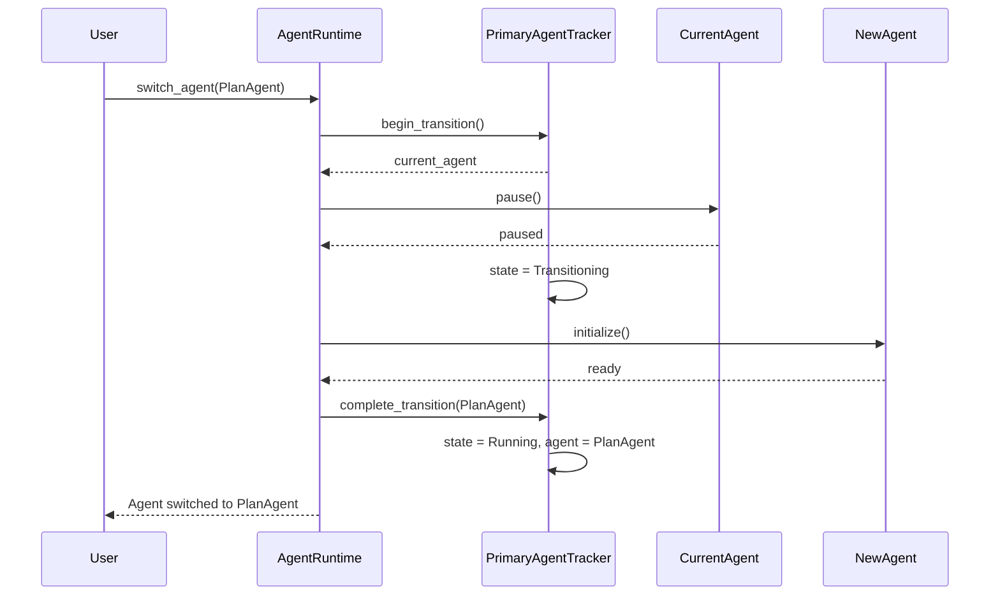
```mermaid
sequenceDiagram
    participant User
    participant AgentRuntime
    participant PrimaryAgentTracker
    participant CurrentAgent
    participant NewAgent

    User->>AgentRuntime: switch_agent(PlanAgent)
    AgentRuntime->>PrimaryAgentTracker: begin_transition()
    PrimaryAgentTracker-->>AgentRuntime: current_agent
    AgentRuntime->>CurrentAgent: pause()
    CurrentAgent-->>AgentRuntime: paused
    PrimaryAgentTracker->>PrimaryAgentTracker: state = Transitioning
    AgentRuntime->>NewAgent: initialize()
    NewAgent-->>AgentRuntime: ready
    AgentRuntime->>PrimaryAgentTracker: complete_transition(PlanAgent)
    PrimaryAgentTracker->>PrimaryAgentTracker: state = Running, agent = PlanAgent
    AgentRuntime-->>User: Agent switched to PlanAgent
```

---

## 4. Provider/LLM Flows

### 4.1 LLM Chat Flow

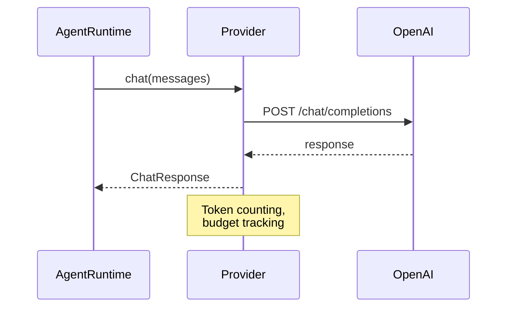
```mermaid
sequenceDiagram
    participant AgentRuntime
    participant Provider
    participant OpenAI

    AgentRuntime->>Provider: chat(messages)
    Provider->>OpenAI: POST /chat/completions
    OpenAI-->>Provider: response
    Provider-->>AgentRuntime: ChatResponse
    Note over Provider: Token counting,<br/>budget tracking
```

### 4.2 Provider Retry Flow

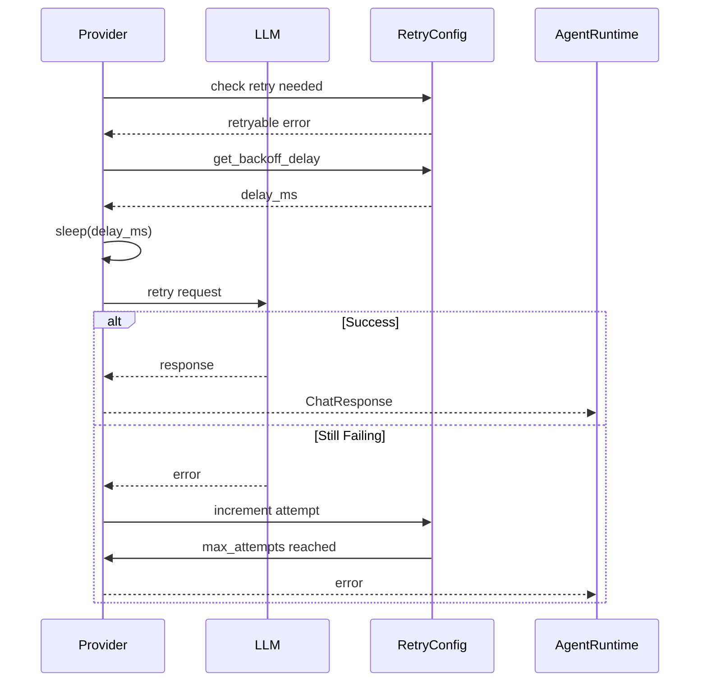
```mermaid
sequenceDiagram
    participant Provider
    participant LLM
    participant RetryConfig

    Provider->>RetryConfig: check retry needed
    RetryConfig-->>Provider: retryable error
    Provider->>RetryConfig: get_backoff_delay
    RetryConfig-->>Provider: delay_ms
    Provider->>Provider: sleep(delay_ms)
    Provider->>LLM: retry request
    alt Success
        LLM-->>Provider: response
        Provider-->>AgentRuntime: ChatResponse
    else Still Failing
        LLM-->>Provider: error
        Provider->>RetryConfig: increment attempt
        RetryConfig->>Provider: max_attempts reached
        Provider-->>AgentRuntime: error
    end
```

### 4.3 Budget Tracking Flow

```mouncement
sequenceDiagram
    participant Provider
    participant BudgetTracker
    participant LLM

    Provider->>BudgetTracker: check_budget(additional_tokens)
    BudgetTracker-->>Provider: within_limit
    Provider->>LLM: chat(messages)
    LLM-->>Provider: response + usage
    Provider->>BudgetTracker: record_usage(usage)
    BudgetTracker->>BudgetTracker: update remaining
    Provider-->>AgentRuntime: ChatResponse
```

---

## 5. Storage Flows

### 5.1 Session Save Flow

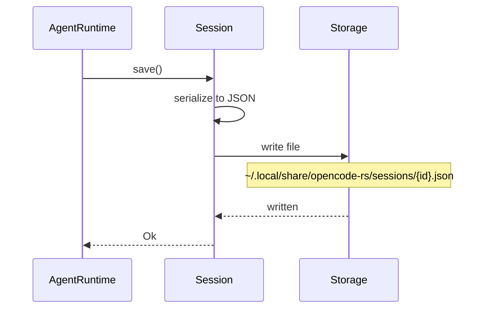
```mermaid
sequenceDiagram
    participant AgentRuntime
    participant Session
    participant Storage

    AgentRuntime->>Session: save()
    Session->>Session: serialize to JSON
    Session->>Storage: write file
    Note over Storage: ~/.local/share/opencode-rs/sessions/{id}.json
    Storage-->>Session: written
    Session-->>AgentRuntime: Ok
```

### 5.2 Session Recovery Flow

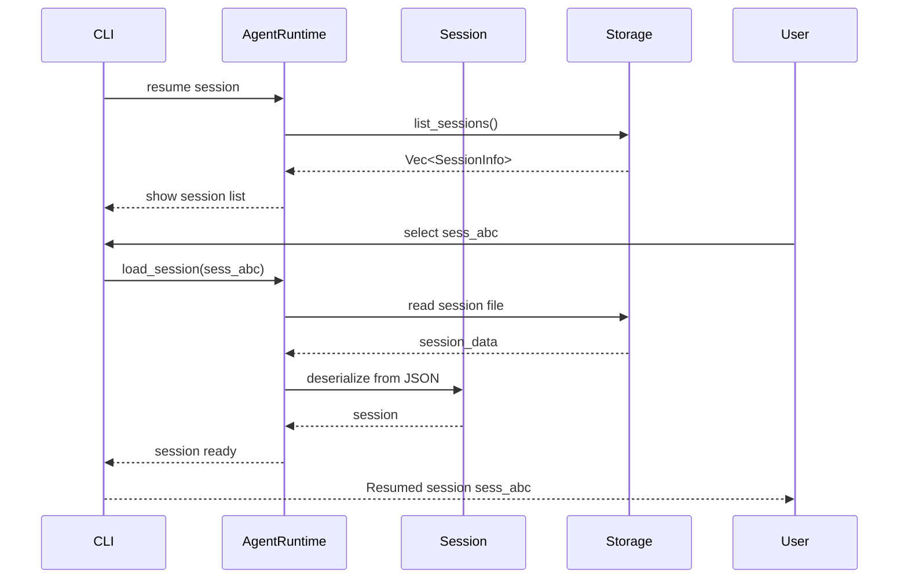
```mermaid
sequenceDiagram
    participant CLI
    participant AgentRuntime
    participant Session
    participant Storage

    CLI->>AgentRuntime: resume session
    AgentRuntime->>Storage: list_sessions()
    Storage-->>AgentRuntime: Vec<SessionInfo>
    AgentRuntime-->>CLI: show session list
    User->>CLI: select sess_abc
    CLI->>AgentRuntime: load_session(sess_abc)
    AgentRuntime->>Storage: read session file
    Storage-->>AgentRuntime: session_data
    AgentRuntime->>Session: deserialize from JSON
    Session-->>AgentRuntime: session
    AgentRuntime-->>CLI: session ready
    CLI-->>User: Resumed session sess_abc
```

---

## 6. MCP Integration Flows

### 6.1 MCP Tool Call Flow

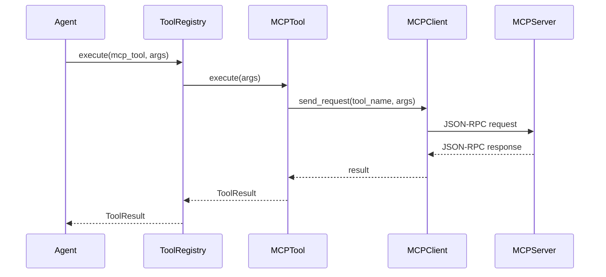
```mermaid
sequenceDiagram
    participant Agent
    participant ToolRegistry
    participant MCPTool
    participant MCPClient
    participant MCPServer

    Agent->>ToolRegistry: execute(mcp_tool, args)
    ToolRegistry->>MCPTool: execute(args)
    MCPTool->>MCPClient: send_request(tool_name, args)
    MCPClient->>MCPServer: JSON-RPC request
    MCPServer-->>MCPClient: JSON-RPC response
    MCPClient-->>MCPTool: result
    MCPTool-->>ToolRegistry: ToolResult
    ToolRegistry-->>Agent: ToolResult
```

### 6.2 MCP Resource Flow

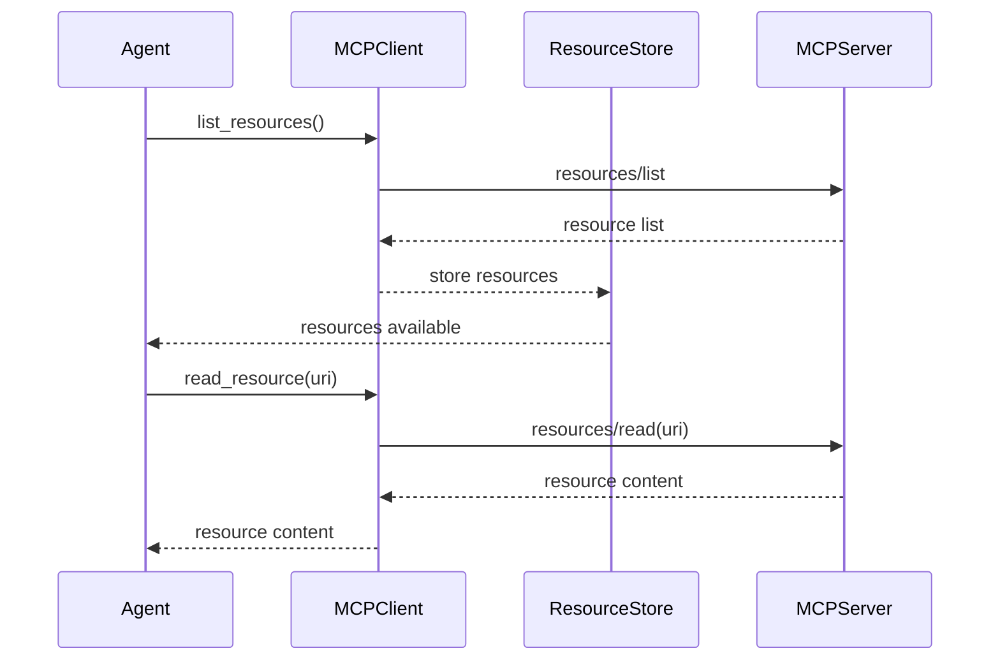
```mermaid
sequenceDiagram
    participant Agent
    participant MCPClient
    participant ResourceStore
    participant MCPServer

    Agent->>MCPClient: list_resources()
    MCPClient->>MCPServer: resources/list
    MCPServer-->>MCPClient: resource list
    MCPClient-->>ResourceStore: store resources
    ResourceStore-->>Agent: resources available
    Agent->>MCPClient: read_resource(uri)
    MCPClient->>MCPServer: resources/read(uri)
    MCPServer-->>MCPClient: resource content
    MCPClient-->>Agent: resource content
```

---

## 7. Plugin System Flows

### 7.1 Plugin Loading Flow

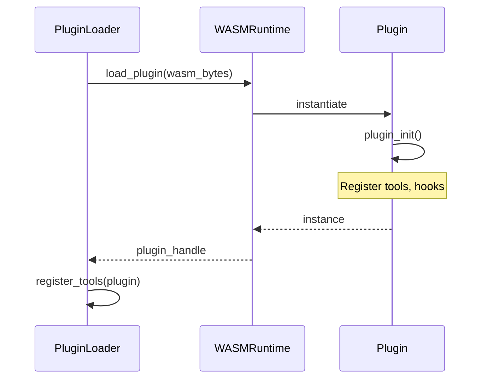
```mermaid
sequenceDiagram
    participant PluginLoader
    participant WASMRuntime
    participant Plugin

    PluginLoader->>WASMRuntime: load_plugin(wasm_bytes)
    WASMRuntime->>Plugin: instantiate
    Plugin->>Plugin: plugin_init()
    Note over Plugin: Register tools, hooks
    Plugin-->>WASMRuntime: instance
    WASMRuntime-->>PluginLoader: plugin_handle
    PluginLoader->>PluginLoader: register_tools(plugin)
```

### 7.2 Plugin Tool Call Flow

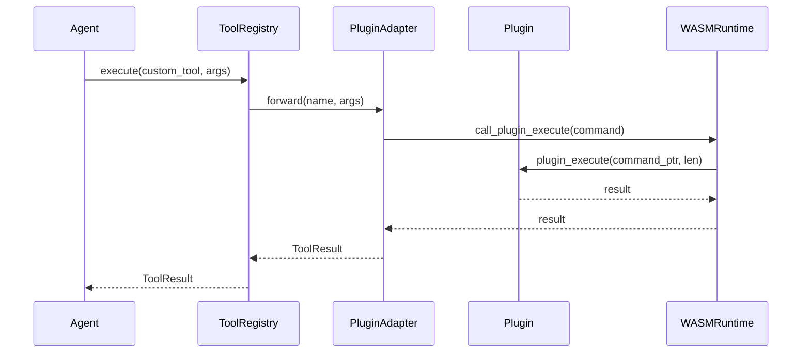
```mermaid
sequenceDiagram
    participant Agent
    participant ToolRegistry
    participant PluginAdapter
    participant Plugin
    participant WASMRuntime

    Agent->>ToolRegistry: execute(custom_tool, args)
    ToolRegistry->>PluginAdapter: forward(name, args)
    PluginAdapter->>WASMRuntime: call_plugin_execute(command)
    WASMRuntime->>Plugin: plugin_execute(command_ptr, len)
    Plugin-->>WASMRuntime: result
    WASMRuntime-->>PluginAdapter: result
    PluginAdapter-->>ToolRegistry: ToolResult
    ToolRegistry-->>Agent: ToolResult
```

---

## Cross-References

| Flow | Related Documents |
|-------|-------------------|
| Session flows | [01-core-architecture.md](./01-core-architecture.md), [modules/session.md](../modules/session.md) |
| Tool flows | [03-tools-system.md](./03-tools-system.md), [modules/tool.md](../modules/tool.md) |
| Agent flows | [02-agent-system.md](./02-agent-system.md), [modules/agent.md](../modules/agent.md) |
| Provider flows | [10-provider-model-system.md](./10-provider-model-system.md), [modules/provider.md](../modules/provider.md) |
| Storage flows | [modules/storage.md](../modules/storage.md) |
| MCP flows | [04-mcp-system.md](./04-mcp-system.md), [modules/mcp.md](../modules/mcp.md) |
| Plugin flows | [08-plugin-system.md](./08-plugin-system.md), [modules/plugin.md](../modules/plugin.md) |
