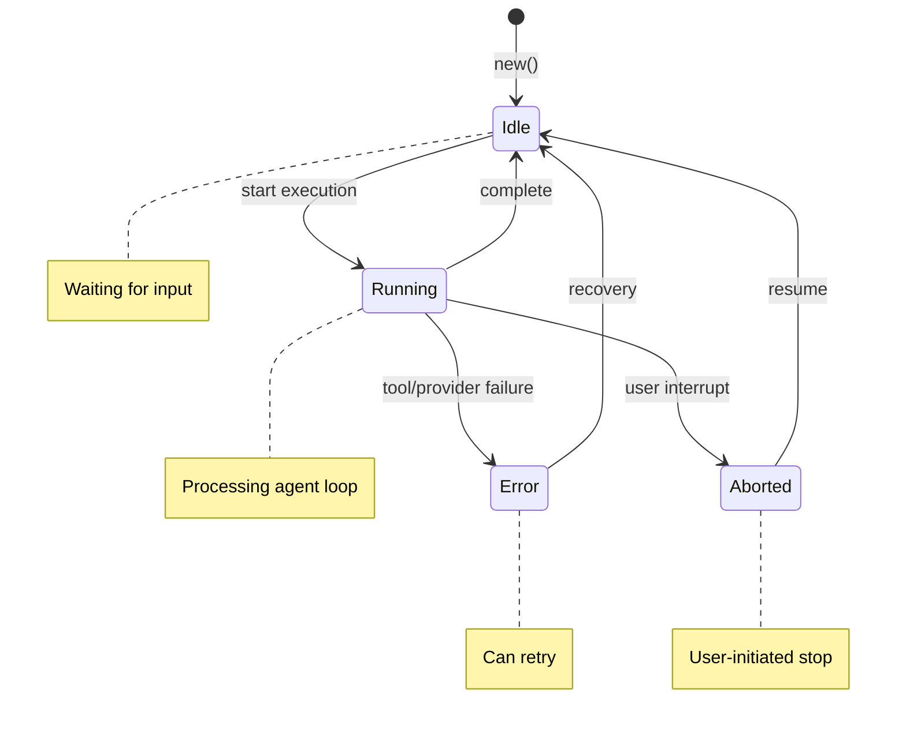

# Module: session

> **User Documentation**: Session management concepts are exposed through the TUI and CLI. There is no separate user-facing session document; core concepts are documented in [agents.mdx](https://github.com/anomalyco/opencode/blob/main/packages/web/src/content/docs/zh-cn/agents.mdx).

**See Also**: [Glossary: Session](../../system/01_glossary.md#session)

## Overview

The `session` module in `opencode-core` (`crates/core/src/session.rs`) manages conversation sessions: creation, message history, fork/undo/redo, compaction, sharing, and serialization. It is the primary data model for all agent interactions.

**Crate**: `opencode-core`
**Source**: `crates/core/src/session.rs`
**Status**: Fully implemented (~1535+ lines with comprehensive tests)

---

## Crate Layout

```
crates/core/src/
├── session.rs          ← Session struct, fork, share, undo/redo, compaction
├── session_state.rs    ← SessionState enum + transition validation
├── compaction.rs       ← Compactor, CompactionConfig, CompactionResult
├── message.rs          ← Message struct, Role enum
└── context.rs          ← Context, ContextBuilder
```

**`crates/core/Cargo.toml`** deps:
```toml
uuid = { workspace = true, features = ["v4", "serde"] }
chrono = { workspace = true, features = ["serde"] }
serde = { workspace = true, features = ["derive"] }
serde_json = { workspace = true }
sha2 = "0.10"
directories = "5"
regex = { workspace = true }
```

**`crates/core/src/lib.rs`** exports:
```rust
pub mod session;
pub use session::{
    Action, ForkEntry, ForkError, HistoryEntry, Session, SessionInfo,
    SessionSummaryMetadata, ShareError, ToolInvocationRecord,
};
```

---

## Core Types

### `Session`

```rust
#[derive(Debug, Clone, Serialize, Deserialize)]
pub struct Session {
    pub id: Uuid,
    pub messages: Vec<Message>,
    pub created_at: DateTime<Utc>,
    pub updated_at: DateTime<Utc>,
    pub state: SessionState,
    #[serde(skip_serializing_if = "Option::is_none")]
    pub parent_session_id: Option<String>,
    /// Ancestor path: "grandparent_id/parent_id" or None for root
    #[serde(skip_serializing_if = "Option::is_none")]
    pub lineage_path: Option<String>,
    #[serde(skip_serializing_if = "Vec::is_empty", default)]
    pub fork_history: Vec<ForkEntry>,
    #[serde(skip_serializing_if = "Vec::is_empty", default)]
    pub tool_invocations: Vec<ToolInvocationRecord>,
    #[serde(skip_serializing_if = "Vec::is_empty", default)]
    pub undo_history: Vec<HistoryEntry>,
    #[serde(skip_serializing_if = "Vec::is_empty", default)]
    pub redo_history: Vec<HistoryEntry>,
    #[serde(skip_serializing_if = "Option::is_none", default)]
    pub shared_id: Option<String>,
    #[serde(skip_serializing_if = "Option::is_none", default)]
    pub share_mode: Option<ShareMode>,
    #[serde(skip_serializing_if = "Option::is_none", default)]
    pub share_expires_at: Option<DateTime<Utc>>,
}
```

### Supporting Types

```rust
#[derive(Debug, Clone, Serialize, Deserialize)]
pub struct ForkEntry {
    pub forked_at: DateTime<Utc>,
    pub child_session_id: Uuid,
}

#[derive(Debug, Clone, Serialize, Deserialize)]
pub struct ToolInvocationRecord {
    pub id: Uuid,
    pub tool_name: String,
    pub arguments: serde_json::Value,
    pub args_hash: String,           // SHA-256 of args JSON
    pub result: Option<String>,
    pub started_at: DateTime<Utc>,
    pub completed_at: Option<DateTime<Utc>>,
    pub latency_ms: Option<u64>,
}

#[derive(Debug, Clone, Serialize, Deserialize, PartialEq)]
pub struct SessionSummaryMetadata {
    pub summary: String,
    pub created_at: DateTime<Utc>,
}

#[derive(Debug, Clone, Serialize, Deserialize)]
pub struct HistoryEntry {
    pub action: Action,
    pub messages: Vec<Message>,
    pub timestamp: DateTime<Utc>,
}

#[derive(Debug, Clone, Serialize, Deserialize)]
pub enum Action {
    AddMessage,
    RemoveMessage,
    ClearSession,
}

#[derive(Debug, Clone, Serialize, Deserialize)]
pub struct SessionInfo {
    pub id: Uuid,
    pub created_at: DateTime<Utc>,
    pub updated_at: DateTime<Utc>,
    pub message_count: usize,
    pub preview: String,    // Last 50 chars of last message
}
```

### Error Types

```rust
#[derive(Debug, Clone, PartialEq, Eq)]
pub enum ShareError {
    SharingDisabled,
    InvalidShareMode,
    AccessDenied,
}
impl std::error::Error for ShareError {}
impl std::fmt::Display for ShareError { ... }

#[derive(Debug, Clone, PartialEq, Eq)]
pub enum ForkError {
    MessageIndexOutOfBounds { requested: usize, len: usize },
}
impl std::error::Error for ForkError {}
```

---

## Key Implementations

```rust
impl Session {
    /// Create a new session with a fresh UUID, Idle state, empty history.
    pub fn new() -> Self { ... }

    /// Fork: copy all messages into a new session with parent linkage.
    pub fn fork(&self, new_session_id: Uuid) -> Self { ... }

    /// Fork at a specific message index (inclusive). Returns ForkError if OOB.
    pub fn fork_at_message(&self, message_index: usize) -> Result<Session, ForkError> { ... }

    /// Compute "grandparent_id/parent_id" lineage path for display.
    pub fn compute_lineage_path(&self) -> Option<String> { ... }

    /// Add a message (pushes to undo stack, clears redo, triggers auto-compact).
    pub fn add_message(&mut self, message: Message) { ... }

    /// Undo `steps` message additions. Returns Ok(n_undone) or Err if empty.
    pub fn undo(&mut self, steps: usize) -> Result<usize, String> { ... }

    /// Redo `steps` undone messages. Returns Ok(n_redone) or Err if empty.
    pub fn redo(&mut self, steps: usize) -> Result<usize, String> { ... }

    /// Generate/return a share URL. Fails if ShareMode::Disabled.
    pub fn generate_share_link(&mut self) -> Result<String, ShareError> { ... }

    /// Update share mode (Disabled clears shared_id and expiry).
    pub fn set_share_mode(&mut self, mode: ShareMode) { ... }

    /// Is this session currently shared and not expired?
    pub fn is_shared(&self) -> bool { ... }

    /// Get share_id if shared and not expired.
    pub fn get_share_id(&self) -> Option<&str> { ... }

    /// Set share expiry datetime.
    pub fn set_share_expiry(&mut self, expiry: Option<DateTime<Utc>>) { ... }

    /// Store compaction summary as a ToolInvocationRecord.
    pub fn store_summary_metadata(&mut self, summary: impl Into<String>, created_at: DateTime<Utc>) { ... }

    /// Export as pretty-printed JSON (redacts credentials).
    pub fn export_json(&self) -> Result<String, OpenCodeError> { ... }

    /// Export as Markdown with role headers.
    pub fn export_markdown(&self) -> Result<String, OpenCodeError> { ... }

    /// Save to JSON file at path (creates parent dirs).
    pub fn save(&self, path: &PathBuf) -> Result<(), OpenCodeError> { ... }

    /// Load from JSON file.
    pub fn load(path: &PathBuf) -> Result<Self, OpenCodeError> { ... }

    /// Load by UUID from the sessions directory.
    pub fn load_by_id(id: &Uuid) -> Result<Self, OpenCodeError> { ... }

    /// List all sessions sorted by updated_at desc.
    pub fn list() -> Result<Vec<SessionInfo>, OpenCodeError> { ... }

    /// Truncate messages to fit max_tokens (rough 4-chars/token estimate).
    pub fn truncate_for_context(&mut self, max_tokens: usize) { ... }

    /// Run the Compactor to reduce message count while preserving system/recent.
    pub fn compact_messages(&mut self, max_tokens: usize) -> CompactionResult { ... }

    /// Estimate total token count.
    pub fn estimate_token_count(&self) -> usize { ... }

    /// Get compaction status (check budget utilization).
    pub fn get_compaction_status(&self) -> CompactionStatus { ... }
}
```

**Sessions directory resolution** (`Session::sessions_dir()`):
1. `OPENCODE_DATA_DIR` env var (if set) → `$OPENCODE_DATA_DIR/sessions/`
2. `ProjectDirs::from("com","opencode","rs")` → platform data dir
3. Fallback: `~/.local/share/opencode-rs/sessions/`

---

## Inter-crate Dependencies

| Dependency | Purpose |
|---|---|
| `crate::compaction::{Compactor, CompactionConfig, CompactionResult, CompactionStatus, CompactionTrigger, TokenBudget}` | Auto-compact logic |
| `crate::config::{CompactionConfig as RuntimeCompactionConfig, ShareMode}` | Config types |
| `crate::context::{Context, ContextBuilder}` | Build context for LLM prompt |
| `crate::message::{Message, Role}` | Message data type |
| `crate::session_state::{SessionState, StateTransitionError, is_valid_transition}` | State machine |
| `crate::OpenCodeError` | Error propagation |
| `sha2` | SHA-256 for args_hash in ToolInvocationRecord |
| `directories` | Platform-appropriate sessions dir |
| `regex` | Credential sanitization in `sanitize_content` |

---

## Credential Sanitization

`export_json()` and `export_markdown()` call `sanitize_content()` which:
- Redacts `sk-...`, `ghp_...`, `xoxb-...`, `gho_...`, JWT tokens
- Redacts lines containing `api_key=`, `secret:`, `password=`, `token=`
- Redacts SQL injection patterns (DROP TABLE, DELETE FROM, etc.)
- HTML-encodes `&`, `<`, `>`, `"`, `'`

---

## Test Design

```rust
#[cfg(test)]
mod tests {
    use super::*;
    use tempfile::TempDir;
    use crate::message::Message;

    #[test]
    fn new_session_has_unique_id_and_empty_messages() {
        let s = Session::new();
        assert!(!s.id.is_nil());
        assert!(s.messages.is_empty());
        assert_eq!(s.state, SessionState::Idle);
    }

    #[test]
    fn add_message_pushes_to_undo_stack() {
        let mut s = Session::new();
        s.add_message(Message::user("Hello".into()));
        assert_eq!(s.messages.len(), 1);
        assert_eq!(s.undo_history.len(), 1);
        assert!(s.redo_history.is_empty());
    }

    #[test]
    fn undo_restores_previous_state() {
        let mut s = Session::new();
        s.add_message(Message::user("a".into()));
        s.add_message(Message::assistant("b".into()));
        assert_eq!(s.undo(1).unwrap(), 1);
        assert_eq!(s.messages.len(), 1);
    }

    #[test]
    fn redo_after_undo_restores() {
        let mut s = Session::new();
        s.add_message(Message::user("a".into()));
        s.add_message(Message::assistant("b".into()));
        s.undo(1).unwrap();
        assert_eq!(s.redo(1).unwrap(), 1);
        assert_eq!(s.messages.len(), 2);
    }

    #[test]
    fn new_message_after_undo_clears_redo() {
        let mut s = Session::new();
        s.add_message(Message::user("a".into()));
        s.undo(1).unwrap();
        assert_eq!(s.redo_history.len(), 1);
        s.add_message(Message::user("b".into()));
        assert!(s.redo_history.is_empty());
    }

    #[test]
    fn save_and_load_roundtrip() {
        let tmp = TempDir::new().unwrap();
        let path = tmp.path().join("s.json");
        let mut s = Session::new();
        s.add_message(Message::user("test".into()));
        s.save(&path).unwrap();
        let loaded = Session::load(&path).unwrap();
        assert_eq!(loaded.id, s.id);
        assert_eq!(loaded.messages[0].content, "test");
    }

    #[test]
    fn fork_creates_child_with_parent_reference() {
        let parent = Session::new();
        let child = parent.fork(uuid::Uuid::new_v4());
        assert_eq!(child.parent_session_id.as_deref(), Some(parent.id.to_string().as_str()));
        assert_ne!(child.id, parent.id);
    }

    #[test]
    fn fork_at_message_out_of_bounds_returns_error() {
        let mut s = Session::new();
        s.add_message(Message::user("only".into()));
        assert!(matches!(
            s.fork_at_message(5),
            Err(ForkError::MessageIndexOutOfBounds { requested: 5, len: 1 })
        ));
    }

    #[test]
    fn share_link_sets_shared_id_and_mode() {
        let mut s = Session::new();
        let link = s.generate_share_link().unwrap();
        assert!(link.contains("/share/"));
        assert!(s.shared_id.is_some());
        assert_eq!(s.share_mode, Some(ShareMode::Manual));
        assert!(s.is_shared());
    }

    #[test]
    fn share_link_blocked_when_disabled() {
        let mut s = Session::new();
        s.set_share_mode(ShareMode::Disabled);
        assert_eq!(s.generate_share_link().unwrap_err(), ShareError::SharingDisabled);
    }

    #[test]
    fn expired_share_is_not_shared() {
        let mut s = Session::new();
        s.generate_share_link().unwrap();
        s.set_share_expiry(Some(chrono::Utc::now() - chrono::Duration::minutes(1)));
        assert!(!s.is_shared());
    }

    #[test]
    fn multi_level_fork_lineage_path() {
        let g = Session::new();
        let p = g.fork(uuid::Uuid::new_v4());
        let c = p.fork(uuid::Uuid::new_v4());
        assert_eq!(
            c.compute_lineage_path(),
            Some(format!("{}/{}", g.id, p.id))
        );
    }

    #[test]
    fn summary_metadata_stored_and_retrieved() {
        let mut s = Session::new();
        let now = chrono::Utc::now();
        s.store_summary_metadata("Summary text", now);
        let meta = s.latest_summary_metadata().unwrap();
        assert_eq!(meta.summary, "Summary text");
    }
}
```

---

## State Machine (`session_state.rs`)

```rust
// SessionState drives valid lifecycle transitions:
// Idle → Running → Idle | Error | Aborted
// Error → Idle (recovery)

#[derive(Debug, Clone, Copy, PartialEq, Eq, Serialize, Deserialize)]
pub enum SessionState { Idle, Running, Error, Aborted }

pub struct StateTransitionError { pub from: SessionState, pub to: SessionState }
pub fn is_valid_transition(from: SessionState, to: SessionState) -> bool { ... }
```

Set state via `session.set_state(new)` — returns `Err(StateTransitionError)` for invalid transitions.

---

## State Machine Diagram



---

## Acceptance Criteria

### Session Lifecycle

| ID | Criterion | Test Method |
|----|-----------|-------------|
| AC-001 | `Session::new()` creates session with unique UUID and Idle state | Unit test |
| AC-002 | Session persists to `~/.local/share/opencode-rs/sessions/` | Integration test |
| AC-003 | Session loads correctly from JSON file | Unit test: save/load roundtrip |
| AC-004 | Session cannot be created with nil UUID | Unit test assertion |

### Fork Operations

| ID | Criterion | Test Method |
|----|-----------|-------------|
| AC-005 | `fork()` creates child with correct `parent_session_id` | Unit test |
| AC-006 | `fork_at_message()` returns error for out-of-bounds index | Unit test |
| AC-007 | Forked session starts in Idle state | Unit test |
| AC-008 | Multi-level fork computes correct `lineage_path` | Unit test |

### State Transitions

| ID | Criterion | Test Method |
|----|-----------|-------------|
| AC-009 | Valid transitions: Idle→Running, Running→Idle/Error/Aborted, Error→Idle, Aborted→Idle | Unit test |
| AC-010 | Invalid transitions return `StateTransitionError` | Unit test |
| AC-011 | Fork does not change parent session state | Unit test |

### Message Operations

| ID | Criterion | Test Method |
|----|-----------|-------------|
| AC-012 | `add_message()` pushes to undo stack and clears redo | Unit test |
| AC-013 | `undo()` restores previous message state | Unit test |
| AC-014 | `redo()` restores undone messages | Unit test |
| AC-015 | New message after undo clears redo history | Unit test |

### Share Operations

| ID | Criterion | Test Method |
|----|-----------|-------------|
| AC-016 | `generate_share_link()` creates valid share URL | Unit test |
| AC-017 | Share fails when `ShareMode::Disabled` | Unit test |
| AC-018 | Expired share returns `is_shared() == false` | Unit test |

### Compaction

| ID | Criterion | Test Method |
|----|-----------|-------------|
| AC-019 | `compact_messages()` preserves system and recent messages | Unit test |
| AC-020 | `truncate_for_context()` respects max_tokens budget | Unit test |
| AC-021 | Token count estimate is within 10% of actual | Integration test |

### Credential Sanitization

| ID | Criterion | Test Method |
|----|-----------|-------------|
| AC-022 | API keys (`sk-`, `ghp_`, `xoxb-`, `gho_`) are redacted in export | Unit test |
| AC-023 | Passwords and secrets in content are redacted | Unit test |
| AC-024 | SQL injection patterns are redacted | Unit test |
| AC-025 | HTML special characters are encoded | Unit test |

---

## Cross-References

| Reference | Description |
|-----------|-------------|
| [Core Architecture PRD](../../system/01-core-architecture.md) | Session ownership, entity model |
| [Glossary: Session](../../system/01_glossary.md#session) | Session terminology |
| [Glossary: Fork](../../system/01_glossary.md#fork) | Fork semantics |
| [Glossary: Compaction](../../system/01_glossary.md#compaction) | Compaction semantics |
| [ERROR_CODE_CATALOG.md](../../ERROR_CODE_CATALOG.md#5xxx) | Session error codes (5001-5004) |
