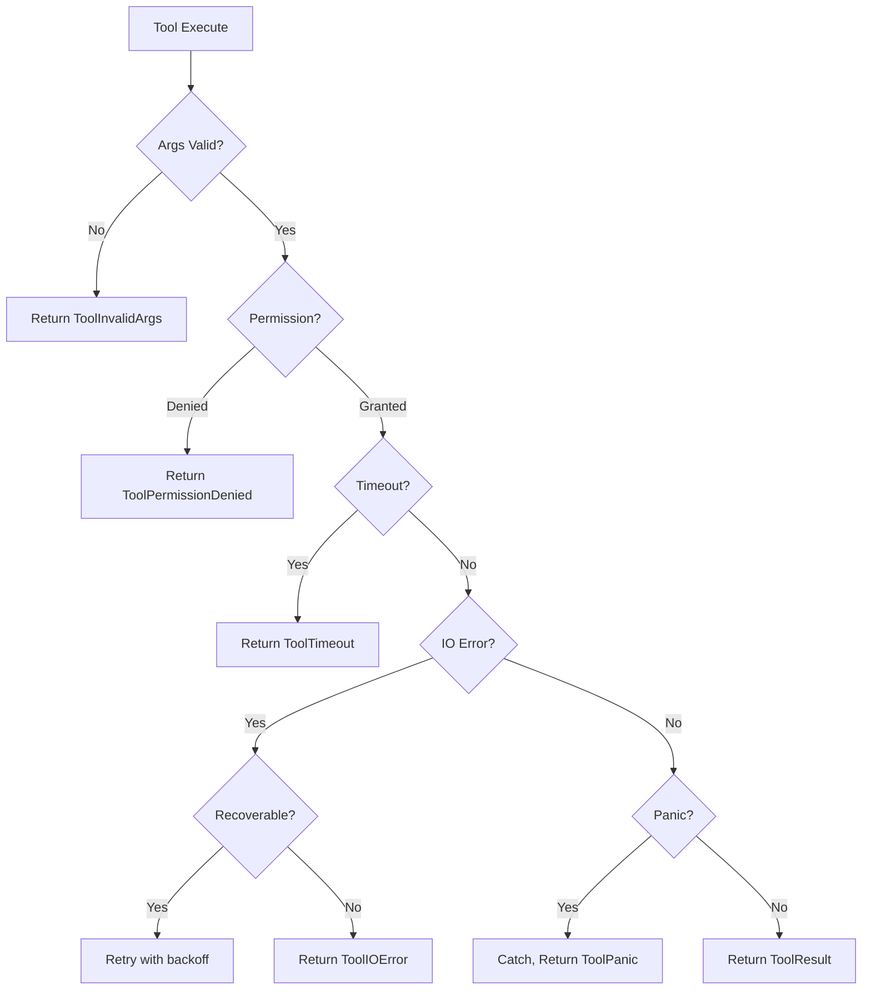
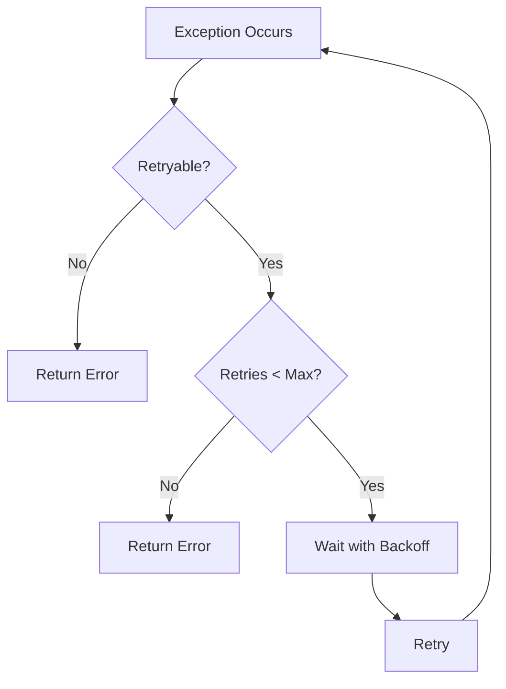

# tool.md — Tools Module

> **User Documentation**: [tools.mdx](https://github.com/anomalyco/opencode/blob/main/packages/web/src/content/docs/zh-cn/tools.mdx) — Built-in tools reference for users

**See Also**: [Glossary: Tool](../../system/01_glossary.md#tool) | [System PRD: Tools System](../../system/03-tools-system.md)

## Module Overview

- **Crate**: `opencode-tools`
- **Source**: `crates/tools/src/lib.rs`
- **Status**: Fully implemented — PRD reflects actual Rust API
- **Purpose**: Defines the `Tool` trait, `ToolContext`, `ToolResult`, `ToolRegistry` for dynamic tool registration/execution, and implements ~30 concrete tools (read, write, edit, grep, glob, bash, git, lsp, web search, etc.).

---

## Crate Layout

```
crates/tools/src/
├── lib.rs              ← Re-exports, module declarations
├── tool.rs             ← Tool trait, ToolResult, ToolContext
├── registry.rs         ← ToolRegistry (async, RwLock-based, priority)
├── discovery.rs        ← build_default_registry, register_custom_tools
├── schema_validation.rs ← ToolSchema validation
├── codesearch.rs       ← CodeSearchTool
├── multiedit.rs        ← MultiEditTool
├── truncation_dir.rs   ← TruncationDirTool
├── bash.rs             ← BashTool
├── read.rs             ← ReadTool
├── write.rs            ← WriteTool
├── edit.rs             ← EditTool
├── glob.rs             ← GlobTool
├── grep_tool.rs        ← GrepTool
├── lsp_tool.rs         ← LspTool
├── webfetch.rs         ← WebFetchTool
├── web_search.rs       ← WebSearchTool
├── skill.rs            ← SkillTool
├── todowrite.rs        ← TodowriteTool
├── task.rs             ← TaskTool
├── question.rs         ← QuestionTool
├── plan.rs             ← PlanExitTool
├── plan_exit.rs        ← PlanExitTool (duplicate/alias)
├── truncate.rs         ← TruncateTool
├── git_tools.rs        ← GitTools (commit, diff, status, etc.)
├── external_directory.rs ← ExternalDirectoryTool
├── ls.rs               ← LsTool
├── file_tools.rs       ← file-related tools
├── apply_patch.rs      ← ApplyPatchTool
├── batch.rs            ← BatchTool
├── invalid.rs          ← InvalidTool (error tool)
├── grep_tool_test.rs
├── lsp_tool_test.rs
├── read_test.rs
├── session_tools.rs / session_tools_test.rs
├── skill_test.rs
├── write_test.rs
└── formatter_hook.rs
```

**Key Cargo.toml dependencies**:
```toml
[dependencies]
async-trait = "0.1"
serde = { version = "1.0", features = ["derive"] }
serde_json = "1.0"
tokio = { version = "1.45", features = ["full"] }
regex = "1"
reqwest = { version = "0.12" }

opencode-core = { path = "../core" }
opencode-permission = { path = "../permission" }
```

**Public exports from lib.rs**:
```rust
pub use codesearch::CodeSearchTool;
pub use discovery::{build_default_registry, register_custom_tools};
pub use multiedit::MultiEditTool;
pub use registry::{ToolRegistry, ToolSource};
pub use schema_validation::ToolSchema;
pub use tool::sealed;
pub use tool::{Tool, ToolContext, ToolResult};
pub use truncation_dir::TruncationDirTool;
```

---

## Core Types

### ToolResult

```rust
#[derive(Debug, Clone, Serialize, Deserialize)]
pub struct ToolResult {
    pub success: bool,
    pub content: String,
    pub error: Option<String>,
    pub title: Option<String>,
    pub metadata: Option<serde_json::Value>,
}

impl ToolResult {
    pub fn ok(content: impl Into<String>) -> Self { ... }
    pub fn err(error: impl Into<String>) -> Self { ... }
    pub fn with_title(mut self, title: impl Into<String>) -> Self { ... }
    pub fn with_metadata(mut self, metadata: serde_json::Value) -> Self { ... }
}
```

### ToolContext

```rust
#[derive(Debug, Clone, Serialize, Deserialize, Default)]
pub struct ToolContext {
    pub session_id: String,
    pub message_id: String,
    pub agent: String,
    pub worktree: Option<String>,
    pub directory: Option<String>,
    pub permission_scope: Option<opencode_permission::AgentPermissionScope>,
}

impl ToolContext {
    pub fn with_permission_scope(
        mut self,
        scope: opencode_permission::AgentPermissionScope,
    ) -> Self { ... }
}
```

### Tool Trait

```rust
pub mod sealed {
    pub trait Sealed {}
}

#[async_trait]
pub trait Tool: Send + Sync + sealed::Sealed {
    fn name(&self) -> &str;
    fn description(&self) -> &str;
    fn clone_tool(&self) -> Box<dyn Tool>;
    
    async fn execute(
        &self,
        args: serde_json::Value,
        ctx: Option<ToolContext>,
    ) -> Result<ToolResult, OpenCodeError>;

    fn is_safe(&self) -> bool { false }
    fn get_dependencies(&self, _args: &serde_json::Value) -> HashSet<PathBuf> { HashSet::new() }
}
```

---

## ToolRegistry

```rust
// From registry.rs
pub struct ToolRegistry { ... }  // async, RwLock, priority-based dispatch

impl ToolRegistry {
    pub fn new() -> Self;
    pub async fn register(&self, tool: Box<dyn Tool>) -> Result<(), ToolError>;
    pub async fn execute(
        &self,
        name: &str,
        args: serde_json::Value,
        ctx: Option<ToolContext>,
    ) -> Result<ToolResult, ToolError>;
    pub async fn get_tool(&self, name: &str) -> Option<Box<dyn Tool>>;
    pub async fn list_tools(&self) -> Vec<String>;
    pub async fn unregister(&self, name: &str) -> Option<Box<dyn Tool>>;
}

pub enum ToolSource {
    BuiltIn,
    Plugin(String),
    Custom,
}
```

---

## Discovery / Default Registry

```rust
// From discovery.rs
pub fn build_default_registry() -> ToolRegistry { ... }
pub fn register_custom_tools(registry: &ToolRegistry) { ... }
```

`build_default_registry()` registers all built-in tools:
- `ReadTool` (name: "read")
- `WriteTool` (name: "write")
- `EditTool` (name: "edit")
- `GlobTool` (name: "glob")
- `GrepTool` (name: "grep")
- `BashTool` (name: "bash")
- `LsTool` (name: "list" / "ls")
- `LspTool` (name: "lsp")
- `WebFetchTool` (name: "webfetch")
- `WebSearchTool` (name: "websearch")
- `SkillTool` (name: "skill")
- `TodowriteTool` (name: "todowrite")
- `TaskTool` (name: "task")
- `QuestionTool` (name: "question")
- `PlanExitTool` (name: "plan_exit")
- `TruncateTool` (name: "truncate")
- `MultiEditTool` (name: "multiedit")
- `CodeSearchTool` (name: "codesearch")
- `TruncationDirTool` (name: "truncation_dir")
- `ApplyPatchTool` (name: "apply_patch")
- `ExternalDirectoryTool` (name: "external_directory")
- `GitTools` (multiple names: "git_commit", "git_diff", "git_status", "git_log", etc.)
- `InvalidTool` (name: "invalid")
- Batch tool(s)
- File tools

---

## Key Tool Implementations

### ReadTool
```rust
pub struct ReadTool;
impl Tool for ReadTool {
    fn name(&self) -> &str { "read" }
    fn description(&self) -> &str { "Read file contents" }
    fn is_safe(&self) -> bool { true }
    async fn execute(&self, args: serde_json::Value, ctx: Option<ToolContext>) -> Result<ToolResult, OpenCodeError>;
}
```

### BashTool
```rust
pub struct BashTool;
impl Tool for BashTool {
    fn name(&self) -> &str { "bash" }
    fn description(&self) -> &str { "Execute shell commands" }
    fn is_safe(&self) -> bool { false }  // requires permission check
    async fn execute(&self, args: serde_json::Value, ctx: Option<ToolContext>) -> Result<ToolResult, OpenCodeError>;
}
```

### GrepTool
```rust
pub struct GrepTool;
impl Tool for GrepTool { ... }
```

### LspTool
```rust
pub struct LspTool;
impl Tool for LspTool { ... }
```

---

## Inter-Crate Dependencies

| Dependant Crate | What it uses from `opencode-tools` |
|---|---|
| `opencode-agent` | `ToolRegistry`, `ToolContext` to invoke tools in agent loop |
| `opencode-server` | `ToolRegistry` for request handling |
| `opencode-tui` | Tool invocation from UI |
| `opencode-plugin` | `ToolRegistry` + `PluginToolAdapter` to register plugin tools |

**Dependencies of `opencode-tools`**:
| Crate | Usage |
|---|---|
| `opencode-core` | `OpenCodeError`, `Session` |
| `opencode-permission` | `AgentPermissionScope` for permission checks |

---

## Test Design

```rust
#[cfg(test)]
mod tests {
    use super::*;

    #[tokio::test]
    async fn test_tool_result_ok() {
        let result = ToolResult::ok("file contents");
        assert!(result.success);
        assert_eq!(result.content, "file contents");
        assert!(result.error.is_none());
    }

    #[tokio::test]
    async fn test_tool_result_err() {
        let result = ToolResult::err("permission denied");
        assert!(!result.success);
        assert!(result.content.is_empty());
        assert_eq!(result.error, Some("permission denied".to_string()));
    }

    #[tokio::test]
    async fn test_tool_result_with_title() {
        let result = ToolResult::ok("content").with_title("File: README.md");
        assert_eq!(result.title, Some("File: README.md".to_string()));
    }

    #[tokio::test]
    async fn test_tool_context_default() {
        let ctx = ToolContext::default();
        assert!(ctx.session_id.is_empty());
        assert!(ctx.permission_scope.is_none());
    }

    #[tokio::test]
    async fn test_tool_context_with_permission_scope() {
        let ctx = ToolContext::default()
            .with_permission_scope(AgentPermissionScope::ReadOnly);
        assert_eq!(ctx.permission_scope, Some(AgentPermissionScope::ReadOnly));
    }

    #[tokio::test]
    async fn test_registry_execute_built_in_tool() {
        let registry = build_default_registry();
        let result = registry.execute(
            "read",
            serde_json::json!({"path": "/tmp/test.txt"}),
            None,
        ).await;
        // Result depends on whether file exists
    }

    #[tokio::test]
    async fn test_registry_execute_unknown_tool() {
        let registry = build_default_registry();
        let result = registry.execute("nonexistent_tool", serde_json::json!({}), None).await;
        assert!(result.is_err());
    }

    #[tokio::test]
    async fn test_registry_list_tools() {
        let registry = build_default_registry();
        let tools = registry.list_tools().await;
        assert!(tools.contains(&"read".to_string()));
        assert!(tools.contains(&"write".to_string()));
        assert!(tools.contains(&"bash".to_string()));
    }

    #[tokio::test]
    async fn test_registry_register_and_execute() {
        let registry = ToolRegistry::new();
        registry.register(Box::new(ReadTool)).await.unwrap();
        let tools = registry.list_tools().await;
        assert!(tools.contains(&"read".to_string()));
    }

    #[test]
    fn test_tool_result_serialization() {
        let result = ToolResult::ok("content").with_title("title");
        let json = serde_json::to_string(&result).unwrap();
        assert!(json.contains("\"success\":true"));
        assert!(json.contains("\"title\":\"title\""));
    }

    #[test]
    fn test_tool_result_deserialization() {
        let json = r#"{"success": false, "content": "", "error": "failed"}"#;
        let result: ToolResult = serde_json::from_str(json).unwrap();
        assert!(!result.success);
        assert_eq!(result.error, Some("failed".to_string()));
    }
}
```

---

## Usage Example

```rust
use opencode_tools::{ToolRegistry, build_default_registry, ToolContext, ToolResult};
use opencode_permission::AgentPermissionScope;

async fn execute_tool() -> Result<ToolResult, ToolError> {
    let registry = build_default_registry();

    let ctx = ToolContext {
        session_id: "session-123".to_string(),
        message_id: "msg-456".to_string(),
        agent: "build".to_string(),
        worktree: Some("/path/to/project".to_string()),
        directory: Some("/path/to/project".to_string()),
        permission_scope: Some(AgentPermissionScope::Full),
    };

    let result = registry
        .execute("read", serde_json::json!({"path": "/path/to/file.txt"}), Some(ctx))
        .await?;

    println!("Tool result: {}", result.content);
    Ok(result)
}
```

---

## Error Handling

### Error Types

| Error Type | Code | Description |
|------------|------|-------------|
| `ToolNotFound` | 4001 | Requested tool does not exist in registry |
| `ToolTimeout` | 4002 | Tool execution exceeded configured timeout |
| `ToolInvalidArgs` | 4003 | Tool arguments fail schema validation |
| `ToolPermissionDenied` | 4004 | Tool execution denied by permission system |
| `ToolExecutionFailed` | 4005 | Tool execution returned an error |
| `ToolPanic` | 4006 | Tool panicked during execution |
| `ToolIOError` | 4007 | I/O error during tool execution |

### Error Handling Matrix

| Scenario | Expected Behavior | Error Code |
|----------|------------------|------------|
| Execute non-existent tool | Return `ToolNotFound` | 4001 |
| Invalid JSON args | Return `ToolInvalidArgs` | 4003 |
| Missing required arg | Return `ToolInvalidArgs` | 4003 |
| Permission denied | Return `ToolPermissionDenied` | 4004 |
| Tool panics | Catch, return `ToolPanic` | 4006 |
| Tool times out | Return `ToolTimeout` | 4002 |
| I/O error | Return `ToolIOError` | 4007 |

### Exception Categories

#### Recoverable Exceptions

These exceptions allow retry or graceful degradation:

| Category | Examples | Recovery Strategy |
|----------|----------|-------------------|
| Transient I/O | Network timeout, file busy | Retry with backoff |
| Rate limiting | Provider rate limit | Wait and retry |
| Resource temporarily unavailable | Port in use | Retry on different port |

#### Non-Recoverable Exceptions

These exceptions require user intervention:

| Category | Examples | Recovery Strategy |
|----------|----------|-------------------|
| Permission denied | No read access | Request permission or use different path |
| Invalid arguments | Malformed path | Fix arguments |
| Resource not found | File deleted | Notify user |
| Quota exceeded | Budget limit | Reduce scope or upgrade |

#### Tool-Specific Exceptions

| Tool | Typical Exception | Handling |
|------|-------------------|----------|
| `Read` | File not found, Permission denied | Check path, request permission |
| `Write` | Directory not found, Disk full | Create parent, free space |
| `Bash` | Command not found, Timeout | Check PATH, increase timeout |
| `Lsp` | Server not running | Start LSP server |
| `WebFetch` | Network error, Invalid URL | Check URL, retry |
| `Git` | Not a git repo, Merge conflict | Initialize repo, resolve conflict |

### Exception Flow Diagrams

#### Tool Execution Exception Flow



#### Retry Decision Flow



### Error Response Format

Tool errors should return structured error information:

```rust
// ToolError response structure
ToolResult::err(format!(
    "{{\"code\": {:?}, \"tool\": {:?}, \"detail\": {:?}}}",
    error_code,
    tool_name,
    error_detail
))
```

### Panic Handling

All tools must be wrapped in panic handlers:

```rust
async fn execute_with_panic_handling(
    tool: &dyn Tool,
    args: serde_json::Value,
    ctx: Option<ToolContext>,
) -> Result<ToolResult, OpenCodeError> {
    let result = tokio::spawn(async move {
        tool.execute(args, ctx).await
    }).await;

    match result {
        Ok(Ok(val)) => Ok(val),
        Ok(Err(e)) => Err(e),
        Err(_) => Err(OpenCodeError::ToolPanic {
            tool: tool.name().to_string(),
            detail: Some("Tool execution panicked".to_string()),
        }),
    }
}
```

### Timeout Handling

| Tool Category | Default Timeout | Configurable |
|---------------|-----------------|--------------|
| Read | 30s | Yes |
| Write | 30s | Yes |
| Edit | 30s | Yes |
| Bash | 60s | Yes |
| Glob | 30s | Yes |
| Grep | 60s | Yes |
| Lsp | 120s | Yes |
| WebFetch | 30s | Yes |
| WebSearch | 60s | Yes |
| Git | 60s | Yes |

### Error Logging

Tool errors must be logged with context:

```rust
tracing::error!(
    tool = %tool_name,
    session_id = ?ctx.session_id,
    error = %error,
    "Tool execution failed"
);
```

### Best Practices

1. **Always return structured errors** - Include error code, tool name, and detail
2. **Log before returning** - Ensure errors are captured in logs
3. **Catch panics at registry level** - Never let panics propagate
4. **Set appropriate timeouts** - Per-tool timeouts based on expected duration
5. **Implement retry for transient errors** - I/O and network errors
6. **Don't retry permission errors** - These require user action

---

## Acceptance Criteria

### ToolRegistry

| ID | Criterion | Test Method |
|----|-----------|-------------|
| AC-TR001 | `build_default_registry()` returns registry with all built-in tools | Unit test |
| AC-TR002 | `registry.list_tools()` returns at least 26 tool names | Unit test |
| AC-TR003 | `registry.execute("read", ...)` executes ReadTool | Integration test |
| AC-TR004 | `registry.execute("nonexistent", ...)` returns `ToolNotFound` error | Unit test |
| AC-TR005 | `registry.register()` adds tool to registry | Unit test |
| AC-TR006 | `registry.unregister()` removes tool from registry | Unit test |
| AC-TR007 | Concurrent `execute()` calls are handled safely (RwLock) | Concurrency test |
| AC-TR008 | Tool priority determines execution order when multiple matches | Unit test |

### Tool Trait

| ID | Criterion | Test Method |
|----|-----------|-------------|
| AC-T001 | All tools implement `Tool::name()` returning non-empty string | Unit test |
| AC-T002 | All tools implement `Tool::description()` returning non-empty string | Unit test |
| AC-T003 | All tools implement `Clone` via `clone_tool()` | Unit test |
| AC-T004 | `ToolResult::ok()` creates success result | Unit test |
| AC-T005 | `ToolResult::err()` creates error result | Unit test |
| AC-T006 | `ToolResult::with_title()` chains correctly | Unit test |
| AC-T007 | `ToolResult::with_metadata()` chains correctly | Unit test |
| AC-T008 | Tool execution returns `Result<ToolResult, OpenCodeError>` | Unit test |

### ReadTool

| ID | Criterion | Given-When-Then |
|----|-----------|------------------|
| AC-READ001 | Read existing file | Given file `/tmp/test.txt` exists with "hello", When execute ReadTool with `{"path": "/tmp/test.txt"}`, Then return `ToolResult::ok("hello")` |
| AC-READ002 | Read non-existent file | Given file `/tmp/nonexistent` does not exist, When execute ReadTool, Then return `ToolResult::err(...)` with error containing "No such file" |
| AC-READ003 | Read file with invalid permissions | Given file exists but is unreadable, When execute ReadTool, Then return error with "Permission denied" |
| AC-READ004 | Read binary file | Given file contains binary data, When execute ReadTool, Then return content (possibly truncated with warning) |
| AC-READ005 | Read large file (>1MB) | Given file exists with >1MB content, When execute ReadTool, Then return content or error if truncation enabled |

### WriteTool

| ID | Criterion | Given-When-Then |
|----|-----------|------------------|
| AC-WRITE001 | Write new file | Given directory `/tmp` exists, When execute WriteTool with `{"path": "/tmp/new.txt", "content": "hello"}`, Then file created with "hello" |
| AC-WRITE002 | Overwrite existing file | Given file exists, When execute WriteTool with new content, Then file replaced |
| AC-WRITE003 | Write to non-existent directory | Given parent directory missing, When execute WriteTool, Then return error "No such directory" |
| AC-WRITE004 | Write with permission denied | Given directory is not writable, When execute WriteTool, Then return error "Permission denied" |
| AC-WRITE005 | Write empty content | Given valid path, When execute WriteTool with empty content, Then file created empty |

### EditTool

| ID | Criterion | Given-When-Then |
|----|-----------|------------------|
| AC-EDIT001 | Edit existing file | Given file has "hello world", When execute EditTool with `{"path": "/tmp/file", "old": "world", "new": "rust"}`, Then file contains "hello rust" |
| AC-EDIT002 | Edit with exact match not found | Given file doesn't contain "old", When execute EditTool, Then return error "Pattern not found" |
| AC-EDIT003 | Edit creates file if not exists | Given file doesn't exist, When execute EditTool, Then return error "File not found" (edit requires existing file) |
| AC-EDIT004 | Edit with invalid regex | Given "old" is invalid regex, When execute EditTool, Then return `ToolInvalidArgs` |

### BashTool

| ID | Criterion | Given-When-Then |
|----|-----------|------------------|
| AC-BASH001 | Execute valid command | Given `echo "hello"` command, When execute BashTool, Then return `ToolResult::ok("hello\n")` |
| AC-BASH002 | Command with non-zero exit | Given `exit 1` command, When execute BashTool, Then return error with exit code 1 |
| AC-BASH003 | Command timeout | Given `sleep 100` with timeout 1s, When execute BashTool, Then return `ToolTimeout` |
| AC-BASH004 | Permission denied command | Given command requiring elevated privileges, When execute with ReadOnly permission, Then return `ToolPermissionDenied` |
| AC-BASH005 | Command not found | Given `nonexistent_command_xyz`, When execute BashTool, Then return error containing "not found" |
| AC-BASH006 | Command with special characters | Given `echo "hello > file.txt"`, When execute BashTool, Then shell expansion works correctly |

### GrepTool

| ID | Criterion | Given-When-Then |
|----|-----------|------------------|
| AC-GREP001 | Find matching lines | Given file with "hello world", When execute GrepTool with `{"pattern": "hello"}`, Then return lines containing "hello" |
| AC-GREP002 | No matches | Given file without pattern, When execute GrepTool, Then return empty results |
| AC-GREP003 | Recursive search | Given directory, When execute GrepTool with `{"recursive": true}`, Then search all files |
| AC-GREP004 | Regex pattern | Given valid regex, When execute GrepTool, Then return matches |
| AC-GREP005 | Case insensitive | Given pattern with `(?i)flag`, When execute GrepTool, Then match case-insensitively |

### GlobTool

| ID | Criterion | Given-When-Then |
|----|-----------|------------------|
| AC-GLOB001 | Match files | Given directory with `*.rs` files, When execute GlobTool with `{"pattern": "**/*.rs"}`, Then return list of `.rs` files |
| AC-GLOB002 | No matches | Given no matching files, When execute GlobTool, Then return empty list |
| AC-GLOB003 | Hidden files | Given pattern `".*"`, When execute GlobTool, Then return hidden files (if permission allows) |

### LspTool

| ID | Criterion | Given-When-Then |
|----|-----------|------------------|
| AC-LSP001 | Get definitions | Given LSP server running, When execute LspTool with `{"action": "definitions", "path": "file.rs", "position": {"line": 10, "character": 5}}`, Then return definition locations |
| AC-LSP002 | Find references | Given LSP server running, When execute LspTool with `{"action": "references", ...}`, Then return reference locations |
| AC-LSP003 | LSP server not available | Given no LSP server, When execute LspTool, Then return error "LSP server not running" |
| AC-LSP004 | Invalid document | Given non-existent file, When execute LspTool, Then return error |

### WebFetchTool

| ID | Criterion | Given-When-Then |
|----|-----------|------------------|
| AC-WFETCH001 | Fetch valid URL | Given `https://example.com`, When execute WebFetchTool, Then return HTML content |
| AC-WFETCH002 | Fetch with redirect | Given URL with 302 redirect, When execute WebFetchTool, Then follow redirect and return final content |
| AC-WFETCH003 | Invalid URL | Given `not-a-url`, When execute WebFetchTool, Then return `ToolInvalidArgs` |
| AC-WFETCH004 | Timeout | Given slow/unresponsive server, When execute WebFetchTool, Then return `ToolTimeout` |
| AC-WFETCH005 | HTTPS only | Given HTTP URL when HTTPS required, When execute WebFetchTool, Then return error or redirect to HTTPS |

### WebSearchTool

| ID | Criterion | Given-When-Then |
|----|-----------|------------------|
| AC-WSEARCH001 | Valid search | Given query "rust programming", When execute WebSearchTool, Then return search results |
| AC-WSEARCH002 | Empty query | Given empty query, When execute WebSearchTool, Then return error or empty results |
| AC-WSEARCH003 | Provider error | Given search provider error, When execute WebSearchTool, Then return error with details |

### SkillTool

| ID | Criterion | Given-When-Then |
|----|-----------|------------------|
| AC-SKILL001 | Load existing skill | Given skill "tdd-workflow" exists, When execute SkillTool, Then return skill definition |
| AC-SKILL002 | Skill not found | Given skill "nonexistent", When execute SkillTool, Then return error "Skill not found" |
| AC-SKILL003 | List all skills | Given skill registry has items, When execute SkillTool with no args, Then return list of available skills |

### TodowriteTool

| ID | Criterion | Given-When-Then |
|----|-----------|------------------|
| AC-TODO001 | Create todo | Given valid todo content, When execute TodowriteTool with `{"action": "create", "content": "task"}`, Then todo created |
| AC-TODO002 | List todos | Given todos exist, When execute TodowriteTool with `{"action": "list"}`, Then return todo list |
| AC-TODO003 | Update todo | Given todo exists, When execute TodowriteTool with `{"action": "update", "id": "...", "status": "done"}`, Then todo updated |
| AC-TODO004 | Delete todo | Given todo exists, When execute TodowriteTool with `{"action": "delete", "id": "..."}`, Then todo deleted |

### GitTools

| ID | Criterion | Given-When-Then |
|----|-----------|------------------|
| AC-GIT001 | Git status | Given git repo, When execute `git_status`, Then return modified files |
| AC-GIT002 | Git diff | Given git repo with changes, When execute `git_diff`, Then return diff output |
| AC-GIT003 | Git commit | Given staged changes, When execute `git_commit` with message, Then commit created |
| AC-GIT004 | Git log | Given git repo, When execute `git_log`, Then return commit history |
| AC-GIT005 | Not a git repo | Given directory without git, When execute git tools, Then return error "Not a git repository" |

### Permission Enforcement

| ID | Criterion | Given-When-Then |
|----|-----------|------------------|
| AC-PERM001 | Full permission allows dangerous tools | Given `permission_scope: Full`, When execute BashTool, Then tool executes |
| AC-PERM002 | ReadOnly permission blocks dangerous tools | Given `permission_scope: ReadOnly`, When execute BashTool, Then return `ToolPermissionDenied` |
| AC-PERM003 | ReadOnly allows safe tools | Given `permission_scope: ReadOnly`, When execute ReadTool, Then tool executes |
| AC-PERM004 | Tool checks `is_safe()` flag | Given custom tool with `is_safe: true`, When execute with ReadOnly permission, Then tool executes |

### Tool Schema Validation

| ID | Criterion | Given-When-Then |
|----|-----------|------------------|
| AC-SCHEMA001 | Valid args pass validation | Given tool schema requires "path", When execute with `{"path": "/tmp"}`, Then tool executes |
| AC-SCHEMA002 | Missing required arg | Given schema requires "path", When execute with `{}`, Then return `ToolInvalidArgs` |
| AC-SCHEMA003 | Wrong arg type | Given schema requires number, When execute with string, Then return `ToolInvalidArgs` |
| AC-SCHEMA004 | Additional properties ignored | Given extra properties not in schema, When execute, Then tool executes (ignore extra) |

### Custom Tool Registration

| ID | Criterion | Given-When-Then |
|----|-----------|------------------|
| AC-CUSTOM001 | Register custom tool | Given custom tool implementing Tool trait, When `registry.register(custom_tool)`, Then tool available in registry |
| AC-CUSTOM002 | Custom tool executes | Given custom tool registered, When `registry.execute("custom_name", ...)`, Then custom tool's execute() called |
| AC-CUSTOM003 | Plugin tool registration | Given plugin calls `register_tool()`, When tool executes, Then plugin tool handles request |
| AC-CUSTOM004 | Duplicate tool name | Given tool with existing name, When register, Then return error or override existing |

### Performance

| ID | Criterion | Target | Test Method |
|----|-----------|--------|-------------|
| AC-PERF001 | Tool execution overhead | < 5ms | Microbenchmark |
| AC-PERF002 | Registry list_tools() | < 1ms for 30 tools | Microbenchmark |
| AC-PERF003 | Concurrent tool execution | 10+ concurrent safe | Concurrency test |

### Security

| ID | Criterion | Test Method |
|----|-----------|-------------|
| AC-SEC001 | No credential leakage in logs | Verify logs don't contain API keys | Security test |
| AC-SEC002 | Path traversal blocked | Given `../` in path, When execute ReadTool, Then return error or restrict to worktree | Security test |
| AC-SEC003 | Shell injection blocked | Given `; rm -rf` in bash command, When execute BashTool, Then command fails or is safely escaped | Security test |

---

## Cross-References

| Reference | Description |
|-----------|-------------|
| [Tool System PRD](../../system/03-tools-system.md) | System-level tool architecture |
| [Glossary: Tool](../../system/01_glossary.md#tool) | Tool terminology |
| [ERROR_CODE_CATALOG.md](../../ERROR_CODE_CATALOG.md#4xxx) | Tool error codes (4001-4005) |
| [permission.md](../permission.md) | Permission system |
```
