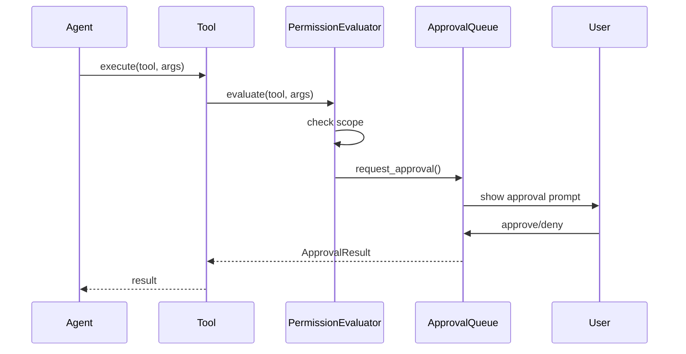

# permission.md — Permission Module

## Module Overview

- **Crate**: `opencode-permission`
- **Source**: `crates/permission/src/lib.rs`
- **Status**: Fully implemented — PRD reflects actual Rust API
- **Purpose**: Permission evaluation, approval queues, audit logging, and sensitive path checking.

---

## Crate Layout

```
crates/permission/src/
├── lib.rs              ← Public re-exports, all types
├── [various modules]
```

**Key Cargo.toml dependencies**:
```toml
[dependencies]
serde = { version = "1.0", features = ["derive"] }
serde_json = "1.0"
thiserror = "2.0"
tokio = { version = "1.45", features = ["full"] }

opencode-core = { path = "../core" }
```

**Public exports**:
```rust
pub use crate::audit::{AuditDecision, AuditEntry, AuditLog};
pub use crate::approval_queue::{ApprovalQueue, ApprovalResult, PendingApproval};
pub use crate::evaluator::{FilePermissionResult, PermissionEvaluator};
pub use crate::scope::{AgentPermissionScope, PermissionScope};

// Functions
pub use crate::sensitive::{
    check_sensitive, get_sensitive_reason, is_external_directory,
    is_sensitive_directory, is_sensitive_path, SensitiveCheckResult,
};
pub use crate::check::{check_tool_permission, check_tool_permission_default};
```

---

## Core Types

### AgentPermissionScope

```rust
#[derive(Debug, Clone, Copy, PartialEq, Eq, Serialize, Deserialize)]
#[serde(rename_all = "lowercase")]
pub enum AgentPermissionScope {
    None,
    ReadOnly,
    Restricted,
    Full,
}

impl AgentPermissionScope {
    pub fn from_agent_permissions(can_write: bool, can_run_commands: bool) -> Self;
    pub fn intersect(self, other: AgentPermissionScope) -> AgentPermissionScope;
    pub fn can_write_files(&self) -> bool;
    pub fn can_run_commands(&self) -> bool;
}
```

### PermissionScope

```rust
#[derive(Debug, Clone, PartialEq, Eq, Serialize, Deserialize, Default)]
pub struct PermissionScope {
    pub read: bool,
    pub edit: bool,
    pub bash: bool,
    pub external_directory: bool,
    pub tool_defaults: HashMap<String, PermissionAction>,
}

#[derive(Debug, Clone, Copy, PartialEq, Eq, Serialize, Deserialize)]
#[serde(rename_all = "lowercase")]
pub enum PermissionAction {
    Ask,
    Allow,
    Deny,
}
```

### ApprovalQueue

```rust
pub struct ApprovalQueue {
    scope: PermissionScope,
    pending: Arc<RwLock<Vec<PendingApproval>>>,
}

impl ApprovalQueue {
    pub fn new(scope: PermissionScope) -> Self;
    pub async fn request_approval(&self, req: ApprovalRequest) -> Result<ApprovalResult, PermissionError>;
    pub async fn get_pending(&self) -> Vec<PendingApproval>;
    pub async fn approve(&self, id: &str) -> Result<(), PermissionError>;
    pub async fn deny(&self, id: &str) -> Result<(), PermissionError>;
}

pub struct PendingApproval {
    pub id: String,
    pub tool: String,
    pub args: serde_json::Value,
    pub session_id: String,
    pub requested_at: DateTime<Utc>,
    pub expires_at: Option<DateTime<Utc>>,
}

pub enum ApprovalResult {
    AutoApprove,
    RequireApproval,
    Denied,
}
```

### AuditLog

```rust
pub struct AuditLog {
    entries: Arc<RwLock<Vec<AuditEntry>>>,
}

pub struct AuditEntry {
    pub id: Uuid,
    pub timestamp: DateTime<Utc>,
    pub session_id: Option<String>,
    pub decision: AuditDecision,
    pub tool: Option<String>,
    pub scope: DecisionScope,
    pub reason: Option<String>,
}

pub enum AuditDecision {
    Allow,
    Deny,
    Ask,
    Approve,
}
```

### PermissionEvaluator

```rust
pub struct PermissionEvaluator {
    scope: PermissionScope,
}

impl PermissionEvaluator {
    pub fn new(scope: PermissionScope) -> Self;
    pub fn evaluate_file_access(&self, path: &Path, operation: FileOperation) -> FilePermissionResult;
    pub fn evaluate_tool_call(&self, tool: &str, args: &serde_json::Value) -> PermissionResult;
}

pub enum FileOperation {
    Read,
    Write,
    Execute,
}

pub enum FilePermissionResult {
    Allowed,
    Denied { reason: String },
    RequiresApproval,
}
```

### Sensitive Path Checking

```rust
pub fn is_sensitive_path(path: &Path) -> bool;
pub fn is_sensitive_directory(path: &Path) -> bool;
pub fn is_external_directory(path: &Path) -> bool;
pub fn check_sensitive(path: &Path) -> SensitiveCheckResult;
pub fn get_sensitive_reason(path: &Path) -> Option<String>;

pub struct SensitiveCheckResult {
    pub is_sensitive: bool,
    pub reason: Option<String>,
    pub suggestion: Option<String>,
}
```

### Tool Permission Checking

```rust
pub fn check_tool_permission(tool: &str, scope: PermissionScope) -> ApprovalResult;
pub fn check_tool_permission_default(tool: &str) -> ApprovalResult;
```

---

## Inter-Crate Dependencies

| Dependant Crate | What it uses from `opencode-permission` |
|---|---|
| `opencode-server` | `ApprovalQueue`, `AuditLog` in `ServerState` |
| `opencode-tools` | `AgentPermissionScope` in `ToolContext` |
| `opencode-agent` | `AgentPermissionScope` in `RuntimeConfig` |
| `opencode-plugin` | `ApprovalResult`, `PermissionScope` for plugin tool access |

---

## Test Design

```rust
#[cfg(test)]
mod tests {
    #[test]
    fn test_agent_permission_scope_from_write() {
        assert_eq!(AgentPermissionScope::from_agent_permissions(true, false), AgentPermissionScope::Restricted);
        assert_eq!(AgentPermissionScope::from_agent_permissions(true, true), AgentPermissionScope::Full);
        assert_eq!(AgentPermissionScope::from_agent_permissions(false, false), AgentPermissionScope::ReadOnly);
    }

    #[test]
    fn test_permission_scope_intersection() {
        let full = AgentPermissionScope::Full;
        let readonly = AgentPermissionScope::ReadOnly;
        assert_eq!(full.intersect(readonly), AgentPermissionScope::ReadOnly);
    }

    #[tokio::test]
    async fn test_approval_queue_request() {
        let queue = ApprovalQueue::new(PermissionScope::default());
        let req = ApprovalRequest { tool: "bash".into(), args: serde_json::json!({}), session_id: "s1".into() };
        let result = queue.request_approval(req).await;
        // Depends on tool and scope
    }

    #[test]
    fn test_sensitive_path_detection() {
        assert!(is_sensitive_path(Path::new("/etc/passwd")));
        assert!(!is_sensitive_path(Path::new("/home/user/project/src/main.rs")));
    }

    #[test]
    fn test_audit_log_records_decision() {
        let log = AuditLog::new();
        log.record(AuditEntry { id: Uuid::new_v4(), timestamp: Utc::now(), session_id: Some("s1".into()), decision: AuditDecision::Allow, tool: Some("read".into()), scope: DecisionScope::File, reason: None });
        assert_eq!(log.entries().len(), 1);
    }
}
```

---

## Permission Matrix

### AgentPermissionScope vs Tool Access

| Permission Scope | Read | Write | Bash | Dangerous Tools |
|------------------|------|-------|------|-----------------|
| `None` | ✗ | ✗ | ✗ | ✗ |
| `ReadOnly` | ✓ | ✗ | ✗ | ✗ |
| `Restricted` | ✓ | ✓ (with approval) | ✗ | ✗ |
| `Full` | ✓ | ✓ | ✓ | ✓ |

### PermissionScope Granular Controls

| Operation | Default | Ask | Allow | Deny |
|-----------|---------|-----|-------|------|
| `read` | `Allow` | `Ask` | `Allow` | `Deny` |
| `edit` | `Ask` | `Ask` | `Allow` | `Deny` |
| `bash` | `Ask` | `Ask` | `Allow` | `Deny` |
| `external_directory` | `Deny` | `Ask` | `Allow` | `Deny` |

### Sensitive Paths

The following paths are considered sensitive and require explicit user approval:

| Path Pattern | Reason |
|--------------|--------|
| `/etc/` | System configuration |
| `/usr/` | System binaries |
| `/bin/` | System binaries |
| `/sbin/` | System binaries |
| `/boot/` | Boot files |
| `/dev/` | Device files |
| `/proc/` | Process info |
| `/sys/` | System kernel |
| `$HOME/.ssh/` | SSH keys |
| `$HOME/.aws/` | AWS credentials |
| `$HOME/.config/opencode-rs/` | OpenCode config |

### External Directory Restrictions

| Pattern | Allowed |
|---------|---------|
| Project directory and subdirectories | ✓ |
| `/tmp/` | ✓ (with warning) |
| `/var/tmp/` | ✓ (with warning) |
| Parent of project directory | ✗ |
| `$HOME/` | ✗ |
| `/etc/` | ✗ |
| Any path outside project tree | ✗ (unless explicitly permitted) |

---

## User Roles

### Role Definitions

| Role | Description | Typical Use Case |
|------|-------------|------------------|
| **Developer** | Default role, can read/write files and run commands within project | Daily development |
| **DevOps** | Extended permissions for infrastructure tasks | Deployment, CI/CD |
| **Admin** | Full system access | System configuration |
| **Auditor** | Read-only access to audit logs | Security review |

### Role vs Permission Scope Mapping

| Role | Default Scope | Can Override | Restrictions |
|------|---------------|-------------|-------------|
| Developer | `Restricted` | ✗ | No bash by default |
| DevOps | `Full` | ✗ | None |
| Admin | `Full` | ✗ | None |
| Auditor | `ReadOnly` | ✗ | Read-only |

### Permission Actions by Role

| Action | Developer | DevOps | Admin | Auditor |
|--------|-----------|--------|-------|---------|
| Read project files | ✓ | ✓ | ✓ | ✓ |
| Edit project files | ✓ (approval) | ✓ | ✓ | ✗ |
| Execute bash | ✗ | ✓ | ✓ | ✗ |
| Access sensitive paths | ✗ | ✗ | ✓ | ✗ |
| View audit logs | ✗ | ✗ | ✓ | ✓ |
| Manage approvals | ✗ | ✗ | ✓ | ✗ |

---

## Approval Workflow

### Approval Request Flow



### Approval Decision Matrix

| Tool | Scope | Path Sensitive | Previous Denied | Result |
|------|-------|----------------|----------------|--------|
| `read` | `ReadOnly` | ✗ | - | `AutoApprove` |
| `read` | `ReadOnly` | ✓ | - | `RequireApproval` |
| `write` | `Restricted` | ✗ | ✗ | `RequireApproval` |
| `write` | `Restricted` | ✗ | ✓ | `Denied` |
| `bash` | `Full` | ✗ | ✗ | `AutoApprove` |
| `bash` | `Restricted` | - | - | `RequireApproval` |
| `bash` | `None` | - | - | `Denied` |

---

## Audit Logging

### AuditEntry Fields

| Field | Type | Description |
|-------|------|-------------|
| `id` | Uuid | Unique audit entry ID |
| `timestamp` | DateTime | When decision was made |
| `session_id` | Option<String> | Associated session |
| `decision` | AuditDecision | Allow/Deny/Ask/Approve |
| `tool` | Option<String> | Tool name if applicable |
| `scope` | DecisionScope | File/Tool/Session |
| `reason` | Option<String> | Denial or approval reason |

### Audit Retention

| Data | Retention Period | Access |
|------|------------------|--------|
| Audit entries | 90 days | Admin, Auditor |
| Approval history | 90 days | Admin, Auditor |
| Session logs | 30 days | Admin |
| Tool execution logs | 7 days | Admin |

---

## Acceptance Criteria

### Permission Evaluation

| ID | Criterion | Given-When-Then |
|----|-----------|------------------|
| AC-PE001 | ReadOnly scope allows Read tool | Given `ReadOnly` scope, When `PermissionEvaluator.evaluate_tool_call("read", ...)`, Then return `Allowed` |
| AC-PE002 | ReadOnly scope denies Write tool | Given `ReadOnly` scope, When `PermissionEvaluator.evaluate_tool_call("write", ...)`, Then return `Denied` |
| AC-PE003 | ReadOnly scope denies Bash tool | Given `ReadOnly` scope, When `PermissionEvaluator.evaluate_tool_call("bash", ...)`, Then return `Denied` |
| AC-PE004 | Full scope allows all tools | Given `Full` scope, When `PermissionEvaluator.evaluate_tool_call(any_tool, ...)`, Then return `Allowed` |
| AC-PE005 | None scope denies all tools | Given `None` scope, When `PermissionEvaluator.evaluate_tool_call(any_tool, ...)`, Then return `Denied` |

### Sensitive Path Detection

| ID | Criterion | Given-When-Then |
|----|-----------|------------------|
| AC-SP001 | Detect /etc/passwd as sensitive | Given path "/etc/passwd", When `is_sensitive_path()`, Then return `true` |
| AC-SP002 | Detect project file as non-sensitive | Given "/home/user/project/src/main.rs", When `is_sensitive_path()`, Then return `false` |
| AC-SP003 | External directory detection | Given path "/tmp/external", When `is_external_directory()`, Then return `true` |
| AC-SP004 | Get sensitive reason | Given "/etc/passwd", When `get_sensitive_reason()`, Then return Some explanation |

### Approval Queue

| ID | Criterion | Given-When-Then |
|----|-----------|------------------|
| AC-AQ001 | Auto-approve safe operation | Given `Restricted` scope, When request approval for `read`, Then return `AutoApprove` |
| AC-AQ002 | Require approval for write | Given `Restricted` scope, When request approval for `write`, Then return `RequireApproval` |
| AC-AQ003 | Deny previously denied | Given tool previously denied in session, When request approval, Then return `Denied` |
| AC-AQ004 | Queue pending approvals | Given multiple approval requests, When `get_pending()`, Then return all pending |
| AC-AQ005 | Approve request | Given pending request ID, When `approve(id)`, Then request approved |
| AC-AQ006 | Deny request | Given pending request ID, When `deny(id)`, Then request denied |

### Audit Logging

| ID | Criterion | Given-When-Then |
|----|-----------|------------------|
| AC-AL001 | Log allow decision | Given tool execution allowed, When executed, Then audit log entry created with `Allow` |
| AC-AL002 | Log deny decision | Given tool execution denied, When executed, Then audit log entry created with `Deny` |
| AC-AL003 | Log approval decision | Given user approves request, When `approve()`, Then audit log entry created with `Approve` |
| AC-AL004 | Audit entry contains tool name | Given tool executed, When audit log created, Then entry.tool = tool_name |

### Scope Intersections

| ID | Criterion | Given-When-Then |
|----|-----------|------------------|
| AC-SI001 | Full intersect ReadOnly = ReadOnly | Given Full and ReadOnly intersect, Then result = ReadOnly |
| AC-SI002 | Restricted intersect ReadOnly = ReadOnly | Given Restricted and ReadOnly intersect, Then result = ReadOnly |
| AC-SI003 | None intersect Any = None | Given None and any scope intersect, Then result = None |

---

## Error Handling

| Error Type | Code | Description |
|------------|------|-------------|
| `PermissionDenied` | 2001 | Operation denied by permission system |
| `SensitivePathDenied` | 2002 | Access to sensitive path attempted |
| `ExternalDirectoryDenied` | 2003 | Access to external directory denied |
| `ApprovalTimeout` | 2004 | Approval request timed out |
| `ApprovalDenied` | 2005 | User explicitly denied approval |

---

## Cross-References

| Reference | Description |
|-----------|-------------|
| [Tool System PRD](../../system/03-tools-system.md) | Tool permission enforcement |
| [Glossary: Tool](../../system/01_glossary.md#tool) | Tool terminology |
| [agent.md](../agent.md) | Agent runtime permission configuration |
| [tool.md](../tool.md) | Tool execution permission checks |
| [ERROR_CODE_CATALOG.md](../../ERROR_CODE_CATALOG.md#2xxx) | Permission error codes |
```
