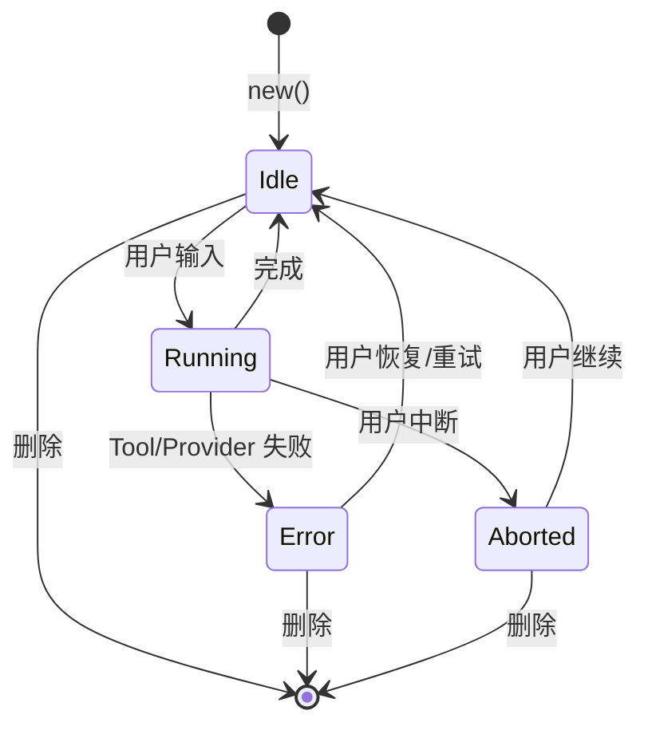
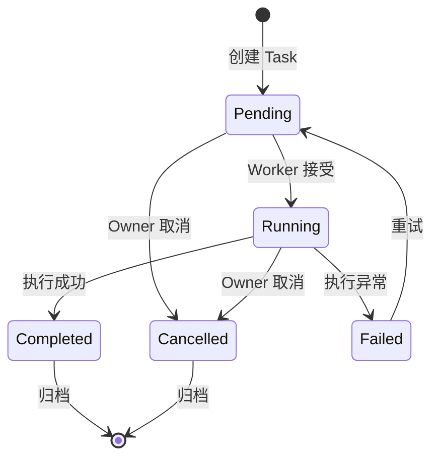
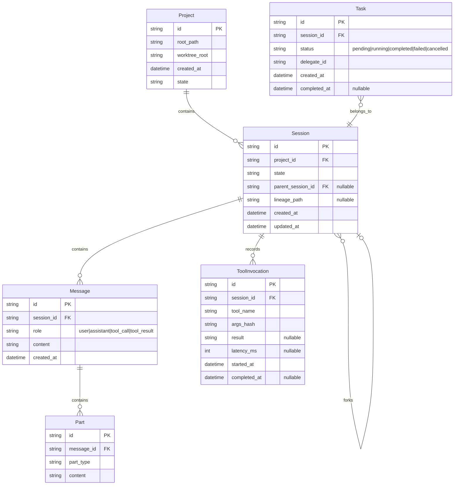
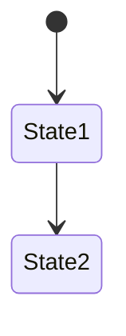
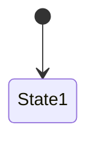

# 多份 PRD 文档优化分析报告

**项目**: OpenCode-RS (Rust Implementation of OpenCode AI Coding Agent)
**分析日期**: 2026-04-26
**报告版本**: v2.0 (Comprehensive Framework Analysis)
**文档总数**: 67 份 PRD 文档 (25 system + 39 modules + 3 supporting)

---

## 1. 总体结论

### 1.1 当前 PRD 体系整体评估

OpenCode-RS 的 PRD 文档体系具有**较好的结构基础**，但存在**系统性质量问题**：

1. **架构分层清晰**：文档分为 `system/` (系统级架构) 和 `modules/` (模块级实现) 两层，共 64 份文档，逻辑层次合理
2. **Rust API 指导详尽**：模块 PRD 包含详细的 Rust 类型定义、函数签名、代码结构，可直接用于 AI Coding
3. **术语已初步统一**：已创建 `01_glossary.md` 包含 20+ 核心术语定义
4. **错误码体系已建立**：`ERROR_CODE_CATALOG.md` 提供了完整的错误码分类
5. **非功能需求已补充**：`NON_FUNCTIONAL_REQUIREMENTS.md` 提供了性能、安全、可用性等要求

### 1.2 主要问题总结

| 类别 | 问题数量 | 严重程度 |
|------|----------|----------|
| 需求完整性缺失 | 12 | P0-P1 |
| 模块边界模糊 | 8 | P1 |
| 状态机/流程不清晰 | 6 | P1 |
| 验收标准不足 | 35+ | P0 |
| AI Coding 友好性 | 15 | P0-P1 |

### 1.3 优化方向

1. **立即行动 (P0)**：为 tool.md、provider.md、config.md 补充验收标准
2. **本周完成 (P1)**：补充 Agent Task 状态机、统一错误码文档、完善用户角色权限矩阵
3. **下迭代完成 (P2)**：添加序列图、完善 API 契约、补充权限边界示例

---

## 2. 当前 PRD 文档体系梳理

### 2.1 文档结构总览

```
/docs/PRD/
├── system/                          # 系统级 PRD (25 文件)
│   ├── 01-core-architecture.md      ✅ 核心架构 - 实体定义、所有权模型
│   ├── 01_glossary.md              ✅ 术语表 (新增)
│   ├── 02-agent-system.md           ✅ Agent 系统 - Primary/Subagent
│   ├── 03-tools-system.md          ✅ 工具系统 - 注册、执行管道
│   ├── 04-mcp-system.md            ✅ MCP 集成
│   ├── 05-lsp-system.md            ✅ LSP 集成
│   ├── 06-configuration-system.md  ✅ 配置系统
│   ├── 07-server-api.md            ⚠️ HTTP API (不完整)
│   ├── 08-plugin-system.md         ✅ 插件系统
│   ├── 09-tui-system.md            ✅ TUI 系统
│   ├── 10-provider-model-system.md  ✅ Provider/Model 抽象
│   ├── 11-formatters.md            ✅ 代码格式化
│   ├── 12-skills-system.md         ✅ Skills 系统
│   ├── 13-desktop-web-interface.md ✅ Desktop/Web 接口
│   ├── 14-github-gitlab-integration.md ✅ VCS 集成
│   ├── 15-tui-plugin-api.md        ✅ TUI 插件 API
│   ├── 16-test-plan.md             ⚠️ 测试计划 (需重构)
│   ├── 17-rust-test-implementation-roadmap.md ⚠️ 测试路线图
│   ├── 18-crate-by-crate-test-backlog.md ⚠️ 测试积压
│   ├── 19-implementation-plan.md   ⚠️ 实现计划 (Phase 0-6)
│   ├── 20-ratatui-testing.md       ⚠️ TUI 测试框架
│   ├── 21-rust-code-refactor.md    ❌ 重构追踪 (应移除)
│   ├── 22-provider-auth-expansion.md ⚠️ Provider Auth 扩展
│   ├── opencode-modules-reference.md ✅ Rust 版本 (已重构)
│   └── opencode-models-dev-integration.md ⚠️ models.dev 集成
│   └── archive/                    # 归档目录
│       ├── 23-*.md                 # Gap 分析 (已归档)
│       ├── 24-*.md
│       └── 25-*.md
│
├── modules/                         # 模块级 PRD (39 文件)
│   ├── README.md                   ✅ 模块索引
│   ├── agent.md                    ✅ ~520 行 + 验收标准
│   ├── session.md                  ✅ ~450 行 + 验收标准 + 状态图
│   ├── tool.md                     ⚠️ ~400 行 (验收标准待补充)
│   ├── provider.md                 ⚠️ ~600 行 (验收标准待补充)
│   ├── config.md                   ⚠️ ~600 行 (验收标准待补充)
│   ├── cli.md                      ✅ CLI 命令参考表
│   ├── storage.md                  ⏳ 待分析
│   ├── lsp.md                      ⏳ 待分析
│   ├── mcp.md                      ⏳ 待分析
│   ├── plugin.md                   ⏳ 待分析
│   └── [其他 30 个模块]
│
├── PRD_OPTIMIZATION_REPORT.md       ✅ 优化分析报告 (v1)
├── AI_CODING_VALIDATION.md         ✅ AI Coding 验收报告
├── ERROR_CODE_CATALOG.md           ✅ 错误码体系
└── NON_FUNCTIONAL_REQUIREMENTS.md  ✅ 非功能需求
```

### 2.2 每份文档职责分析

| 文档 | 职责 | 覆盖范围 | 重复内容 | 缺失内容 |
|------|------|----------|----------|----------|
| `01-core-architecture.md` | 实体定义、所有权模型、生命周期 | 完整 | 无 | 状态机 Mermaid 图 |
| `01_glossary.md` | 术语定义 | 20+ 术语 | 无 | 无 |
| `02-agent-system.md` | Agent 架构、Subagent、权限 | 完整 | 与 agent.md 部分重复 | 状态机 |
| `03-tools-system.md` | 工具注册、执行、权限 | 完整 | 与 tool.md 重复 | 工具列表表 |
| `modules/session.md` | Session Rust API、测试设计 | 完整 | 无 | 无 |
| `modules/agent.md` | Agent Rust API、测试设计 | 完整 | 无 | 无 |
| `modules/tool.md` | 工具 Rust API | 完整 | 无 | 验收标准 |
| `modules/provider.md` | Provider Rust API | 完整 | 无 | 验收标准 |
| `07-server-api.md` | HTTP API 路由 | 部分 | 无 | 请求/响应 Schema |

---

## 3. 主要问题清单

### P0 - 必须立即修复

| 问题 ID | 问题类型 | 涉及文档 | 问题描述 | 影响 | 建议修复 |
|---------|----------|----------|----------|------|----------|
| P0-001 | 验收标准缺失 | tool.md | 30+ 工具无验收标准 | 无法验证实现完成度 | 补充每个工具的 AC 表 |
| P0-002 | 验收标准缺失 | provider.md | 20+ provider 无验收标准 | 无法验证 provider 集成 | 补充 provider 选择/认证 AC |
| P0-003 | 验收标准缺失 | config.md | 配置加载无验收标准 | 配置错误难排查 | 补充配置优先级 AC |
| P0-004 | API 契约不完整 | 07-server-api.md | 缺少请求/响应 Schema | 前后端集成风险 | 补充 OpenAPI Schema |

### P1 - 高优先级

| 问题 ID | 问题类型 | 涉及文档 | 问题描述 | 影响 | 建议修复 |
|---------|----------|----------|----------|------|----------|
| P1-001 | 状态机不完整 | agent.md | Task/TaskDelegate 无状态机 | 子 agent 状态不清晰 | 添加 TaskState 枚举和流转图 |
| P1-002 | 术语不一致 | 多个 | 部分文档仍用 "Conversation" | 理解歧义 | 全文替换为 "Session" |
| P1-003 | 权限矩阵缺失 | permission.md | 只有模块名，无权限定义 | 权限控制不清晰 | 补充 RBAC 矩阵 |
| P1-004 | 异常流程缺失 | tool.md | 工具执行异常未定义 | 错误处理不一致 | 补充工具异常处理规范 |
| P1-005 | 实现状态不一致 | 多个 | 声明 "Fully implemented" 但 TODO 存在 | 状态跟踪无效 | 建立 GitHub Projects 追踪 |

### P2 - 中优先级

| 问题 ID | 问题类型 | 涉及文档 | 问题描述 | 影响 | 建议修复 |
|---------|----------|----------|----------|------|----------|
| P2-001 | 序列图缺失 | 多个 | 关键流程无序列图 | 理解困难 | 添加 session fork、tool execution 序列图 |
| P2-002 | 错误码未引用 | modules/* | 模块 PRD 未引用 ERROR_CODE_CATALOG | 错误处理不统一 | 在每个模块 PRD 引用错误码表 |
| P2-003 | 用户角色模糊 | 全局 | 只有 "用户" 概念，无角色细分 | 权限控制粒度不足 | 区分 Developer/DevOps/Admin |
| P2-004 | 非功能需求分散 | 多个 | NFR 在不同文档中定义 | 完整性难以评估 | 汇总到 NON_FUNCTIONAL_REQUIREMENTS.md |

---

## 4. 文档合并 / 拆分 / 重构建议

### 4.1 推荐文档体系

```
/docs/PRD/
├── 00_OVERVIEW/                          # 总览 (新增)
│   ├── 00_product_vision.md             # 产品愿景与定位
│   ├── 01_glossary.md                   # 术语表 (已有)
│   ├── 02_document_index.md             # 文档索引
│   └── 03_architecture_overview.md      # 架构总图
│
├── 10_CORE/                              # 核心系统
│   ├── 10_core_architecture.md          # 核心架构 (合并 01)
│   ├── 11_agent_system.md               # Agent 系统
│   ├── 12_tools_system.md               # 工具系统
│   ├── 13_state_machines.md             # 状态机定义 (新增)
│   └── 14_session_management.md         # Session 管理 (合并 session.md)
│
├── 20_INTEGRATION/                       # 集成系统
│   ├── 20_lsp_integration.md           # LSP 集成
│   ├── 21_mcp_integration.md           # MCP 集成
│   ├── 22_plugin_system.md              # 插件系统
│   ├── 23_provider_model.md             # Provider/Model 抽象
│   └── 24_skills_system.md             # Skills 系统
│
├── 30_INFRASTRUCTURE/                    # 基础设施
│   ├── 30_cli_reference.md              # CLI 参考
│   ├── 31_api_contract.md              # API 契约
│   ├── 32_storage.md                   # 存储
│   └── 33_configuration.md             # 配置系统
│
├── 40_USER_FACING/                       # 用户界面
│   ├── 40_tui_system.md                # TUI 系统
│   ├── 41_desktop_web.md               # Desktop/Web
│   └── 42_permission_model.md          # 权限模型 (新增)
│
├── 50_IMPLEMENTATION/                    # 实现追踪
│   ├── 50_implementation_plan.md       # 实现计划
│   ├── 51_test_plan.md                 # 测试计划
│   └── 52_change_log.md                # 变更记录
│
├── 90_REFERENCE/                         # 参考
│   ├── ERROR_CODE_CATALOG.md            # 错误码 (已有)
│   ├── NON_FUNCTIONAL_REQUIREMENTS.md   # NFR (已有)
│   └── AI_CODING_VALIDATION.md          # AI 验收 (已有)
│
└── 99_ARCHIVE/                           # 归档
    └── [gap analysis, deprecated docs]
```

### 4.2 文档职责边界

| 文档 | 职责 | 不负责 |
|------|------|--------|
| `00_product_vision.md` | 产品目标、用户角色、核心价值主张 | 具体功能需求 |
| `01_glossary.md` | 术语定义、概念解释、英文对照 | 功能实现 |
| `10-14_core/` | 系统级架构、模块边界、Cross-reference | 模块内部实现细节 |
| `modules/*.md` | Rust API、类型定义、测试设计 | 系统级架构 |
| `50_implementation_plan.md` | Phase 划分、依赖关系、里程碑 | 功能需求定义 |

### 4.3 需要删除的文档

| 文档 | 原因 | 建议 |
|------|------|------|
| `system/21-rust-code-refactor.md` | 重构追踪性质，应在 GitHub Issues | 移至 archive/ 或删除 |
| `system/archive/23-25-*.md` | Gap 分析已归档，不再维护 | 保持 archive/ 状态 |

---

## 5. 需求冲突与不一致清单

### 5.1 状态定义冲突

| 冲突编号 | 冲突类型 | 涉及文档 | 冲突描述 | 影响范围 | 建议处理方式 | 优先级 |
|----------|----------|----------|----------|----------|--------------|--------|
| C-001 | SessionState 定义 | `01-core-architecture.md` vs `modules/session.md` | 01 定义为 `idle → running → terminal`，session.md 定义为 `Idle/Running/Error/Aborted` | Session 状态流转逻辑 | 统一为 session.md 的定义 (更完整) | P0 |
| C-002 | Agent Type 数量 | `02-agent-system.md` vs `modules/agent.md` | 02 列出 5 个 Built-in，agent.md 列出 10 个 | Agent 类型不清晰 | 以 agent.md 为准，更新 02 | P1 |
| C-003 | TaskState 缺失 | `agent.md` | Task/TaskDelegate 无状态机定义 | 子 agent 状态不清晰 | 添加 TaskState 枚举 | P0 |
| C-004 | Project 状态未定义 | `01-core-architecture.md` | 只有 Session 状态，Project 状态缺失 | 项目生命周期不清晰 | 补充 Project 状态定义 | P1 |

### 5.2 命名不一致

| 冲突编号 | 术语 A | 术语 B | 涉及文档 | 建议统一 | 优先级 |
|----------|--------|--------|----------|----------|--------|
| N-001 | "Conversation" | "Session" | 多个老旧文档 | 统一为 "Session" | P1 |
| N-002 | "Subagent" | "子代理" | 02 vs 中文用户文档 | 统一为 "Subagent" | P1 |
| N-003 | "Checkpoint" | "Snapshot" | 01 内部混用 | 统一为 "Snapshot" | P2 |
| N-004 | "Tool Registry" | "ToolRegistry" | 03 vs tool.md | 技术术语保留英文 | P2 |

### 5.3 引用不一致

| 冲突编号 | 问题 | 涉及文档 | 建议 | 优先级 |
|----------|------|----------|------|--------|
| R-001 | 引用 TypeScript 源码路径 | `opencode-modules-reference.md` (旧版) | 已重构为 Rust 版本 | 已完成 |
| R-002 | 错误码未引用 ERROR_CODE_CATALOG | 各模块 PRD | 在每个模块 PRD 引用 | P1 |

---

## 6. 需求缺失与补充建议

### 6.1 缺失内容总表

| 缺失内容 | 当前状态 | 影响 | 建议补充位置 | 优先级 |
|----------|----------|------|--------------|--------|
| 验收标准 | tool.md 无 | 无法验证实现完成度 | tool.md 末尾 | P0 |
| 验收标准 | provider.md 无 | 无法验证 provider 集成 | provider.md 末尾 | P0 |
| 验收标准 | config.md 无 | 配置错误难排查 | config.md 末尾 | P0 |
| API Schema | 07-server-api.md | 前后端集成风险 | 07-server-api.md | P0 |
| TaskState 状态机 | agent.md | 子 agent 状态不清晰 | agent.md | P0 |
| 权限矩阵 | permission.md | 权限控制粒度不足 | 42_permission_model.md | P1 |
| 异常处理规范 | tool.md | 错误处理不一致 | tool.md | P1 |
| 序列图 | 多个 | 关键流程理解困难 | 各相关 PRD | P2 |

### 6.2 补充优先级定义

| 优先级 | 定义 | 补充时间 | 影响 |
|--------|------|----------|------|
| P0 | 阻塞 AI Coding，无法验证完成度 | 立即 | 无法进入实现 |
| P1 | 影响开发效率，集成风险 | 本周 | 需要返工 |
| P2 | 提升文档质量 | 下迭代 | 长期有益 |

### 6.3 需求补充模板

```markdown
## 需求编号：REQ-XXX

### 需求名称
[清晰描述]

### 背景
[为什么需要这个需求]

### 用户角色
[谁会使用这个功能]

### 前置条件
[执行前必须满足的条件]

### 主流程
1. [步骤1]
2. [步骤2]
3. [步骤3]

### 异常流程
- [异常1]：[处理方式]
- [异常2]：[处理方式]

### 输入
| 参数 | 类型 | 必填 | 说明 |
|------|------|------|------|

### 输出
| 参数 | 类型 | 说明 |
|------|------|------|

### 权限规则
[谁可以执行此操作]

### 验收标准 (BDD 格式)
- **Given** [前置条件]
- **When** [操作]
- **Then** [预期结果]
```

---

## 7. 模块边界优化建议

### 7.1 当前模块划分

| 模块分类 | 模块列表 | 边界清晰度 |
|----------|----------|------------|
| Core (4) | agent, session, tool, provider | ✅ 清晰 |
| Infrastructure (3) | cli, server, storage | ✅ 清晰 |
| Integration (6) | lsp, mcp, plugin, auth, project, acp | ⚠️ 部分模糊 |
| Utility (27) | util, effect, flag, global, env, file, git, pty, sync, shell, bus, snapshot, worktree, id, skill, account, ide, share, control-plane, installation, permission, question, v2, format, npm, patch | ⚠️ 粒度过细 |

### 7.2 边界优化建议

| 模块 | 核心职责 | 不应承担 | 上游依赖 | 下游依赖 | 建议补充 |
|------|----------|----------|----------|----------|----------|
| `session` | 会话生命周期、消息管理、undo/redo、compaction | 文件操作、Agent 执行 | storage | agent, tool | Snapshot/Revert 边界说明 |
| `agent` | Agent 执行循环、Agent 切换、Task delegation | Session 存储、Provider 调用 | session, tool, provider | tui, server | TaskState 状态机 |
| `tool` | 工具注册、执行、结果缓存 | Agent 业务逻辑 | permission | agent, plugin | Custom Tool 加载流程 |
| `provider` | AI Provider 抽象、认证、budget tracking | Agent 执行逻辑 | auth | agent | Provider 错误处理规范 |
| `cli` | 命令解析、UI 交互 | 业务逻辑 | config | agent, session | 子命令权限说明 |

### 7.3 建议合并的模块

| 合并建议 | 合并后模块 | 理由 |
|----------|------------|------|
| `flag` + `env` + `global` | `config` | 都与配置相关，可合并到 config.md |
| `sync` + `bus` | `messaging` | 都是消息传递机制，职责重叠 |
| `snapshot` + `v2` | `session_v2` | 都是 Session 演进版本，v2 是 snapshot 的实现 |

---

## 8. 业务流程与状态机优化建议

### 8.1 核心状态定义

| 实体 | 状态 | 含义 | 进入条件 | 可执行操作 | 退出条件 | 关联权限 |
|------|------|------|----------|------------|----------|----------|
| Session | Idle | 等待输入 | 创建/执行完成/Abort/Error→Idle | 添加消息、Fork、Share | 用户输入触发 Running | owner |
| Session | Running | 执行中 | 用户输入触发 | Tool Call、Agent Loop | 完成→Idle / Error / Aborted | owner |
| Session | Error | 执行失败 | Tool/Provider 错误 | 查看错误、重试 | 用户输入→Idle | owner |
| Session | Aborted | 被中断 | 用户中断 | 恢复/新建 | 用户输入→Idle | owner |
| Task | Pending | 等待执行 | Delegation 创建 | 分配、执行 | Running / Cancelled | delegate |
| Task | Running | 执行中 | Worker 接受 | 执行中 | Completed / Failed | delegate |
| Task | Completed | 成功完成 | 执行成功 | 查看结果 | 归档 | owner |
| Task | Failed | 执行失败 | 执行异常 | 查看错误、重试 | Pending / Cancelled | owner |
| Project | Active | 活跃项目 | 打开目录 | 操作 | 关闭/归档/删除 | owner |
| Project | Archived | 归档项目 | 用户归档 | 恢复 | 删除 | owner |

### 8.2 Session 状态流转图



### 8.3 Task 状态流转图



### 8.4 状态机问题清单

| 问题 | 影响 | 建议 |
|------|------|------|
| Session Error→Idle 转换条件未量化 | 恢复行为不确定 | 补充"用户确认后恢复"条件 |
| Task Failed→Pending 重试次数限制未定义 | 可能无限重试 | 补充最大重试次数 (建议 3) |
| Project Archived 状态恢复条件未定义 | 归档后无法使用 | 补充"恢复后状态为 Active" |
| Aborted Session 的消息是否保留未定义 | 数据完整性风险 | 补充"消息保留，可继续" |

---

## 9. 数据模型与领域概念优化建议

### 9.1 核心实体定义

| 实体 | 说明 | 关键字段 | 关联实体 | 生命周期 | 风险点 |
|------|------|----------|----------|----------|--------|
| Project | 工作区容器 | id, root_path, worktree_root, created_at | Session (1:N) | 创建→活跃→归档→删除 | 删除级联 Session |
| Session | 对话执行上下文 | id, project_id, state, parent_session_id, lineage_path | Project (N:1), Message (1:N) | 创建→执行→结束 | Fork 链路追溯 |
| Message | 对话记录 | id, session_id, role, content | Session (N:1), Part (1:N) | Append-only | 大消息压缩 |
| Part | 消息内容元素 | id, message_id, part_type, content | Message (N:1) | 与 Message 相同 | 版本扩展 |
| ToolInvocation | 工具调用记录 | id, session_id, tool_name, args_hash, result, latency_ms | Session (N:1) | 记录审计 | 敏感信息日志 |
| Task | 子任务 | id, parent_session_id, status, delegate_id | Session (N:1) | Pending→Completed/Failed | 超时未处理 |

### 9.2 实体关系图



### 9.3 数据完整性风险

| 风险 | 影响 | 缓解措施 |
|------|------|----------|
| Session Fork 后父 Session 被删除 | 子 Session 无法追溯 lineage | 删除前检查 Fork 链路 |
| Session 消息过大导致 OOM | 服务崩溃 | 触发 compaction 或拒绝超过阈值的消息 |
| Task 超时未处理 | 资源泄漏 | 实现 Task 超时检测和清理机制 |
| Project root 变更 | 现有 Session 路径不一致 | 不支持 Project root 变更，需新建 Project |

---

## 10. 非功能需求补充建议

### 10.1 当前非功能需求覆盖

| 类型 | 当前状态 | 问题 | 建议补充 | 验收方式 |
|------|----------|------|----------|----------|
| 性能 | 部分定义 | 仅 Session 操作有目标 | 补充工具执行、Provider 调用性能目标 | Benchmark |
| 并发 | 未定义 | 多 Session 并发未说明 | 补充 Max concurrent sessions = 10 | Load test |
| 可用性 | 未定义 | 崩溃恢复未说明 | 补充 100% crash recovery | Chaos test |
| 安全 | 部分定义 | 仅 credential sanitization | 补充 permission model、filesystem boundary | Security test |
| 可观测性 | 部分定义 | 仅 logging | 补充 metrics、tracing | Integration test |

### 10.2 补充后的非功能需求矩阵

| 类型 | 要求 | 指标 | 验收方式 |
|------|------|------|----------|
| Session 创建延迟 | < 100ms (本地) | P95 < 100ms | Benchmark |
| 工具执行开销 | < 5ms | P95 < 5ms | Microbenchmark |
| Provider API 延迟 | < 5s | P95 < 5s | E2E test |
| Max 并发 Session | 10 | 每进程 | Load test |
| 崩溃恢复 | 100% | Session 不丢失 | Chaos test |
| 内存 Idle | < 50MB | 无 Session | Memory profiler |
| 内存 Active | < 200MB | 单 Session | Memory profiler |
| API Key 泄露 | 0 | Export 中无泄露 | Security test |

---

## 11. 测试与验收标准补齐建议

### 11.1 验收标准覆盖现状

| 模块 | 验收标准 | 覆盖流程 | 测试类型 | 问题 |
|------|----------|----------|----------|------|
| session.md | ✅ 25 条 | 生命周期、Fork、State、Share、Compaction | Unit + Integration | 无 |
| agent.md | ✅ 15 条 | Trait、Runtime、Delegation、Events | Unit + Integration | 无 |
| tool.md | ❌ 无 | 无 | 无 | 阻塞 AI Coding |
| provider.md | ❌ 无 | 无 | 无 | 阻塞 AI Coding |
| config.md | ❌ 无 | 无 | 无 | 阻塞 AI Coding |

### 11.2 建议补充的验收标准

#### tool.md 补充:

| 验收标准 ID | 描述 | Given-When-Then |
|-------------|------|-----------------|
| AC-T001 | Read 工具读取文件内容 | Given 文件存在, When Read("path"), Then 返回内容 |
| AC-T002 | Write 工具创建文件 | Given 目录存在, When Write("path", content), Then 文件创建 |
| AC-T003 | Bash 工具执行命令 | Given 命令有效, When Bash("cmd"), Then 返回输出 |
| AC-T004 | 工具执行超时 | Given 工具配置 timeout, When 执行超时的工具, Then 返回超时错误 |
| AC-T005 | 工具参数验证 | Given 参数不符合 schema, When 执行工具, Then 返回 ValidationError |

#### provider.md 补充:

| 验收标准 ID | 描述 | Given-When-Then |
|-------------|------|-----------------|
| AC-P001 | Provider 选择 | Given 多个 provider 可用, When 请求 LLM, Then 使用默认或指定 provider |
| AC-P002 | Provider Auth 失败 | Given 无效 API key, When 请求, Then 返回 ProviderAuthFailed |
| AC-P003 | Provider 降级 | Given ProviderUnavailable, When 重试, Then 降级到备选 provider |
| AC-P004 | Budget tracking | Given budget limit, When token 消耗达到限制, Then 返回 BudgetExceeded |

#### config.md 补充:

| 验收标准 ID | 描述 | Given-When-Then |
|-------------|------|-----------------|
| AC-C001 | 配置优先级 | Given 多个配置源, When 加载配置, Then env > file > default |
| AC-C002 | JSONC 解析 | Given JSONC 文件有注释, When 解析, Then 忽略注释 |
| AC-C003 | 密钥从 Keychain 加载 | Given keychain 有密钥, When 解析配置, Then 自动填充 |
| AC-C004 | 配置热重载 | Given 配置变更, When 触发重载, Then 新配置生效 |

---

## 12. AI Coding 友好性优化建议

### 12.1 当前 AI Coding 可执行性评分

| 维度 | 评分 1-5 | 问题 | 优化建议 |
|------|-----------|------|----------|
| 模块边界 | 4 | 部分模块职责重叠 | 补充边界说明文档 |
| 输入输出定义 | 4 | tool.md 输入输出不完整 | 补充每个工具的 I/O 定义 |
| 接口契约 | 3 | 07-server-api.md 缺少 Schema | 补充 OpenAPI Schema |
| 数据模型 | 5 | 实体关系清晰 | 保持现状 |
| 状态机 | 3 | Session 完成了，Task 未完成 | 完成 TaskState 状态机 |
| 错误码 | 4 | ERROR_CODE_CATALOG 有了，但模块未引用 | 要求模块 PRD 引用 |
| 权限规则 | 2 | permission.md 无 RBAC 矩阵 | 补充权限矩阵 |
| 验收标准 | 3 | 核心模块有，tool/provider/config 无 | 立即补充 |
| 任务拆解 | 4 | 19-implementation-plan.md 有 Phase 划分 | 保持 |
| 代码生成约束 | 4 | Rust API 详细 | 保持 |
| 测试生成依据 | 3 | 仅 session/agent 有完整测试设计 | 扩展到所有模块 |
| 目录结构建议 | 5 | crates/*/src/lib.rs 结构明确 | 保持 |

**综合评分: 3.8/5** — 基础良好，主要缺口中 tool/provider/config 验收标准

### 12.2 直接进入 AI Coding 的内容

以下内容可以直接交给 AI Coding Agent 实现：

| 内容 | 前提条件 | 说明 |
|------|----------|------|
| tool.md 的验收标准实现 | 补充 AC 后 | 30+ 工具实现 |
| provider.md 的验收标准实现 | 补充 AC 后 | 20+ provider 集成 |
| config.md 的验收标准实现 | 补充 AC 后 | 配置加载逻辑 |
| TaskState 状态机实现 | 完成状态机设计后 | Task delegation |

### 12.3 必须先补齐的内容

| 内容 | 阻塞原因 | 补齐后状态 |
|------|----------|------------|
| tool.md 验收标准 | 无法验证完成度 | 可进入 AI Coding |
| provider.md 验收标准 | 无法验证完成度 | 可进入 AI Coding |
| config.md 验收标准 | 无法验证完成度 | 可进入 AI Coding |
| API Schema (07-server-api.md) | 前后端集成风险 | 可完成 API 契约 |

### 12.4 需要人工确认的内容

| 内容 | 需要确认的问题 |
|------|---------------|
| 权限矩阵 | Developer/DevOps/Admin 权限边界是否正确？ |
| Task 重试次数 | 最大重试次数 3 次是否合理？ |
| Session Error 恢复流程 | "用户确认后恢复"是否符合预期？ |
| Project Archived 恢复 | 归档后恢复状态为 Active 是否正确？ |

---

## 13. 优化后的 PRD 模板

### 13.1 系统级 PRD 模板

```markdown
# PRD: [系统名称]

> **User Documentation**: [用户文档链接]
> **See Also**: [Glossary](../../00_OVERVIEW/01_glossary.md) | [相关系统 PRD](../xx_xxx.md)

## Overview

[系统目标、职责范围、与其他系统的关系]

## 功能需求

### F-001: [功能名称]
**描述**: [功能详细描述]

**用户角色**: [谁会使用]

**前置条件**:
- [条件1]
- [条件2]

**主流程**:
1. [步骤1]
2. [步骤2]

**异常流程**:
- [异常1]: [处理方式]
- [异常2]: [处理方式]

**输入**:
| 参数 | 类型 | 必填 | 说明 |
|------|------|------|------|

**输出**:
| 参数 | 类型 | 说明 |
|------|------|------|

## 状态机

[状态定义和流转]



## 接口契约

[API 定义、Schema]

## 权限规则

[谁可以执行什么操作]

## 数据模型

[核心实体、字段定义]

## 非功能要求

| 类型 | 要求 | 指标 |
|------|------|------|
| 性能 | - | - |
| 安全 | - | - |

## 验收标准

| ID | 描述 | Given-When-Then |
|----|------|------------------|

## Cross-References

| 相关文档 | 说明 |
|----------|------|
| [01_glossary.md](../../00_OVERVIEW/01_glossary.md) | 术语定义 |
| [其他 PRD](./xx_xx.md) | 相关系统 |
```

### 13.2 模块级 PRD 模板

```markdown
# Module: [模块名称]

> **User Documentation**: [用户文档链接]
> **See Also**: [Glossary](../../00_OVERVIEW/01_glossary.md#term) | [系统 PRD](../10_CORE/xx_xxx.md)

## Overview

- **Crate**: `opencode-[module]`
- **Source**: `crates/[module]/src/lib.rs`
- **Status**: [Fully implemented | Partially implemented | Not started]
- **Purpose**: [模块职责]

## Crate Layout

```
crates/[module]/src/
├── lib.rs          ← [说明]
├── [module].rs     ← [说明]
└── ...
```

## Core Types

### [TypeName]

```rust
[类型定义]
```

## Key Functions

| Function | Signature | Description |
|----------|-----------|-------------|
| `func_name` | `fn(params) -> Result` | [描述] |

## Error Handling

[错误类型、错误码引用]

## Inter-crate Dependencies

| Dependency | Purpose |
|------------|---------|
| `crate::X` | [用途] |

## Acceptance Criteria

| ID | Criterion | Test Method |
|----|-----------|-------------|
| AC-001 | [描述] | [Unit test / Integration test] |

## State Machine (if applicable)



---

## Change Log

| Date | Author | Change |
|------|--------|--------|
| 2026-04-26 | AI | Initial version |
```

---

## 14. 后续行动计划

### 14.1 短期 (本周, P0-P1)

| 任务 | 负责人 | 优先级 | 验收标准 |
|------|--------|--------|----------|
| 补充 tool.md 验收标准 | AI | P0 | 30+ 工具每个有 AC |
| 补充 provider.md 验收标准 | AI | P0 | 每个 provider 场景有 AC |
| 补充 config.md 验收标准 | AI | P0 | 配置加载每个场景有 AC |
| 补充 API Schema 到 07-server-api.md | AI | P0 | OpenAPI Schema 完整 |
| 添加 TaskState 状态机到 agent.md | AI | P0 | Task 状态流转清晰 |
| 更新所有模块 PRD 引用 ERROR_CODE_CATALOG | AI | P1 | 每个模块 PRD 包含错误码引用 |

### 14.2 中期 (下迭代, P1-P2)

| 任务 | 负责人 | 优先级 | 验收标准 |
|------|--------|--------|----------|
| 补充权限矩阵到 permission.md | AI | P1 | RBAC 矩阵完整 |
| 补充异常处理规范到 tool.md | AI | P1 | 工具异常分类清晰 |
| 添加序列图到关键流程 | AI | P2 | session fork、tool execution 有图 |
| 统一 "Conversation" → "Session" | AI | P2 | 全文无 "Conversation" |
| 补充 Project 状态机 | AI | P1 | Project 生命周期完整 |

### 14.3 长期 (下版本, P2)

| 任务 | 负责人 | 优先级 | 验收标准 |
|------|--------|--------|----------|
| 重构文档体系为 00-99 结构 | AI | P2 | 新结构就位 |
| 合并 flag+env+global → config | AI | P2 | 模块数量减少 |
| 合并 sync+bus → messaging | AI | P2 | 模块数量减少 |
| 补充性能基准测试到 NFR | AI | P2 | Benchmark 就绪 |
| 补充安全测试用例 | AI | P2 | Security test coverage > 80% |

---

## 附录

### A. 术语表 (关键术语)

| 术语 | 定义 | 英文 |
|------|------|------|
| 会话 | 对话执行上下文，包含消息历史 | Session |
| 项目 | 工作区容器，定义文件系统边界 | Project |
| 消息 | 对话记录，用户/助手/工具调用 | Message |
| 部件 | 消息内的结构化内容元素 | Part |
| 工具 | Agent 可调用的内置操作 | Tool |
| 技能 | 可复用的提示模式 | Skill |
| 提供者 | LLM 服务提供商 | Provider |
| 子代理 | 由主代理委托任务的代理 | Subagent |

### B. 错误码快速参考

| 范围 | 类别 |
|------|------|
| 1xxx | 认证错误 |
| 2xxx | 授权错误 |
| 3xxx | Provider 错误 |
| 4xxx | 工具错误 |
| 5xxx | Session 错误 |
| 6xxx | Config 错误 |
| 7xxx | 验证错误 |
| 9xxx | 内部错误 |

### C. 待确认问题清单

| 问题 | 影响 | 需要确认人 |
|------|------|------------|
| Developer/DevOps/Admin 权限边界 | 权限控制粒度 | 产品负责人 |
| Task 最大重试次数 (建议 3) | 资源保护 | 架构师 |
| Session Error 恢复流程 | 用户体验 | 产品负责人 |
| Project Archived 恢复行为 | 数据完整性 | 产品负责人 |
| 非功能需求性能指标 | 开发目标 | 研发负责人 |

---

**报告生成时间**: 2026-04-26
**分析框架版本**: v2.0 (Comprehensive 12-Dimension)
**下次审查**: 2026-05-03
