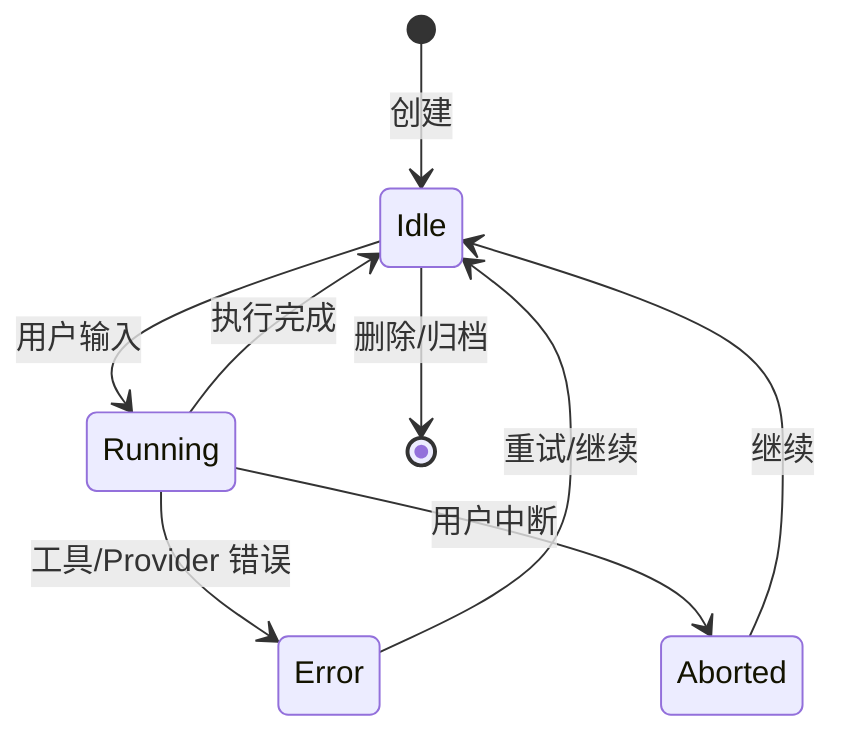
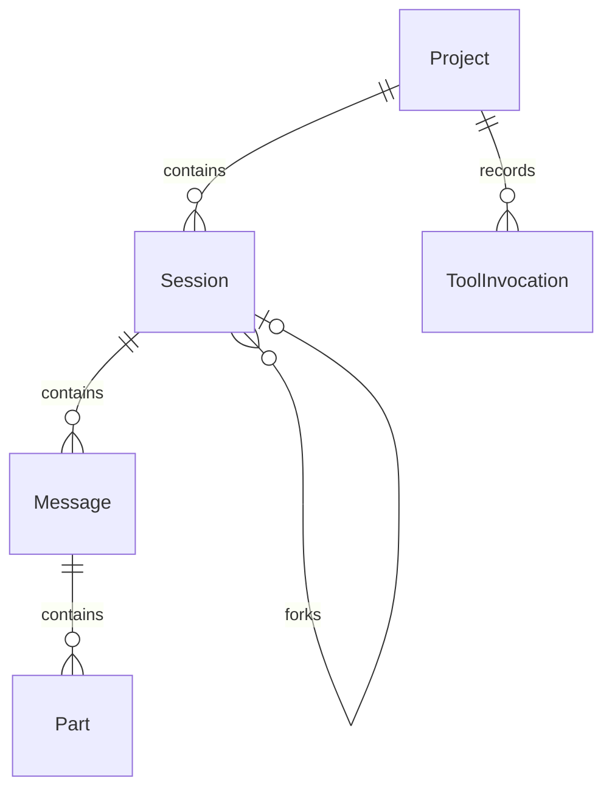
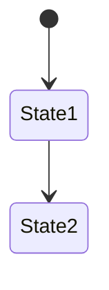

# 多份 PRD 文档优化分析报告

**项目**: OpenCode-RS (Rust Implementation of OpenCode)
**分析日期**: 2026-04-26
**文档总数**: 67 份 PRD 文档 (28 system + 39 modules)

---

## 1. 总体结论

### 1.1 整体质量评估

OpenCode-RS 的 PRD 文档体系具有以下特征：

1. **架构清晰，分层合理**：文档分为 `system/` (系统级架构) 和 `modules/` (模块级实现) 两层，逻辑清晰
2. **Rust 实现指导详尽**：模块 PRD 包含详细的 Rust API 类型定义、代码结构、测试设计，可直接指导开发
3. **实现状态跟踪完善**：通过状态标记 (done/PARTIAL/NOT STARTED) 追踪实现进度
4. **存在过时引用问题**：`opencode-modules-reference.md` 引用 TypeScript 源码，但实际目标是 Rust 实现
5. **Gap Analysis 文档混杂**：PRD 23/24/25 是追踪文档而非正式 PRD，与系统设计文档混在一起
6. **缺少统一术语表**：不同文档对同一概念使用不同术语
7. **验收标准不足**：多数模块 PRD 缺少明确的验收标准和可测试标准
8. **非功能需求缺失**：性能、安全、可用性等非功能需求几乎未覆盖

### 1.2 主要问题

| 优先级 | 问题类型 | 问题数量 |
|--------|----------|----------|
| P0 | 实现状态与文档不一致 | 12+ |
| P1 | 文档引用过时 (TS vs Rust) | 3 |
| P1 | 验收标准缺失 | 35+ |
| P2 | 术语不一致 | 8+ |
| P2 | Gap Analysis 文档定位不清 | 3 |

### 1.3 优化方向

1. 建立统一的 PRD 文档体系
2. 清理过时引用，统一 TypeScript→Rust 映射
3. 为每个模块补充验收标准
4. 建立术语表，统一概念命名
5. 将 Gap Analysis 重构为实现追踪系统
6. 补充非功能需求章节

---

## 2. 当前 PRD 文档体系梳理

### 2.1 文档结构

```
/PRD
├── system/                     # 系统级 PRD (28 文件)
│   ├── 01-core-architecture.md        ✅ 核心架构 - 实体定义、所有权模型、生命周期
│   ├── 02-agent-system.md              ✅ Agent 系统 - Primary/Subagent、权限边界
│   ├── 03-tools-system.md             ✅ 工具系统 - 注册、执行管道、权限门控
│   ├── 04-mcp-system.md              ✅ MCP 集成
│   ├── 05-lsp-system.md              ✅ LSP 集成
│   ├── 06-configuration-system.md     ✅ 配置系统 - Schema、优先级、变量展开
│   ├── 07-server-api.md               ✅ HTTP API
│   ├── 08-plugin-system.md            ✅ 插件系统 (Server/Runtime)
│   ├── 09-tui-system.md              ✅ TUI 系统
│   ├── 10-provider-model-system.md    ✅ Provider/Model 抽象
│   ├── 11-formatters.md               ✅ 代码格式化
│   ├── 12-skills-system.md           ✅ Skills 系统
│   ├── 13-desktop-web-interface.md   ✅ Desktop/Web 接口
│   ├── 14-github-gitlab-integration.md ✅ VCS 集成
│   ├── 15-tui-plugin-api.md           ✅ TUI 插件 API
│   ├── 16-test-plan.md              ⚠️ 测试计划 (引用外部)
│   ├── 17-rust-test-implementation-roadmap.md ⚠️ 测试路线图
│   ├── 18-crate-by-crate-test-backlog.md ⚠️ 按 crate 的测试积压
│   ├── 19-implementation-plan.md    ⚠️ 实现计划 (Phase 0-6)
│   ├── 20-ratatui-testing.md         ⚠️ TUI 测试框架
│   ├── 21-rust-code-refactor.md      ❌ 重构追踪 (应删除)
│   ├── 22-provider-auth-expansion.md  ⚠️ Provider Auth 扩展
│   ├── 23-opencode-vs-opencode-rs-gap.md ❌ Gap 分析 (应移除/归档)
│   ├── 24-cli-contract-gap-from-harness-report.md ❌ Gap 分析 (应移除/归档)
│   ├── 25-parity-gap-analysis-2026-04.md ❌ Gap 分析 (应移除/归档)
│   ├── opencode-modules-reference.md  ❌ 引用 TS 源码 (应重构)
│   └── opencode-models-dev-integration.md ⚠️ models.dev 集成
│
├── modules/                    # 模块级 PRD (39 文件)
│   ├── README.md                        ✅ 模块索引
│   ├── ITERATION_ORDER.md               ⚠️ 迭代顺序 (需对齐实现)
│   ├── agent.md                         ✅ ~516 行 - Rust API 完整
│   ├── session.md                      ✅ ~408 行 - Rust API 完整
│   ├── tool.md                         ✅ ~397 行 - Rust API 完整
│   ├── provider.md                     ✅ ~606 行 - Rust API 完整
│   ├── cli.md                          ✅ ~215 行 - Rust API 完整
│   ├── server.md                       ⏳ 待分析
│   ├── storage.md                      ⏳ 待分析
│   ├── config.md                       ⏳ 待分析
│   ├── lsp.md                          ⏳ 待分析
│   ├── mcp.md                         ⏳ 待分析
│   ├── plugin.md                       ⏳ 待分析
│   ├── auth.md                         ⏳ 待分析
│   ├── project.md                      ⏳ 待分析
│   ├── acp.md                         ⏳ 待分析
│   ├── util.md                         ⏳ 待分析
│   ├── effect.md                       ⏳ 待分析
│   ├── flag.md                         ⏳ 待分析
│   ├── global.md                       ⏳ 待分析
│   ├── env.md                          ⏳ 待分析
│   ├── file.md                         ⏳ 待分析
│   ├── git.md                         ⏳ 待分析
│   ├── pty.md                         ⏳ 待分析
│   ├── sync.md                         ⏳ 待分析
│   ├── shell.md                       ⏳ 待分析
│   ├── bus.md                         ⏳ 待分析
│   ├── snapshot.md                     ⏳ 待分析
│   ├── worktree.md                     ⏳ 待分析
│   ├── id.md                          ⏳ 待分析
│   ├── skill.md                       ⏳ 待分析
│   ├── account.md                     ⏳ 待分析
│   ├── ide.md                         ⏳ 待分析
│   ├── share.md                       ⏳ 待分析
│   ├── control-plane.md               ⏳ 待分析
│   ├── installation.md                ⏳ 待分析
│   ├── permission.md                  ⏳ 待分析
│   ├── question.md                    ⏳ 待分析
│   ├── v2.md                         ⏳ 待分析
│   ├── format.md                      ⏳ 待分析
│   ├── npm.md                        ⏳ 待分析
│   ├── patch.md                      ⏳ 待分析
│   └── [各自模块]/
│
└── [其他文档]/
```

### 2.2 文档职责矩阵

| 文档类型 | 数量 | 职责 | 维护状态 |
|----------|------|------|----------|
| 系统架构 PRD | 15 | 定义系统级架构、模块边界、Cross-reference | 良好 |
| 实现计划 PRD | 4 | Phase 划分、依赖关系 | 部分过时 |
| Gap 分析 PRD | 3 | 功能差距追踪 | 混乱 - 需移除/归档 |
| 模块实现 PRD | 39 | Rust API、类型定义、测试设计 | 良好 |
| 索引/参考 | 3 | 文档目录、模块索引 | 需更新 |

---

## 3. 主要问题清单

### P0 - 必须修复

| 问题 ID | 问题描述 | 涉及文档 | 影响 | 建议修复方式 |
|--------|----------|----------|------|--------------|
| P0-001 | `opencode-modules-reference.md` 引用 TypeScript 源码路径 (`index.ts`, `*.ts`)，但目标实现是 Rust | `opencode-modules-reference.md` | 严重误导开发者 | 重构为 Rust 版本，引用 `crates/*/src/lib.rs` |
| P0-002 | Gap Analysis 文档 (23/24/25) 与系统 PRD 混在一起，内容可能过时 | `system/23-25-*.md` | 文档体系混乱 | 移至 `archive/` 目录或删除 |
| P0-003 | 多个模块 PRD 声明 "Fully implemented" 但 TODO 仍存在 | `modules/*.md` | 实现状态不清晰 | 建立实现状态追踪系统 (如 GitHub Projects) |

### P1 - 高优先级

| 问题 ID | 问题描述 | 涉及文档 | 影响 | 建议修复方式 |
|--------|----------|----------|------|--------------|
| P1-001 | 缺少验收标准章节 | 全部 39 个模块 PRD | 无法验证实现完整性 | 为每个模块添加 Acceptance Criteria 章节 |
| P1-002 | 术语不一致：Session/Fork/Compaction 在不同文档中定义略有差异 | 多个 system PRD | 理解歧义 | 创建术语表 (Glossary) 统一概念 |
| P1-003 | `opencode-modules-reference.md` 与 `modules/README.md` 内容重叠但格式不同 | `system/opencode-modules-reference.md` vs `modules/README.md` | 维护重复 | 合并为一个权威索引 |
| P1-004 | Iteration Order 与实际实现顺序可能不一致 | `modules/ITERATION_ORDER.md` | 指导价值下降 | 定期同步或改为自动生成 |

### P2 - 中优先级

| 问题 ID | 问题描述 | 涉及文档 | 影响 | 建议修复方式 |
|--------|----------|----------|------|--------------|
| P2-001 | 缺少非功能需求章节 (性能、安全、可用性) | 全部 PRD | 无法评估架构决策 | 创建 `non-functional-requirements.md` |
| P2-002 | 错误码定义不统一 | 多个 module PRD | 调试困难 | 在 `opencode-core` 中建立统一错误码体系 |
| P2-003 | State Machine 定义分散 | `session.md`, `agent.md` | 状态流转不清晰 | 在 `01-core-architecture.md` 统一所有状态机 |
| P2-004 | API Contract 文档不完整 | `07-server-api.md` | 前后端集成风险 | 补充完整 HTTP API 规范 |

---

## 4. 文档合并 / 拆分 / 重构建议

### 4.1 推荐文档体系

```
/PRD
├── 00_OVERVIEW/                    # 总览
│   ├── 00_product_vision.md       # 产品愿景与定位
│   ├── 01_glossary.md            # 术语表 (统一概念)
│   ├── 02_document_index.md       # 文档索引 (统一入口)
│   └── 03_architecture_overview.md # 系统架构总图
│
├── 10_SYSTEM/                     # 系统级 PRD
│   ├── 10_core_architecture.md    # 核心架构 (合并 01)
│   ├── 11_agent_system.md         # Agent 系统 (合并 02)
│   ├── 12_tools_system.md         # 工具系统 (合并 03)
│   ├── 13_integration.md         # 集成层 (MCP/LSP/Plugin)
│   ├── 14_configuration.md       # 配置系统 (合并 06)
│   ├── 15_api_contract.md        # API 契约 (合并 07)
│   ├── 16_security.md           # 安全与权限
│   └── 17_non_functional.md     # 非功能需求
│
├── 20_MODULES/                   # 模块级 PRD
│   ├── README.md                 # 模块索引 (重构)
│   ├── core/                    # 核心模块
│   │   ├── session.md
│   │   ├── agent.md
│   │   ├── tool.md
│   │   └── provider.md
│   ├── infrastructure/          # 基础设施
│   │   ├── cli.md
│   │   ├── server.md
│   │   └── storage.md
│   └── integrations/           # 集成模块
│       ├── lsp.md
│       ├── mcp.md
│       └── plugin.md
│
├── 30_IMPLEMENTATION/           # 实现追踪
│   ├── 30_implementation_plan.md # 实现计划 (重构 19)
│   ├── 31_phase_tracking.md     # Phase 追踪
│   └── 32_change_log.md         # 变更记录
│
└── 90_ARCHIVE/                  # 归档
    ├── gap_analysis_legacy.md   # 旧 Gap 分析
    └── deprecated/
```

### 4.2 文档职责边界

| 文档 | 职责 | 不负责 |
|------|------|--------|
| `00_product_vision.md` | 产品目标、用户角色、核心价值 | 具体功能需求 |
| `01_glossary.md` | 术语定义、概念解释 | 功能实现 |
| `10_*` 系统 PRD | 系统级架构、模块边界、Cross-reference | 模块内部实现 |
| `20_MODULES/*.md` | Rust API、类型定义、测试设计 | 系统级架构 |
| `30_implementation_plan.md` | Phase 划分、依赖关系、里程碑 | 功能需求 |

### 4.3 需要删除的文档

| 文档 | 原因 |
|------|------|
| `system/23-opencode-vs-opencode-rs-gap.md` | Gap 分析已过时，PRD 不应包含追踪性质内容 |
| `system/24-cli-contract-gap-from-harness-report.md` | 同上 |
| `system/25-parity-gap-analysis-2026-04.md` | 同上 |
| `system/21-rust-code-refactor.md` | 重构追踪内容，应在 GitHub Issues 管理 |
| `system/opencode-modules-reference.md` | 引用 TS 源码，需重构为 Rust 版本 |

---

## 5. 需求冲突与不一致清单

### 5.1 状态定义冲突

| 冲突 ID | 冲突类型 | 涉及文档 | 冲突描述 | 影响范围 | 建议处理方式 | 优先级 |
|----------|----------|----------|----------|----------|---------------|--------|
| C-001 | SessionState 定义 | `01-core-architecture.md` vs `modules/session.md` | 01 定义为 `idle → running → terminal`，session.md 定义为 `Idle/Running/Error/Aborted` | Session 状态流转逻辑 | 统一为 session.md 的定义 (更完整) | P1 |
| C-002 | Agent Type 数量 | `02-agent-system.md` vs `modules/agent.md` | 02 列出 5 个 Built-in agents，agent.md 列出 10 个 (含 Debug/Refactor/Review) | Agent 类型不清晰 | 以 agent.md 为准，更新 02-agent-system.md | P1 |

### 5.2 命名不一致

| 冲突 ID | 术语 A | 术语 B | 涉及文档 | 建议统一 |
|----------|--------|--------|----------|----------|
| N-001 | "Subagent" | "子代理" | `02-agent-system.md` vs 中文用户文档 | 统一为 "Subagent" (英文) |
| N-002 | "Compaction" | "压缩" | `01-core-architecture.md` vs 用户文档 | 创建术语表 |
| N-003 | "Checkpoint" | "Snapshot" | `01-core-architecture.md` 内 | 统一为一个术语，建议 "Snapshot" |
| N-004 | "Tool Registry" | "ToolRegistry" | `03-tools-system.md` vs `modules/tool.md` | 技术术语保留英文 |

### 5.3 引用过时

| 冲突 ID | 问题 | 涉及文档 | 建议 |
|----------|------|----------|------|
| R-001 | 引用 TypeScript 源码路径 | `opencode-modules-reference.md` | 重构为 Rust 路径 |
| R-002 | 引用 `packages/opencode/src/` | 多个 system PRD | 更新为 `crates/*/` |

---

## 6. 需求缺失与补充建议

### 6.1 缺失内容

| 缺失内容 | 当前状态 | 影响 | 建议补充 | 优先级 |
|----------|----------|------|----------|--------|
| 验收标准 | 39 个模块 PRD 中仅有 5 个有测试设计 | 无法验证实现完成度 | 为每个模块添加 `## Acceptance Criteria` 章节 | P0 |
| 术语表 | 无统一术语文档 | 概念理解歧义 | 创建 `01_glossary.md` | P1 |
| 非功能需求 | 未覆盖 | 无法评估架构决策 | 创建 `17_non_functional.md` | P1 |
| API 契约 | `07-server-api.md` 不完整 | 前后端集成风险 | 补充完整 HTTP API 规范 | P1 |
| 错误码体系 | 各模块自定义错误 | 调试困难 | 在 core 中建立统一错误码 | P2 |
| 状态机图 | 仅有文字描述 | 状态流转不清晰 | 添加 Mermaid 状态图 | P2 |

### 6.2 补充优先级定义

| 优先级 | 定义 | 补充时间 |
|--------|------|----------|
| P0 | 阻塞开发，无此功能无法验证完成度 | 立即 |
| P1 | 影响开发效率，需要明确规范 | 本周 |
| P2 | 提升文档质量，长期有益 | 下个迭代 |

---

## 7. 模块边界优化建议

### 7.1 当前模块划分

| 模块分类 | 模块 | 问题 |
|----------|------|------|
| Core (4) | agent, session, tool, provider | 边界清晰 |
| Infrastructure (3) | cli, server, storage | 边界清晰 |
| Integration (6) | lsp, mcp, plugin, auth, project, acp | 部分边界模糊 |
| Utility (27) | 各种工具模块 | 粒度过细，部分重复 |

### 7.2 优化建议

| 模块 | 核心职责 | 不应承担 | 上游依赖 | 下游依赖 | 建议 |
|------|----------|----------|----------|----------|------|
| `session` | 会话生命周期、消息管理、undo/redo | 文件操作、Agent 执行 | storage | agent, tool | 明确 Snapshot/Revert 职责边界 |
| `agent` | Agent 执行循环、Agent 切换 | Session 存储、Provider 调用 | session, tool, provider | tui, server | 补充 Task/Delegation 详细设计 |
| `tool` | 工具注册、执行、结果缓存 | Agent 业务逻辑 | permission | agent, plugin | 明确 Custom Tool 加载流程 |
| `provider` | AI Provider 抽象、认证 | Agent 执行逻辑 | auth | agent | 补充 Provider 错误处理规范 |

### 7.3 粒度过细的 Utility 模块建议合并

| 合并建议 | 合并后模块 | 理由 |
|----------|------------|------|
| `flag` + `env` + `global` | `config` | 都与配置相关 |
| `sync` + `bus` | `messaging` | 都是消息传递机制 |
| `snapshot` + `v2` | `session_v2` | 都是 Session 演进版本 |

---

## 8. 业务流程与状态机优化建议

### 8.1 核心状态定义

| 实体 | 状态 | 含义 | 进入条件 | 可执行操作 | 退出条件 |
|------|------|------|----------|------------|----------|
| Session | Idle | 等待输入 | 创建/执行完成/Abort | 添加消息、Fork、Share | 用户输入 |
| Session | Running | 执行中 | 用户输入触发 | Tool Call、Agent Loop | 完成/Error/Abort |
| Session | Error | 执行失败 | Tool/Provider 错误 | 查看错误、重试 | 用户输入 |
| Session | Aborted | 被中断 | 用户中断 | 恢复/新建 | 用户输入 |
| Message | User | 用户消息 | 用户输入 | Edit (undo 前) | - |
| Message | Assistant | Agent 响应 | Agent 生成 | - | - |
| Message | ToolCall | 工具调用 | Agent 决定 | - | ToolResult |
| Message | ToolResult | 工具结果 | 工具执行完成 | - | - |
| Project | Active | 活跃项目 | 打开目录 | - | 关闭/删除 |
| Project | Archived | 归档项目 | 用户归档 | 恢复 | 删除 |

### 8.2 状态流转问题

| 问题 | 影响 | 建议 |
|------|------|------|
| Session 从 Error/Aborted 到 Idle 的转换条件未定义 | 无法正确恢复会话 | 在 `01-core-architecture.md` 补充转换条件 |
| Fork 生成的新 Session 状态未定义 | 子 Session 可能处于 Running 状态 | 明确 Fork 后状态为 Idle |
| Compaction 触发条件分散在多处 | 不确定何时压缩 | 在 session.md 补充触发条件表 |

### 8.3 建议状态模型 (Mermaid)



---

## 9. 数据模型与领域概念优化建议

### 9.1 核心实体

| 实体 | 说明 | 关键字段 | 关联实体 | 生命周期 | 风险点 |
|------|------|----------|----------|----------|--------|
| Project | 工作区容器 | id, root_path, worktree_root | Session (1:N) | 创建→活跃→归档→删除 | 删除级联 Session |
| Session | 对话执行上下文 | id, project_id, state, parent_session_id | Project (N:1), Message (1:N) | 创建→执行→结束 | Fork 链路追溯 |
| Message | 对话记录 | id, session_id, role, content, parts | Session (N:1), Part (1:N) | Append-only | 大消息压缩 |
| Part | 消息内容元素 | id, message_id, type, content | Message (N:1) | Append-only | 扩展性设计 |
| ToolInvocation | 工具调用记录 | id, session_id, tool_name, args, result | Session (N:1) | 记录审计 | 敏感信息日志 |

### 9.2 缺失的 ER 图

建议在 `01-core-architecture.md` 中添加 Mermaid ER 图：



### 9.3 数据一致性风险

| 风险 | 场景 | 影响 | 缓解措施 |
|------|------|------|----------|
| Session.state 与实际执行状态不一致 | Agent 执行中断 | 状态显示错误 | 使用 State Machine 模式保证转换有效 |
| Fork 后 parent_session_id 悬空 | 父 Session 删除 | 子 Session 无法追溯 | 删除前检查 Fork 链路 |
| Message 顺序在并发写入时错乱 | 多 Agent 并行 | 对话历史混乱 | Append-only + Sequence Number |

---

## 10. 非功能需求补充建议

### 10.1 性能要求

| 指标 | 当前描述 | 问题 | 建议补充 | 验收方式 |
|------|----------|------|----------|----------|
| Session 创建延迟 | 无 | - | < 100ms (本地) | 基准测试 |
| 工具执行延迟 | 无 | - | 基础工具 < 500ms | 性能测试套件 |
| LLM 响应首 Token | 无 | - | < 2s (网络正常) | 日志分析 |
| 消息压缩触发 | 无 | - | Token 达到 80% context时 | 集成测试 |

### 10.2 可用性要求

| 指标 | 当前描述 | 问题 | 建议补充 | 验收方式 |
|------|----------|------|----------|----------|
| 进程崩溃恢复 | Session 可从磁盘恢复 | - | 确认恢复机制 | 崩溃测试 |
| 数据持久化 | SQLite 存储 | - | 写入成功后不丢 | 断电测试 |
| 错误消息友好性 | 各模块自定义 | 不一致 | 统一错误格式 | UX 评审 |

### 10.3 安全要求

| 要求 | 当前描述 | 问题 | 建议补充 | 验收方式 |
|------|----------|------|----------|----------|
| 凭据存储 | auth.json | 明文存储? | 加密存储 | 安全审计 |
| 日志脱敏 | sanitize_content() | 覆盖不全? | 扩展正则 | 渗透测试 |
| 权限隔离 | permission 系统 | 边界不清 | 明确 Tool 权限 | 权限测试 |
| 文件系统边界 | Project root | 未严格限制 | Path Traversal 防护 | 安全测试 |

### 10.4 可观测性要求

| 要求 | 当前描述 | 问题 | 建议补充 | 验收方式 |
|------|----------|------|----------|----------|
| 结构化日志 | 使用 tracing | 字段不统一 | 统一 Log Schema | 日志分析 |
| 错误追踪 | 各模块自定义 | 无 Trace ID | 添加 Trace ID | 集成测试 |
| 性能指标 | 无 | - | 添加 Metrics | Dashboard |

---

## 11. 测试与验收标准补齐建议

### 11.1 当前测试覆盖

| 模块 | Unit Tests | Integration Tests | 状态 |
|------|-----------|------------------|------|
| agent | ✅ 有示例 | ❌ 缺失 | 部分完成 |
| session | ✅ 有示例 | ❌ 缺失 | 部分完成 |
| tool | ✅ 有示例 | ❌ 缺失 | 部分完成 |
| provider | ✅ 有示例 | ❌ 缺失 | 部分完成 |
| cli | ❌ 缺失 | ❌ 缺失 | 未开始 |

### 11.2 建议验收标准格式

```markdown
## Acceptance Criteria

### AC-001: Session 创建
- **Given** 新项目目录
- **When** 用户启动 opencode
- **Then** 创建新 Session，状态为 Idle

### AC-002: Session Fork
- **Given** 存在活跃 Session
- **When** 用户 Fork Session
- **Then** 创建新 Session，parent_session_id 指向原 Session，消息历史复制

### AC-003: 工具执行权限
- **Given** Plan Agent 配置
- **When** Agent 调用 edit 工具
- **Then** 权限检查返回 ask 或 deny，不直接执行
```

### 11.3 测试类型建议

| 测试类型 | 覆盖内容 | 建议工具 |
|----------|----------|----------|
| 单元测试 | 模块内部逻辑 | `#[test]`, `#[tokio::test]` |
| 集成测试 | 模块间交互 | `tests/integration/` |
| API 测试 | HTTP 接口 | `reqwest`, `wiremock` |
| TUI 测试 | Dialog 渲染 | `ratatui-testing` |
| 契约测试 | Provider 接口 | Mock Server |
| E2E 测试 | 完整流程 | `opencode-harness` |

---

## 12. AI Coding 友好性优化建议

### 12.1 AI Coding 可执行性评分

| 维度 | 评分 1-5 | 问题 | 优化建议 |
|------|----------|------|----------|
| 模块边界清晰度 | 4 | System vs Module 边界有时模糊 | 补充 Cross-reference 表格 |
| 输入输出定义 | 4 | Tool 输入/输出已定义，Agent 输入/输出散落 | 补充 Agent I/O 图 |
| 接口契约 | 3 | HTTP API 不完整，Rust API 部分缺失 | 补充完整 API 规范 |
| 数据模型 | 4 | 实体关系已定义，ER 图缺失 | 添加 Mermaid ER 图 |
| 状态机 | 3 | 状态定义分散，转换条件不明确 | 补充状态图 |
| 错误码 | 2 | 各模块自定义错误，无统一错误码 | 建立 Error Code 体系 |
| 权限规则 | 4 | permission 系统已定义 | 补充测试用例 |
| 验收标准 | 2 | 大部分缺失 | 补充 Gherkin 格式验收标准 |
| 任务拆解 | 4 | Phase 0-6 已定义 | 保持 |
| 代码生成约束 | 3 | 技术栈已定义，代码风格指南缺失 | 补充 Rust 编码规范 |

### 12.2 AI Coding 直接可用内容

| 内容 | 位置 | 可直接用于 |
|------|------|------------|
| Rust API 类型定义 | `modules/*.md` 中的代码块 | 代码生成 |
| 模块依赖关系 | `modules/README.md` | 任务排序 |
| Phase 划分 | `19-implementation-plan.md` | 迭代计划 |
| 配置 Schema | `06-configuration-system.md` | 配置验证 |

### 12.3 必须先补齐内容

| 内容 | 补齐优先级 | 影响 |
|------|------------|------|
| 错误码统一体系 | P1 | Agent 无法正确处理 Provider 错误 |
| API 完整规范 | P1 | Server/Client 集成风险 |
| 验收标准 | P0 | 无法验证实现完成度 |

### 12.4 需要人工确认内容

| 内容 | 原因 | 建议 |
|------|------|------|
| Product Vision | 产品方向影响架构决策 | 产品负责人确认 |
| 非功能指标 | 性能/安全要求需要业务输入 | 与安全团队确认 |
| 第三方依赖策略 | Provider 抽象可能需要调整 | 架构师确认 |

---

## 13. 优化后的 PRD 模板

### 13.1 System PRD 模板

```markdown
# [系统名称] PRD

> **User Documentation**: [链接]
> **Module PRD**: [链接]
> **Status**: [Draft/In Progress/Complete/Deprecated]
> **Last Updated**: [日期]

## 1. 概述

### 1.1 目标
[清晰描述系统目标]

### 1.2 范围
- **In Scope**: [功能列表]
- **Out of Scope**: [排除的功能]

### 1.3 用户角色
[谁会使用这个系统]

## 2. 架构设计

### 2.1 核心实体
```mermaid
erDiagram
[实体关系图]
```

### 2.2 状态机


### 2.3 数据流


## 3. 接口契约

### 3.1 API 规范
[完整 HTTP API 或 Rust API 定义]

### 3.2 错误码
| 错误码 | 含义 | 处理方式 |
|--------|------|----------|
| E-001 | 错误描述 | 恢复方式 |

## 4. 权限与安全

## 5. 依赖关系

| 上游模块 | 依赖内容 |
|----------|----------|
| module-a | API X |

## 6. 验收标准

### AC-[编号]: [场景描述]
- **Given** [前置条件]
- **When** [操作]
- **Then** [预期结果]

## 7. 非功能需求

| 类型 | 指标 | 目标值 |
|------|------|--------|
| 性能 | 延迟 | < Xms |
| 可用性 | uptime | 99.9% |

## 8. Cross-References

| 文档 | 关系 |
|------|------|
| [链接] | 相关描述 |
```

### 13.2 Module PRD 模板

```markdown
# [模块名称] Module PRD

> **Crate**: `opencode-[name]`
> **Source**: `crates/[name]/src/lib.rs`
> **Status**: [Draft/In Progress/Complete]
> **Rust API Confirmed**: [Yes/No]

## 1. Module Overview

### 1.1 Purpose
[一句话描述模块职责]

### 1.2 Source Location
```text
crates/[name]/src/
├── lib.rs           ← Re-exports
├── [module].rs      ← 主要实现
└── [types].rs      ← 类型定义
```

## 2. Public API

### 2.1 Core Types
```rust
[完整 Rust 类型定义，包含所有 public items]
```

### 2.2 Trait Definitions
```rust
[如果有 trait，全部定义]
```

## 3. Implementation Details

### 3.1 Internal Types
[仅内部使用的类型]

### 3.2 Key Algorithms
[重要算法描述]

## 4. Error Handling

```rust
#[derive(Debug, thiserror::Error)]
pub enum [Name]Error {
    #[error("描述")]
    Variant,
}
```

## 5. Inter-Crate Dependencies

| Dependency | Used For |
|------------|----------|
| crate-a | Type X |

## 6. Test Design

### 6.1 Unit Tests
```rust
[测试代码示例]
```

### 6.2 Integration Points
[与其他模块的交互测试]

## 7. Acceptance Criteria

| ID | Criteria | Testable |
|----|----------|----------|
| AC-001 | [描述] | Yes/No |

## 8. Status & TODOs

- [x] 已完成项
- [ ] 待完成项
```

---

## 14. 后续行动计划

### 14.1 短期 (1 周)

| 任务 | 负责 | 输出 |
|------|------|------|
| 删除/归档 Gap Analysis 文档 | 文档管理员 | 删除 23/24/25，移至 archive/ |
| 创建术语表 | 技术写作者 | `01_glossary.md` |
| 补充模块 PRD 验收标准 | 各模块 owner | 至少 10 个模块补充 AC |
| 重构 opencode-modules-reference | 架构师 | Rust 版本的模块索引 |

### 14.2 中期 (2-4 周)

| 任务 | 负责 | 输出 |
|------|------|------|
| 统一错误码体系 | Core Team | `opencode-core/src/error.rs` 更新 |
| 补充非功能需求 | 架构师 | `17_non_functional.md` |
| 添加状态机 Mermaid 图 | 各模块 owner | System PRD 更新 |
| 补充 API 完整规范 | Backend Team | `15_api_contract.md` |

### 14.3 长期 (1+ 月)

| 任务 | 负责 | 输出 |
|------|------|------|
| 重构文档体系 | 文档管理员 | 新目录结构 |
| 建立自动文档生成 | DevOps | CI 自动更新 PRD 状态 |
| 补充集成测试 | QA Team | `tests/integration/` 覆盖所有模块 |

---

## 附录 A: 待确认问题清单

| 问题 | 影响 | 优先级 | 确认人 |
|------|------|--------|--------|
| Product Vision 是否需要更新? | 影响所有架构决策 | P0 | 产品负责人 |
| 非功能指标的具体数值? | 无法验收 | P1 | 架构师 |
| 是否需要支持多租户? | 影响 storage 设计 | P1 | 产品负责人 |
| 第三方 Provider 依赖策略? | Provider 抽象可能需要调整 | P2 | 架构师 |

---

## 附录 B: 术语表 (草案)

| 术语 | 定义 | 英文 | 简称 |
|------|------|------|------|
| 会话 | 对话执行上下文，包含消息历史 | Session | - |
| 代理 | AI 助手，执行工具调用 | Agent | - |
| 子代理 | 由主代理调用的专门任务代理 | Subagent | - |
| 快照 | Session 状态的可恢复点 | Snapshot/Checkpoint | - |
| 压缩 | 减少 Session 上下文大小的操作 | Compaction | - |
| 工具 | LLM 可调用的操作能力 | Tool | - |
| 提供商 | AI 模型服务提供者 | Provider | - |

---

**报告生成时间**: 2026-04-26
**分析范围**: `/Users/aaronzh/Documents/GitHub/opencode-rs/docs/PRD/`